# AuditOS — Canonical Documentation

> Status: Table of Contents and Appendix structure only. Chapters are written
> incrementally, one at a time, with explicit approval between each. This
> document is always appended to — it is the single canonical source; no
> other markdown file will be created or split off from it.

---

## Table of Contents

### Part I — Foundations
1. Executive Summary
2. What is AuditOS?
3. Problems AuditOS Solves
4. Core Concepts
   - Client
   - Program
   - Engagement
   - Walkthrough
   - Team
   - POC
   - Evidence
   - Control
   - Testing
   - Observation
   - Finding
   - Report
   - Suggestion
   - Approval
   - Audit Trail
   - Repository
   - Context
   - Synchronization
5. Audit Lifecycle
6. Release 1
7. Release 2 Vision

### Part II — Platform
8. Platform Architecture
9. Navigation & Context
10. Repository Architecture
11. Shared Audit State
12. Synchronization
13. Suggestion Lifecycle
14. Telemetry Architecture
    - AI Usage
    - Token Accounting
    - Cost Attribution
    - Model Accounting
    - Provider Accounting
    - Caching
    - Billing
    - Future AI Accounting

### Part III — Workspace Guide
15. Workspace Guide
    - Home
    - Client
    - Engagement
    - Walkthrough
    - Evidence
    - Controls
    - Testing
    - Findings
    - Reporting
    - AI Usage
    - Audit Log
    - Global Approvals

### Part IV — Developer Guide
16. Developer Guide

### Part V — Release 2 AI Architecture
17. Release 2 AI Architecture

### Part VI — AI Agents
18. AI Agents *(each agent documented individually, using the fixed template below)*
    - Documentation Agent
    - Walkthrough Agent
    - Controls Agent
    - Evidence Agent
    - Testing Agent
    - Findings Agent
    - Reporting Agent

    **AI Agent template (applied identically to every agent):**
    Purpose · Responsibilities · Inputs · Outputs · Memory · Context ·
    Knowledge Sources · Repository Interfaces · Synchronization ·
    Approval Workflow · Audit Trail · Human Review · Failure Handling ·
    Plug-in Point · Release 2 Implementation · Future Extensions

---

## Chapters

### Chapter 1 — Executive Summary

*Source grounding: `AuditOS-Knowledge-Base.md`, Document 49
(`docs\00-overview\01-Executive-Summary.md`). This chapter states AuditOS's
governing vision as documented. Chapters 6 and 7 draw the explicit line
between what Release 1 currently implements and what remains Release 2
aspiration; Chapter 32 maps that vision to the concrete extension points
that exist in code today.*

#### 1.1 Introduction

Assurance engagements are knowledge-intensive and constantly evolving, yet
the day-to-day work of running one is still scattered across email,
spreadsheets, meeting notes, templates, evidence folders, and individual
memory. Each of those artifacts drifts independently. The same fact gets
re-typed in three places; context gets reconstructed instead of preserved;
knowledge lives in people rather than in the engagement itself. As
engagements grow more complex, simply keeping everything consistent starts
to cost as much effort as performing the audit.

AuditOS exists to change that model. Instead of treating an audit as a pile
of separate documents, AuditOS treats the engagement itself as one
continuously evolving system whose current state is always known and
explainable. Controls, requirements, walkthroughs, evidence, sample
selections, testing results, documentation, reviewer comments, report
sections, and approvals all become facets of a single, continuously
synchronized understanding — the **Shared Audit State**. Documents stop
being the source of truth and become *outputs generated from it*.

#### 1.2 Vision

AuditOS is an AI-native operating system for assurance engagements: a
single environment where auditors, reviewers, engagement leadership,
organizational knowledge, and artificial intelligence work around one
continuously evolving Shared Audit State, rather than a set of AI features
bolted onto isolated tasks. It is meant to orchestrate the full engagement
lifecycle — planning and scoping, walkthroughs, evidence collection,
testing, documentation, reporting, review, and delivery — so that every
participant operates from the same context, every artifact reflects the
same understanding, and every recommendation is explainable, attributable,
and traceable.

The first implementation targets SOC 2 engagements specifically, to let the
architecture mature on a bounded problem. Every architectural decision is
nonetheless kept framework-agnostic so additional assurance standards can
be added by extension rather than redesign.

#### 1.3 Purpose

AuditOS is not built to automate auditors — it is built to remove
operational friction while strengthening professional judgment. AI is
well-suited to processing information, recognizing patterns, generating
structured content, holding context, and doing repetitive operational
work. Professional judgment, skepticism, materiality assessments, and
audit conclusions stay human responsibilities. That split is permanent and
is the governance model the rest of the platform is built on: AI performs
operational work and prepares recommendations; humans perform assurance
work and authorize decisions. AI accelerates execution; humans remain
accountable for outcomes.

#### 1.4 Product Philosophy

AuditOS rests on one architectural belief: **an audit should exist only
once.** Information should never be recreated just because it needs to
appear in multiple places — controls shouldn't be rewritten across
walkthrough notes, testing workpapers, templates, spreadsheets, and
reports; evidence should be interpreted once and reused wherever it's
needed; knowledge should accumulate rather than be reconstructed every
time circumstances change.

Every artifact in AuditOS is a different *view* of the same engagement, not
an independent copy of information. When understanding changes, the
engagement evolves, and dependent artifacts become aware of that change. AI
proposes how those artifacts should evolve; only explicit human approval
lets a change become part of the official engagement record. Documentation
is therefore a natural consequence of maintaining accurate knowledge, not a
separate activity performed on the side.

#### 1.5 What AuditOS Is

AuditOS is not an AI chatbot, not a documentation generator, not a
workflow-automation tool, not a loose collection of AI agents, and not
another audit management application layered on top of files. It is an
operating system for assurance engagements: the same way a computer
operating system coordinates memory, processes, applications, devices, and
users, AuditOS coordinates knowledge, workflows, approvals, evidence,
documentation, AI, and human expertise across the life of an engagement.
No feature exists in isolation — every part participates in one coherent
operational model.

#### 1.6 Foundational Principles

A small set of constitutional, technology-independent principles governs
every architectural decision:

- A single Shared Audit State is the authoritative understanding of every engagement.
- User interfaces present information derived from that shared state; they do not maintain independent business data of their own.
- AI never modifies the official engagement record without explicit human approval.
- Every recommendation explains its reasoning, supporting evidence, confidence, affected artifacts, and expected impact.
- Every modification generates a permanent, reviewable audit trail.
- Every artifact remains explainable.
- Every workflow favors transparency over automation for its own sake.
- Every architectural decision favors maintainability, extensibility, and consistency over short-term convenience.

#### 1.7 User Experience Philosophy

AuditOS is built for professionals who spend entire working days inside
complex engagements, so the interface optimizes for sustained productivity
rather than surface polish. Information density should never become visual
clutter, and power should never require unnecessary complexity. Every
screen is expected to answer four questions immediately:

1. What is the current state of the engagement?
2. What requires my attention?
3. Why has something changed?
4. What should happen next?

#### 1.8 Human Governance

AI in AuditOS is an advisor, never an authority. Every recommendation
follows the same lifecycle: AI observes, AI reasons, AI proposes; a human
reviews, a human modifies where necessary, a human approves or rejects.
Only after approval does the Shared Audit State evolve. Trust in the
system is established through transparency, not autonomy.

#### 1.9 Long-Term Direction

The initial implementation deliberately limits itself to SOC 2 engagements
so the architecture, operating model, UX, and AI orchestration can mature
before expanding to other assurance frameworks. Additional standards,
organizational templates, deployment models, AI providers, workflow
engines, and enterprise integrations are treated as natural extensions of
the same platform rather than separate products — scalability is an
architectural responsibility from the outset, not an afterthought.

#### 1.10 Definition of Success

AuditOS succeeds when assurance professionals spend substantially less time
managing information and substantially more time exercising professional
judgment — measured through engagement quality, documentation consistency,
reviewer efficiency, evidence traceability, reporting accuracy,
organizational knowledge retention, delivery productivity, and audit
transparency. The measure of success is not how much AI is embedded in the
platform; it is the confidence professionals place in the decisions they
make because AuditOS gives them more context, more consistency, more
transparency, and more operational efficiency throughout the engagement.

#### 1.11 Guiding Statement

> **AuditOS is an AI-native operating system for assurance engagements
> that unifies people, knowledge, workflows, and artificial intelligence
> around a continuously evolving Shared Audit State, ensuring that every
> recommendation remains explainable, every decision remains accountable,
> every artifact remains synchronized, and every engagement remains under
> explicit human governance.**

---

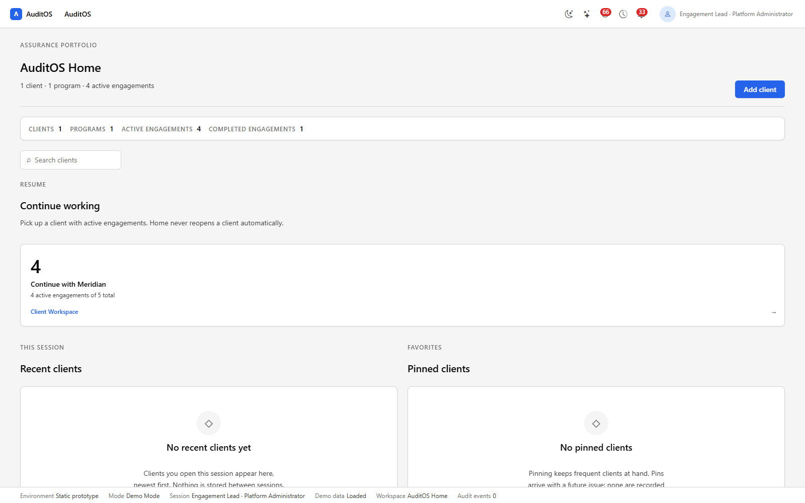

*Captured directly from the running prototype (Issue #42, Phase 3). See Appendix D, entry D.1.*

---

### Chapter 2 — What is AuditOS?

*Source grounding: `AuditOS-Knowledge-Base.md`, Document 50
(`docs\00-overview\02-Product-Vision.md`), cross-checked against
`prototype/js/state/state-store.js` and `prototype/js/platform/repository.js`.
Where Chapter 1 states the platform's governing vision, this chapter
answers the more concrete question of what AuditOS actually *is* — its
central concept, how it differs from a conventional audit tool, its
declared boundaries, and where that concept lives in Release 1 code today.*

#### 2.1 A Concrete Definition

AuditOS reimagines an assurance engagement as a continuously evolving
operational system rather than a set of isolated activities. It is meant
to become the operational foundation on which an engagement is executed —
every workflow, recommendation, document, approval, and decision feeding
one continuously synchronized representation of the engagement, the
**Shared Audit State**. AI does not replace professional judgment; it
reduces operational friction, maintains organizational knowledge, flags
inconsistencies, coordinates repetitive activity, and produces explainable
recommendations, while every authoritative decision stays under explicit
human governance. In this framing, AuditOS turns assurance from a
document-centric discipline into a knowledge-centric operating model.

#### 2.2 The Shared Audit State

At the center of AuditOS is the Shared Audit State: the complete current
understanding of an engagement, accumulated across planning, walkthroughs,
evidence collection, testing, documentation, reporting, reviews,
approvals, and organizational learning. It is deliberately **not** a
document, a database table, or a report — it is the authoritative
representation of the engagement from which every operational view is
derived. User interfaces visualize it; AI reasons against it; reports and
documentation are generated from it. Every architectural capability in
AuditOS ultimately exists to protect the integrity of this one shared
understanding.

#### 2.3 A New Operating Model

Conventional audit platforms are, at their core, document-management
systems with workflow automation layered on top. AuditOS inverts that:
the engagement itself is the primary operational entity, and every
document, workflow, recommendation, approval, and report is generated
from — and reflects back onto — that engagement. Information is
maintained once, understood consistently, and reused throughout the
audit's lifecycle; consistency is an architectural property, not
something enforced by administrative discipline.

#### 2.4 Human-Centered Intelligence

AI's role in AuditOS is deliberately constrained: it assists, recommends,
drafts, summarizes, correlates, and explains — it never independently
changes the official engagement. Every proposed modification passes
through a structured human approval process before it becomes part of the
Shared Audit State (the full governance lifecycle is detailed in Chapter
1, §1.8). The objective is governed intelligence, not autonomous
auditing — AuditOS augments auditors rather than replacing them.

#### 2.5 Product Boundaries

The initial implementation intentionally focuses on SOC 2 assurance
engagements, so the architecture, operating model, and UX can mature on a
bounded problem before expanding to other frameworks. Every decision made
during this phase is expected to preserve long-term extensibility — future
assurance methodologies, regulatory frameworks, organizational templates,
deployment environments, and AI providers are meant to extend the existing
architecture rather than replace it.

#### 2.6 Strategic Objectives

- Eliminate duplicated effort throughout the assurance lifecycle.
- Maintain a single authoritative understanding of every engagement.
- Preserve complete traceability for every recommendation and decision.
- Reduce operational overhead without compromising professional judgment.
- Increase documentation quality through continuous synchronization.
- Improve reviewer efficiency through explainable recommendations.
- Preserve institutional knowledge beyond individual engagements.
- Establish a scalable architecture capable of supporting multiple assurance frameworks.
- Provide a vendor-neutral foundation for multiple AI providers and enterprise platforms.
- Enable organizations to extend AuditOS without fundamental architectural redesign.

#### 2.7 Long-Term Vision

Beyond improving audit productivity, AuditOS aims to become the
operational intelligence layer for assurance organizations: institutional
knowledge persisting beyond individual engagements, successful approaches
becoming reusable organizational assets, and AI improving over time
through accumulated organizational understanding while remaining governed
by explicit human oversight — with global knowledge, client-specific
understanding, and engagement-specific context kept appropriately
separate as that knowledge compounds.

#### 2.8 Where This Lives in Release 1 Today

The Shared Audit State is not only a documented concept — it has a direct,
named implementation today. `prototype/js/state/state-store.js` identifies
itself in its own header as the "AuditOS Shared Audit State Store": the
single source of truth for runtime application data in the static
prototype, loading the demo-data catalog once, keeping that baseline
immutable, and maintaining an in-memory runtime state that every workspace
reads through one framework-agnostic API. `prototype/js/platform/repository.js`
is the adjacent interface boundary that Release 2 is expected to swap for
AI-agent- and real-backend-driven implementations.

That same file header is explicit about what Release 1 deliberately leaves
out: *"UI, business workflows, governance/approval flows, AI, and
persistence"* are out of scope by design, and writes are simulated —
they mutate only the in-memory runtime state and are never routed through
an approval process. See Appendix C, entry C.2.

---

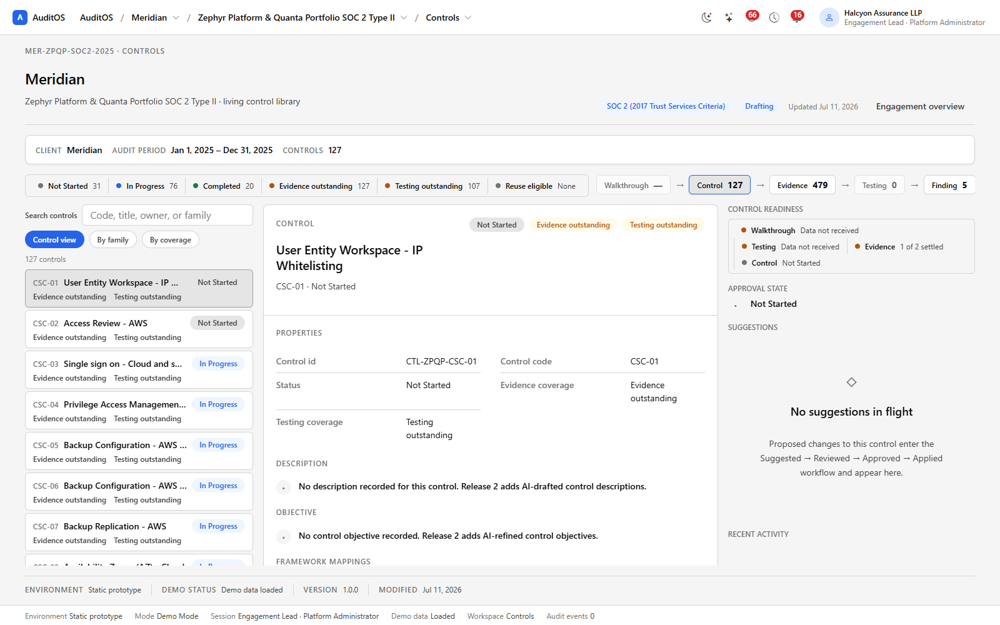

*Captured directly from the running prototype. A true side-by-side of one control open in two workspaces at once was not composited — each workspace is captured independently (this one, and Testing's equivalent view in Chapter 15's screenshot) — but both render from the identical underlying `AuditOS.state`, which is the property this screenshot exists to make visible. See Appendix D, entry D.2.*

---

### Chapter 3 — Problems AuditOS Solves

*Source grounding: `AuditOS-Knowledge-Base.md`, Document 50 §2.2
(`docs\00-overview\02-Product-Vision.md`), Document 53
(`docs\00-overview\05-Product-Goals-and-Non-Goals.md`), Document 54
(`docs\00-overview\06-Target-Users-and-Personas.md`), cross-checked
against `prototype/js/services/evidence-lifecycle.js`.*

#### 3.1 The Fragmentation Problem

Modern assurance engagements generate an enormous volume of information.
Requirements originate during planning; controls evolve during
walkthroughs; evidence arrives across multiple channels; documentation is
continuously revised; reports change as understanding matures; review
comments add further refinement. Despite all of it describing the same
engagement, these artifacts are typically maintained independently. That
independence is the root problem: information becomes inconsistent,
knowledge gets duplicated, evidence gets re-interpreted, documentation
drifts from current understanding, and context ends up living in
individual auditors rather than in the engagement itself. AuditOS exists
to remove this structural inefficiency by making every artifact a
reflection of one continuously evolving understanding, rather than an
independent source of information in its own right.

#### 3.2 Where Fragmentation Shows Up, Persona by Persona

AuditOS is designed around the people who deliver an engagement, not
around features. Each of its primary personas experiences the same
underlying fragmentation problem differently:

- **Engagement Lead** — today, understanding whether an engagement is on schedule, what needs attention, and what risks have emerged usually means manually reading through underlying documents rather than having that state surfaced automatically.
- **Auditor** — the persona that spends the most time in the platform is also the one most exposed to repetitive administrative work: figuring out what to work on next, what's missing, and what changed since yesterday, instead of spending that time on the client's environment and professional judgment.
- **Reviewer** — validating engagement quality currently competes with simply *locating* the information needed to review it; a reviewer needs complete context (what changed, why, who proposed it, what evidence supports it) assembled for every approval decision rather than reconstructed by hand.
- **Subject Matter Expert** — specialists brought in for narrow technical review need exactly the relevant controls and evidence, not the whole engagement, or their time gets consumed navigating unrelated content.
- **Client Representative** — external stakeholders need to understand *what* is being requested and *why* without audit-domain expertise, and without the back-and-forth communication overhead that ambiguous requests create.

Every persona's success criteria, described in these terms, is really the
same fragmentation problem viewed from a different seat.

#### 3.3 What AuditOS Eliminates

Concretely, AuditOS is designed to eliminate:

- Rewriting the same documentation in multiple places.
- Repeating evidence requests that have already been answered elsewhere.
- Maintaining parallel trackers for the same underlying facts.
- Updating multiple workpapers by hand when one underlying fact changes.
- Drafting repetitive, boilerplate communications.
- Reconstructing engagement context that already exists somewhere else.
- Manually synchronizing documentation with current understanding.

The architectural goal behind this list is that controls, requirements,
walkthroughs, evidence, testing, documentation, reporting, and review
activity all derive from the same underlying engagement state instead of
existing as independent artifacts — consistency achieved through
architecture, not through someone remembering to update every copy.

#### 3.4 What AuditOS Does Not Solve

Just as important as what the platform eliminates is what it deliberately
leaves alone. AuditOS does not attempt to perform engagements
autonomously, replace professional auditors, become a general-purpose AI
chat product, become a generic document repository, or let AI bypass
organizational governance under any circumstance. Professional skepticism,
risk evaluation, materiality assessment, and audit conclusions remain
outside what the platform will ever take on — AuditOS measures its success
by how much it increases auditor capability, not by how much auditor
involvement it removes.

#### 3.5 Where This Lives in Release 1 Today

The evidence status model is a concrete, working example of fragmentation
being architected away rather than managed by convention.
`prototype/js/services/evidence-lifecycle.js` defines a single canonical,
expanded status vocabulary that — per its own header comment — "every
surface (table, drawer, charts, filters, approvals, audit history, and the
generated testing workpaper) renders status from." Two differently sourced
datasets (a legacy demo vocabulary and a separate testing vocabulary) are
explicitly mapped onto this one model rather than left to diverge, and the
module documents that an unknown status "renders as itself with a neutral
tone — never fabricated, never dropped." That is §3.3's "manually
synchronizing documentation" problem, solved for one concrete artifact
(evidence/testing status) inside Release 1 today, not merely promised for
Release 2.

---

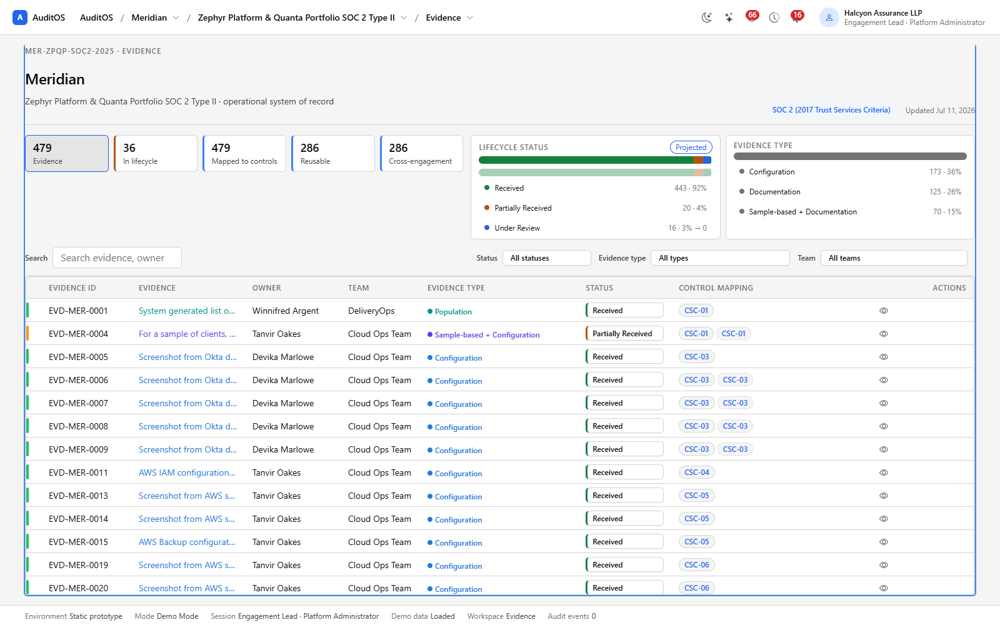

*Captured directly from the running prototype. See Appendix D, entry D.3.*

---

### Chapter 4 — Core Concepts

*Source grounding: `AuditOS-Knowledge-Base.md`, Document 56
(`docs\01-product\01-Domain-Model.md`) for the primary vocabulary, plus
`docs\08-workspaces\15-team-workspace.md` and `16-poc-workspace.md` for
Team and POC. Cross-checked against `prototype/js/workspaces/program.js`
and `prototype/js/platform/{engagement-context-service.js,
synchronization-bus.js, suggestion-service.js, audit-service.js,
repository.js}`. Not every term below has a dedicated markdown source —
Program, Context, and Synchronization exist primarily as code-level
concepts and are grounded directly against the platform files that
implement them.*

The AuditOS domain is deliberately small and hierarchical: an
Organization owns Clients, a Client owns Engagements, and everything
else — requirements, controls, evidence, testing, findings, reports,
approvals — belongs to exactly one Engagement. Nothing in the domain
exists independently of an Engagement. The eighteen concepts below are
the vocabulary every workspace, service, and (eventually) AI agent is
expected to share.

#### 4.1 Client

A Client represents the organization being audited. It holds the client
profile, organizational knowledge, historical engagements, client-specific
templates and terminology, contacts, and business units, and owns
multiple Engagements. A Client is never itself the unit of work — work
happens inside the Engagements it owns.

#### 4.2 Program

A Program is one audit program spanning several concurrent Engagements
that share requirements, controls, and evidence — the construct that lets
the platform answer "where is evidence being reused across engagements
instead of being re-collected?" This is a code-first concept:
`prototype/js/workspaces/program.js` reads `programs.json`, which declares
each program's member engagements (`engagementIds`) and any engagements
whose methodology it reuses without formally joining
(`reuseSourceEngagementIds`). Release 1's Program workspace is read-only —
no AI, no workflow engine, no writes.

#### 4.3 Engagement

The Engagement is the primary operational entity in AuditOS — everything
performed in the platform ultimately belongs to one. It owns scope,
requirements, controls, walkthroughs, evidence, testing, documentation,
reporting, approvals, AI recommendations, timeline, and the Shared Audit
State (Chapter 2, §2.2). No other domain object has greater authority.

#### 4.4 Walkthrough

A Walkthrough is structured knowledge about how a process currently
operates — not simply meeting notes. Walkthroughs continuously refine
controls, risks, documentation, testing, and evidence requests. AI may
summarize a walkthrough, but human reviewers determine the official
understanding that results from it.

#### 4.5 Team

A Team is the operational grouping for a single walkthrough team's
engagement activities — the unit the Team Workspace organizes around,
giving team leads and auditors one view of team status, POC roster,
progress, scheduling, and next actions. A Team consumes the Shared Audit
State and engagement context rather than maintaining independent status
of its own.

#### 4.6 POC

A POC (Point of Contact) is an individual client-side participant within
a Team — the focused view of one person's engagement participation:
identity, role, sessions attended, evidence owned or contributed, and any
POC-specific blockers. The POC Workspace is reached by drilling into a
Team's roster.

#### 4.7 Evidence

Evidence is information supporting audit conclusions — documents,
screenshots, system exports, interviews, demonstrations, recordings,
configuration data, policies, procedures. Evidence belongs to the
Engagement, not to any single Control, and may support multiple Controls
at once; by design it should never require duplicate storage (Chapter 3,
§3.5's canonical status vocabulary is one concrete mechanism enforcing
that).

#### 4.8 Control

A Control is an organizational activity that satisfies one or more
Requirements. Controls are living objects, not static text — they move
through states (proposed, draft, reviewed, approved, tested, effective,
ineffective, archived) and, even though multiple artifacts may reference
the same Control, only one authoritative version exists at any time.

#### 4.9 Testing

Testing evaluates whether a Control operates effectively, referencing
Requirements, Controls, Evidence, and Samples. Testing produces
Observations, not conclusions — professional judgment, not the platform,
determines what a set of observations actually means.

#### 4.10 Observation

An Observation is a factual, objective statement identified during
testing — it describes what was observed and does not, by itself, imply a
deficiency. Observations are the raw material Findings are built from.

#### 4.11 Finding

A Finding is an evaluated conclusion built on one or more Observations. It
may carry severity, impact, root cause, recommendation, management
response, and status, and feeds directly into reporting.

#### 4.12 Report

A Report communicates engagement conclusions and is generated from the
Shared Audit State rather than assembled by hand. Report sections
reference underlying knowledge instead of maintaining independent copies
of it — the same "generated output, not a source of truth" pattern as
Documentation (Chapter 2, §2.2).

#### 4.13 Suggestion

A Suggestion is how AI participates in the Engagement without ever
directly modifying it. In code, every AI suggestion follows one lifecycle:
**Suggested → Reviewed → Approved → Applied** (or Rejected / Modified).
`prototype/js/platform/suggestion-service.js` documents that AI never
writes directly — every transition is a simulated Repository write
performed by the acting session, and every write is automatically
audited. Applying a suggestion additionally publishes the same
propagation chain described in §4.18 (Synchronization). This is the
code-level realization of the "AI proposes, human approves" governance
model from Chapter 1, §1.8.

#### 4.14 Approval

An Approval governs every authoritative modification to the engagement.
It records the reviewer, timestamp, decision, comments, the recommendation
or suggestion it responds to, and the resulting state transition. No
official engagement change happens without one.

#### 4.15 Audit Trail

The Audit Trail records every significant action — repository writes,
approval decisions and requests, session role switches, wizard
completions — as one immutable event. (The Domain Model, Document 56
§8.19, calls this the "Timeline"; Release 1's code names the same concept
the platform audit trail — both describe one immutable event log, not two
different things.) `prototype/js/platform/audit-service.js` documents the
service contract as `record` and read-only: no update, no removal, and an
intentionally empty baseline, because "the platform fabricates no
history." See Appendix C, entry C.4 for a caveat on how permanent that
trail actually is in Release 1.

#### 4.16 Repository

The Repository is the interface boundary every workspace and service
reads and writes engagement data through, rather than accessing storage
directly. `prototype/js/platform/repository.js` documents itself as the
seam Release 2 replaces with AI-agent- and real-backend-driven
implementations (already grounded in Chapter 1, §1.9 and Chapter 2, §2.8)
— every other platform concept in this chapter (Context, Synchronization,
Suggestion, Audit Trail) is, in code, "Repository-backed."

#### 4.17 Context

Context is the single source of AI-derived engagement state: working
memory, observed evidence, assumptions, dependencies, suggestions,
timeline, industry knowledge, confidence, and the requirements / controls
/ report sections / audit references a piece of understanding affects.
`prototype/js/platform/engagement-context-service.js` documents that pages
never write this state directly — only the Synchronization Bus writes it;
pages read it read-only through this service, and every write is
Repository-backed and therefore automatically audited.

#### 4.18 Synchronization

Synchronization is how a change in one part of the engagement becomes
visible in every other part without pages talking to each other directly.
A page publishes an event; the Synchronization Bus updates the Context;
other pages react by reading that Context, never by reaching into another
workspace's state. `prototype/js/platform/synchronization-bus.js`
documents its own `propagate()` as simulating the full downstream chain a
walkthrough-originated change triggers — Walkthrough → Requirements →
Controls → Report → Approvals → Audit → AI Usage → Timeline → Context —
as one immutable audit event per hop today, with Release 2 expected to
replace the simulated publishers with real event producers behind the
same `publish`/`subscribe` contract. See Appendix C, entry C.3.

---

*D.4's domain-hierarchy tree is a conceptual diagram, not a UI capture — outside Playwright's screenshot scope, and remains a placeholder for a hand-authored diagram.*

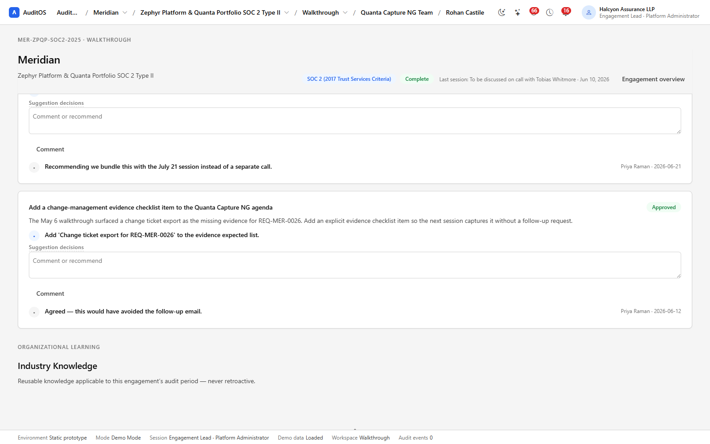

*Captured directly from the running prototype. Shows one Suggestion's Approved state with its full comment/decision trail rather than all four lifecycle states side by side. See Appendix D, entry D.5.*

---

### Chapter 5 — Audit Lifecycle

*Source grounding: `AuditOS-Knowledge-Base.md`, Document 59
(`docs\01-product\04-Audit-Lifecycle.md` — last modified 08/03/2026, the
most recently updated source document used so far), cross-checked against
`prototype/js/workspaces/engagement.js` and
`prototype/js/services/report-generation-service.js`.*

#### 5.1 Lifecycle Philosophy

Traditional audit software focuses on deliverables; AuditOS focuses on
understanding. Deliverables are outcomes — understanding is the process.
Every lifecycle stage exists to improve the quality, completeness,
confidence, and explainability of the Shared Audit State, which makes the
lifecycle cumulative rather than sequential: knowledge produced in one
stage stays available through every later stage. Nothing is discarded,
nothing is recreated — understanding continuously matures.

#### 5.2 The Fourteen-Stage Lifecycle

Every engagement conceptually progresses through fourteen stages:
Engagement Creation → Planning & Scoping → Environment Understanding →
Control Identification → Walkthroughs → Evidence Requests → Evidence
Collection → Control Testing → Observations → Findings → Reporting →
Review & Approval → Engagement Completion → Organizational Learning.
These are represented sequentially but iterate frequently in practice —
AuditOS models progression, not rigid phases.

| Stage | What happens | AI's role | Human's role |
|---|---|---|---|
| 1. Engagement Creation | Initializes client context, engagement metadata, framework, period, team, templates, Shared Audit State, and Timeline. No audit work exists yet — only the operational container. | — | Establishes the engagement |
| 2. Planning & Scoping | Defines objectives, scope, systems, in-scope processes, timelines, responsibilities; imports framework requirements. Output is understanding, not documentation. | — | Defines scope |
| 3. Environment Understanding | Builds understanding of the client's environment: background, org structure, process, technology, business context, existing documentation. | Organizes information, identifies relationships | Owns professional understanding |
| 4. Control Identification | Requirements are translated into Controls, which may be imported, proposed, refined, merged, split, or retired — living objects, not static text. | — | — |
| 5. Walkthroughs | Transforms assumptions into verified understanding of process execution, control operation, roles, system interactions, evidence, exceptions. | Summarizes conversations, flags inconsistencies, suggests missing questions, prepares documentation | Determines official understanding |
| 6. Evidence Requests | Requests evidence with full context: what, why, which controls, format, due date, status — eliminating unnecessary back-and-forth. | — | — |
| 7. Evidence Collection | Evidence is collected, validated, classified, and related to the Shared Audit State; may support multiple requirements/controls/tests/findings without duplicate storage. | Classification, summarization, metadata extraction, relationship identification | Accepts evidence |
| 8. Control Testing | Evaluates whether controls operate effectively, referencing requirements, controls, evidence, samples; every conclusion must reference supporting evidence. | Flags inconsistencies, missing evidence, incomplete procedures | Owns professional conclusions |
| 9. Observations | Testing produces objective, factual Observations — not yet conclusions. | — | — |
| 10. Findings | Professional evaluation transforms Observations into Findings, each keeping explicit relationships to its observations, evidence, controls, requirements, risk, and testing. | — | Evaluates and concludes |
| 11. Reporting | Communicates final understanding; because reports derive directly from the Shared Audit State, consistency improves, manual reconciliation drops, and changes propagate automatically. | Drafts narrative sections (Release 2 only — see §5.5) | — |
| 12. Review & Approval | Every authoritative change — report edits, AI recommendations, findings, reports, significant state transitions — passes formal review; reviewers approve understanding, not isolated text. | Explains recommendations | Approves |
| 13. Engagement Completion | The Shared Audit State becomes read-only; final deliverables are produced; historical traceability is preserved indefinitely. Completion never destroys knowledge. | — | — |
| 14. Organizational Learning | Completed engagements become reusable organizational assets: better templates, documentation, report structures, prompts, workflows, evidence requests, guidance. | — | — |

#### 5.3 Documentation Is Not a Stage

Earlier lifecycle drafts modeled Documentation as its own stage between
Findings and Reporting. That stage was removed: AuditOS does not treat
documentation as a place a user works. Documentation is instead a
continuous projection of the Shared Audit State living **inside the
report itself** — concretely, the Reporting workspace's Section III
(System Description), generated continuously from approved walkthroughs,
evidence, controls, testing, and findings. This is consistent with
Chapter 2's "documents are outputs, not sources of truth" framing
(§2.2) — the lifecycle simply makes explicit that the removal was a
deliberate architectural change, not an oversight.

#### 5.4 The Release 1 Operational Pipeline

The fourteen-stage lifecycle above is the conceptual, full-engagement
model. Day to day, within one active engagement, the concrete work an
audit team executes is a six-stage operational pipeline that the
Engagement Workspace surfaces as navigation:

```text
Walkthrough → Evidence → Controls → Testing → Findings → Reporting
```

`prototype/js/workspaces/engagement.js` confirms this is implemented, not
aspirational: the workspace's middle section renders exactly this
pipeline, with each stage showing its completion, blockers, pending
approvals, and AI suggestions in flight, and each connector carrying the
health of the stage it leaves — flowing (green), waiting (amber), or
blocked (red) — so the pipeline reads as one connected operational flow.
The mapping onto the fourteen-stage model is not one-to-one: "Controls"
in the pipeline represents ongoing refinement of Stage 4 rather than a
single pass, and "Reporting" is continuous from engagement start rather
than a terminal stage. The workspace's own header comment is explicit
that Release 1 renders only existing JSON — "no AI behaviour, no workflow
engine, no business logic" invented — and reserves AI surfaces as
presentation regions rather than populating them.

#### 5.5 AI Throughout the Lifecycle

AI's involvement changes shape by stage — organizing information during
planning, assisting understanding during walkthroughs, identifying
relationships during evidence collection, flagging inconsistencies during
testing, and (in Release 2) drafting narrative sections during reporting.
`report-generation-service.js` confirms Release 1's actual behavior
today: the service assembles the report's five canonical sections from
data the engagement actually records — "faithful generation, never
fabrication" — and a canonical section the dataset doesn't declare
renders as "not recorded in this report," never invented narrative. The
one marked Release 2 seam, `draftNarrative`, is where AI-authored prose
replaces recorded-fact rendering for the narrative sections; every other
contract (section identity, lineage, regeneration scoping, status
vocabulary) stays the same when that happens, and narrative changes still
travel the same Suggestion → Approval → Propagation path as any other
change (Chapter 4, §4.13–§4.14). This is the same extension point already
logged in Appendix C, entry C.1 — no new discrepancy here, only
confirmation.

#### 5.6 Lifecycle Events

Every stage produces operational events — Engagement Created, Scope
Updated, Walkthrough Completed, Evidence Requested, Evidence Received,
Testing Started/Completed, Observation Recorded, Finding Created,
Recommendation Generated/Approved, Report Section Regenerated, Report
Generated, Engagement Closed — which enrich the Audit Trail (Chapter 4,
§4.15) and let every workspace and future AI agent stay synchronized
without direct coupling (Chapter 4, §4.18).

---

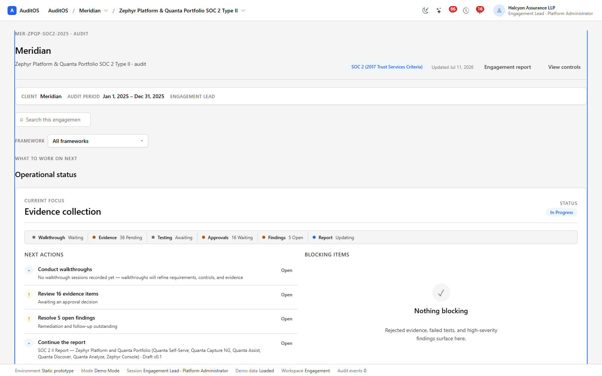

*Captured directly from the running prototype. See Appendix D, entry D.6.*

---

### Chapter 6 — Release 1

*Source grounding: `AuditOS-Knowledge-Base.md`, Document 190
(`docs\15-implementation-guide\06-static-prototype.md`), cross-checked
directly against `prototype/index.html`, `prototype/vendor/`, and the
"classic script" header comments already confirmed across Chapters 1–5.
This chapter describes what Release 1 **is**, built from the actual
source tree — not from the original spec, which turns out to diverge from
it significantly. See §6.4 and Appendix C, entry C.5.*

#### 6.1 What Release 1 Actually Is

Release 1 is a fully static, offline-capable prototype: one HTML entry
point (`prototype/index.html`) loading fifty-two classic `<script src="...">`
tags (confirmed by direct count, zero inline `<script>` blocks) from
`prototype/js/` and `prototype/components/` plus per-workspace stylesheets
from `prototype/css/`, reading exclusively from a bundled demo-data JSON
catalog. There is no backend, no database, no Node.js runtime, no package
manager, and no build step at any point between editing a file and
opening it in a browser. Every file read so far in this document says the
same thing in its own header comment: *"Loaded as a classic script so the
prototype runs directly from `file:///.../prototype/index.html` with no
build step or module loader."* That sentence, repeated verbatim across
dozens of files, is the single architectural decision Release 1 is built
on.

#### 6.2 Technical Constraints Honored

The original specification's constraints hold true in the shipped
prototype: it requires no backend, no database, no Node.js, no package
manager, no framework runtime, and no server — it runs by opening
`index.html` directly, with no installation step. `prototype/vendor/`
contains exactly two vendored libraries, Bootstrap and Bootstrap Icons,
loaded locally rather than from a CDN — consistent with this project's
offline-first, zero-dependency operating rule.

#### 6.3 Application Bootstrap and Navigation, As Built

`prototype/js/main.js` (Chapter 1, §1.5) initializes the Shared Audit
State foundation and then the static routing foundation, in that order —
a two-step bootstrap, simpler than the specification's seven-step sequence
(design tokens → layout → navigation → static data → shared state →
components → workspace → interactions), but achieving the same effect:
the state loads once, the router resolves the initial workspace, and
every subsequent navigation stays inside one continuously running page —
never a fresh document load.

#### 6.4 What Diverged From the Original Plan

The static-prototype specification (Document 190) that Release 1 was
originally scoped from describes a materially different technology stack
than what was actually built:

| Specified (Document 190) | Actually built |
|---|---|
| Vanilla JavaScript as **ES Modules** | Classic `<script>` tags, explicitly *not* ES Modules — every file's header cites `file://` compatibility as the reason |
| Apache ECharts, Chart.js for visualization | No charting library vendored; not present in `prototype/vendor/` |
| Grid.js or Tabulator for tables | No table library vendored |
| TipTap, Monaco Editor, Marked.js for editing | None vendored |
| PDF.js, SheetJS for documents | None vendored |
| Motion One for animation | Not vendored |
| Floating UI, SortableJS utilities | Not vendored |
| `assets/`, `pages/`, `data/` folder layout | `prototype/{js,css,components,demo-data}/` layout |

Bootstrap and Bootstrap Icons are the only items from the specified stack
that were actually vendored. Everything else the specification called for
— five additional third-party libraries and an ES-Module loading strategy
that cannot run correctly from `file://` without a server — was not
built. What exists instead is a smaller, more constrained implementation:
vanilla HTML/CSS/JavaScript only, no external libraries beyond Bootstrap,
and classic scripts everywhere specifically because ES Modules would have
broken the "open `index.html` directly" requirement this same
specification also states in §132.4. See Appendix C, entry C.5.

#### 6.5 What Release 1 Deliberately Does Not Do

Consistent with the extension points already documented in Chapters 1–5:
Release 1 renders only existing JSON and invents nothing (Chapter 5,
§5.4); writes are simulated and never routed through a real approval
engine (Chapter 2, §2.8, Appendix C, entry C.2); synchronization between
workspaces is a scripted simulation of one propagation chain, not
independent live events (Chapter 4, §4.18, Appendix C, entry C.3); the
audit trail is immutable only within a running session and is discarded
on reset (Chapter 4, §4.15, Appendix C, entry C.4); and no AI agent
executes anywhere in the platform — every AI-shaped surface is a reserved
presentation region or a named extension point, not a live model call
(Appendix C, entry C.1). Release 1's scope is the operational platform
and its data model; Release 2 is everything that makes it intelligent and
persistent.

---

*D.7's DevTools Network-tab capture requires inspecting browser network activity directly, not a page screenshot — outside Playwright's `page.screenshot()` scope used for this pass, and remains a placeholder. (Confirmed by a different means during this pass: the harness navigated the live prototype via `file://` throughout Phase 3 with no server of any kind running, consistent with the claim this entry exists to illustrate.)*

---

### Chapter 7 — Release 2 Vision

*Source grounding: `AuditOS-Knowledge-Base.md`, Document 164
(`docs\13-roadmaps\01-product-roadmap.md`, §106.7–106.13, Phases 1–7) and
Document 168 (`docs\13-roadmaps\05-roadmap-summary.md`, the long-term
model). Cross-referenced against every Release-2-tagged item already
found in Release 1 code and logged in Appendix C (entries C.1–C.5). This
chapter states vision only — nothing here is implemented; Chapters 17
(Release 2 AI Architecture) and 18 (AI Agents) go further once this
document reaches that point.*

#### 7.1 Where Release 1 Actually Sits in the Roadmap's Own Terms

The product roadmap divides evolution into seven phases, a finer-grained
model than this document's two-release framing. Phase 1 ("Static Proof of
Concept") is explicitly labeled the roadmap's *current objective* and
"intentionally excludes production implementation." But Phase 2
("Interactive Prototype") describes "interactive workflows, simulated
Business Events, simulated Shared Audit State... Artificial Intelligence
remains simulated where appropriate" — which is a closer match to what
Chapters 1–6 actually found in Release 1 (simulated writes, simulated
synchronization propagation, a simulated Suggestion lifecycle) than Phase
1's more minimal description. Release 1, as this document has verified
it, already sits between the roadmap's Phase 1 and Phase 2 — a clarifying
cross-reference, not a discrepancy, but worth stating plainly so a later
chapter doesn't assume "Release 1 = Phase 1" too literally.

#### 7.2 Release 2, Concretely: What Already Has a Seam Waiting for It

Release 2 is not undefined in this document — it is the sum of every
extension point Chapters 1–6 already found built into Release 1 and
logged in Appendix C:

- **Live AI agents behind the Repository** — `repository.js` names itself the seam Release 2 swaps for AI-agent- and real-backend-driven implementations (Chapter 1, §1.9; Appendix C, C.1).
- **AI-authored narrative** — `report-generation-service.js`'s `draftNarrative` extension point, replacing recorded-fact rendering with real model output for the report's narrative sections (Chapter 5, §5.5; Appendix C, C.1).
- **A real Human Approval Engine** — `state-store.js`'s own comment names this component and states Release 1 has only "the mechanical substrate that later governance issues build in front of" (Chapter 2, §2.8; Appendix C, C.2). The same term, Human Approval Engine, appears independently in the product roadmap's Phase 3 — the two sources corroborate each other without having been cross-checked by any prior chapter.
- **Real event producers** — `synchronization-bus.js` replacing its simulated `propagate()` chain with independent live events from each downstream workspace (Chapter 4, §4.18; Appendix C, C.3).
- **Persistent audit history** — `audit-service.js`'s in-memory-only trail gaining real persistence so traceability survives a reset, not just a session (Chapter 4, §4.15; Appendix C, C.4).

None of these are speculative extrapolations — each is a named seam
already sitting in Release 1 source, waiting for a Release 2
implementation behind an unchanged contract.

#### 7.3 The Seven AI Agents

The product roadmap's Phase 3 ("AI-Assisted Platform") names the AI
agents that make Release 2 more than infrastructure: Documentation,
Walkthrough, Controls, Evidence, Testing, Findings, and Reporting agents,
alongside recommendation aggregation, the Human Approval Engine, and AI
safety enforcement — matching this document's own approved AI Agents
roster (Part VI, Chapter 18) exactly. One open question carried over from
this project's earlier planning: the Documentation Agent has no
standalone code hook the way the other six do, because Issue #41 removed
Documentation as a user-facing surface and folded it into the Reporting
workspace's continuously generated Section III. The most likely
resolution — to be confirmed when Chapter 18's Documentation Agent
section is written, not asserted here — is that the Documentation Agent
*is* the eventual implementation behind `draftNarrative`, not a separate,
missing extension point.

#### 7.4 Beyond Release 2: The Long-Term Vision

The roadmap continues well past what this document scopes as "Release
2." Phase 4 (Enterprise Platform) adds enterprise identity, integrations,
and production deployment architecture. Phase 5 (Multi-Framework
Platform) extends beyond SOC 2 to frameworks such as ISO 27001, PCI DSS,
HIPAA, internal audit, privacy, and risk management, without changing the
Business Object Model (Chapter 4). Phase 6 (Enterprise AI Operating
System) moves AI from task assistance to coordinated multi-agent
reasoning, cross-engagement learning, and executive decision support.
Phase 7 (Continuous Assurance Platform) aims at continuous evidence
ingestion and real-time assurance — explicitly "complementing rather than
replacing professional judgment." The roadmap summary frames all of this
as one long journey — Architecture Validation → Prototype → Enterprise
Platform → AI Operating System → Enterprise Adoption → Continuous
Assurance → Enterprise Assurance Intelligence — where every later stage
extends the same architecture rather than replacing it. This document
treats that full journey as long-term context, not near-term scope.

#### 7.5 What Release 2 Is Not

Every Non-Goal established in Chapter 3, §3.4 still applies without
exception once AI agents are live: no autonomous auditing, no replacing
professional auditors, no becoming a general-purpose AI chat product, no
AI bypassing governance under any circumstance. Adding real AI agents
changes what proposes changes to the Shared Audit State — it does not
change who approves them. The Human Approval Engine named in §7.2 is the
mechanism that keeps that true; it is a prerequisite for Release 2 AI
agents going live, not an optional accompaniment to them.

---

*D.8's roadmap diagram is conceptual, not a UI capture — outside Playwright's screenshot scope, and remains a placeholder for a hand-authored diagram.*

---

### Chapter 8 — Platform Architecture

*Source grounding: `AuditOS-Knowledge-Base.md`, Document 75
(`docs\04-engineering\01-System-Architecture.md`), cross-checked against
every file in `prototype/js/platform/` (10 files), `prototype/js/router/`
(2 files), `prototype/js/state/` (2 files), and the file-level headers of
`prototype/js/services/` (13 files). Depth of verification varies: the
platform, state, and router files below were each read directly; the
services directory is summarized at the directory level except for the
two services (`evidence-lifecycle.js`, `report-generation-service.js`)
already verified in Chapters 3 and 5.*

#### 8.1 Architectural Vision

Document 75 states its own scope plainly: it is deliberately
implementation-agnostic — "whether AuditOS is implemented using Vanilla
JavaScript, Power Platform, React, .NET, Node.js, Kubernetes, Azure, or
future technologies, the architectural principles defined here remain
unchanged." AuditOS is framed as an operating system organized around
operational responsibilities, not an application organized around
screens — independent capabilities collaborating through a Shared Audit
State, an Event Bus, a Context Engine, a Recommendation Engine, and a
Human Approval Engine, governed by twelve permanent principles (Shared
State, Event Driven, Modular, Stateless Intelligence, Human Governance,
Vendor Neutrality, Progressive Evolution, Explainability, Traceability,
Reusability, Extensibility, Simplicity).

#### 8.2 The Conceptual Layer Model, Mapped to Release 1

Document 75 defines seven logical layers — Presentation → Workspace →
Application → Shared Audit State → AI Operating System → Event Bus →
Infrastructure — with dependencies flowing strictly inward: business
knowledge never depends on presentation. Release 1's actual directory
structure maps onto this model directly:

| Conceptual layer | Release 1 location |
|---|---|
| Presentation | `prototype/components/` |
| Workspace | `prototype/js/workspaces/` (15 files, Chapter 15) |
| Application | `prototype/js/services/` (13 files, §8.4 below) |
| Shared Audit State | `prototype/js/state/` + `prototype/js/platform/repository.js` (Chapter 2, §2.8) |
| AI Operating System | `engagement-context-service.js`, `suggestion-service.js` — seeded, not populated (Chapter 4, §4.13, §4.17; Appendix C, C.1) |
| Event Bus | `prototype/js/platform/synchronization-bus.js` (Chapter 4, §4.18) |
| Infrastructure | None — `demo-data/` JSON stands in for it in Release 1 |

#### 8.3 The Platform Directory

`prototype/js/platform/` holds ten files. Five were already grounded in
earlier chapters (`repository.js`, `state-store.js`'s sibling
`engagement-context-service.js`, `synchronization-bus.js`,
`suggestion-service.js`, `audit-service.js`). The remaining five:

- **`permissions.js`** — the platform-wide description of what the current session may do. Self-documented as "an honestly-scoped capability descriptor — not an authorization engine," because Release 1 has no authentication, no identity provider, and no backend. Unavailable actions are hidden rather than rendered disabled.
- **`id-service.js`** — the one place the platform mints runtime identifiers, replacing a prior pattern where each caller rolled its own `Date.now()`-based scheme — a real collision risk the service's own comment traces to a specific concrete case (a Suggestion and a Report Version minted inside the same click handler).
- **`relationships.js`** — the Cross-Workspace Relationship Engine: a shared, pure, read-only derivation layer for relationship logic that had been independently reimplemented across multiple workspaces (control reference resolution, activity-history normalization, collection metadata).
- **`dependency-service.js`** — read-only traversal of the Team → POC → Requirement → Control → Evidence → Report dependency chain. Release 1 reads these from authored demo JSON; the comment states Release 2 AI agents will derive them live from workspace activity through the Synchronization Bus behind the same read surface.
- **`industry-knowledge.js`** — read-only access to organizational learning kept deliberately separate from engagement-scoped Suggestions, reusable across every engagement rather than scoped to one. Its one piece of real logic, `resolveApplicable`, only applies an item from its recorded implementation date forward and never past the engagement's own audit period.

#### 8.4 The Services Directory

`prototype/js/services/` holds thirteen files — the Application Layer in
§8.2's mapping. Navigation and context resolution (`context-resolver.js`,
`navigation-service.js`, `breadcrumb-generator.js`, `hierarchy-builder.js`)
are verified in Chapter 9; `evidence-lifecycle.js` in Chapter 3, §3.5;
`report-generation-service.js` in Chapter 5, §5.5; `ai-lineage-service.js`
and `report-propagation-service.js` in Chapters 17 and 12. The remaining
five — report mechanics and export — were read in full for the Issue #42
final documentation pass:

- **`report-version-service.js`** — the report's version register and the one place its lifecycle advances: Draft → AI Draft → Reviewer Approved → Partner Approved → Issued. An Issued version is immutable; editing one opens a new Draft carrying the issued version forward as its predecessor, so a client-received document never silently changes. An engagement with no version records still gets a real baseline entry from the report's own recorded `version`/`status` fields, never an invented history.
- **`workpaper-service.js`** — the single model behind the generated audit workpaper: Overview, Control description, Walkthrough summary, Testing objective/procedure, Population, Evidence references, Attributes, Exceptions, Conclusion, Reviewer notes, Approval. The Testing workspace, the HTML workpaper, and the workbook export all render this one model — "one structure, three consumers, no second definition." Every section but AI provenance is editable; a section with no recorded data returns `present: false`, never invented content.
- **`document-export.js`** — serializes the report to DOCX, PDF, and HTML with zero runtime dependencies: a real OOXML WordprocessingML package for DOCX (reusing `workbook-export.js`'s ZIP writer), a hand-written PDF 1.4 document with an accurate byte-offset cross-reference table, and a self-contained HTML file. All three read one neutral `documentModel` built from the Report Generation Service's report model.
- **`workbook-export.js`** — the platform's one `.xlsx` writer: a minimal, standards-correct SpreadsheetML part set inside a STORE-method ZIP (no compressor needed, only CRC-32) — a real writer, not a Release 2 placeholder, deliberately without shared strings, formulas, charts, or a calculation chain, none of which a workpaper export needs.
- **`workpaper-export.js`** — the two serializations of the Workpaper Service's one model: a self-contained HTML workpaper and an Excel workbook (via `workbook-export.js`) mirroring the CSC-01 structure plus an evidence register and AI-provenance sheet neither original spreadsheet had. Pure serialization — no DOM reads, no state reads or writes.

All five confirm the same zero-dependency discipline as the rest of
Release 1 (Chapter 6, §6.2): no npm package, no CDN, no build step,
correct under `file://`.

#### 8.5 State and Router

`prototype/js/state/demo-data-registry.js` is the single authoritative
catalog of what its own comment calls "the simulated SharePoint structure
in `prototype/demo-data/`" — structure only (identifier, scope, file
location, record key), no business data or logic, consumed by
`state-store.js` to load demo data. That phrase, "simulated SharePoint
structure," is a concrete, unprompted echo of Document 75's own
Infrastructure Layer examples (§8.1: Power Platform, Microsoft Graph,
SharePoint) — independent corroboration, not a coordinated claim, that
Release 1's eventual backend target was already assumed at the naming
level.

`prototype/js/router/router.js` is the prototype's navigation backbone:
it switches between the Workspace Hosts declared in
`workspace-registry.js`, keeps the URL synchronized for deep linking and
browser history, and announces changes to assistive technology. The
router parses nothing itself — every hash resolves through
`context-resolver.js` (§8.4). `workspace-registry.js` is the single
authoritative list of workspaces the router can reach, each entry
declaring the hierarchy scope it resolves at: platform-flat, client-scoped,
or engagement-scoped.

#### 8.6 The Presentation Layer, Verified

§8.2's mapping names `prototype/components/` the Presentation layer
without enumerating it. Added during the Issue #42 final documentation
pass: eight files, each read directly, none previously cited by name in
this document.

- **`component-library.js`** — the Shared Enterprise Component Library's registry: identity only (id, name, category, base CSS class, description) for every reusable presentation primitive `css/components.css` defines. No visual values, no business data.
- **`workspace-framework.js`** — the Shared Workspace Framework renderer: on every route change, renders the Universal Workspace Structure (header, context summary, toolbar, filter bar, primary content, supporting panels, footer) into the mounted Workspace Host, configured declaratively per workspace rather than re-invented per workspace.
- **`presentation.js`** — the Enterprise Data Presentation System: the one reusable engine turning a workspace's declarative configuration into DOM (data grids, master-detail layouts, inspectors, timelines, activity feeds, entity cards, status badges) by composing the Component Library's primitives. Presentation only — never reads or writes `AuditOS.state`.
- **`workspace-shared.js`** — the Workspace Shared Platform (Issue #27): presentation and derivation patterns that stabilized identically across Engagement, Walkthrough, Evidence, Controls, Testing, Findings, and Reporting, extracted once rather than re-typed per workspace. Holds no business logic or status vocabulary of its own.
- **`navigation.js`** — renders the breadcrumb region the Breadcrumb Generator (Chapter 9, §9.6) supplies; renders only, derives nothing itself.
- **`header.js`** — the global header's trailing regions: theme toggle, AI Usage indicator (hover reveals route-scoped telemetry, Chapter 14), notification and Global Approvals indicators, Session Panel.
- **`footer.js`** — the persistent platform footer: environment/session mode, demo-data status, active workspace, and the live recorded audit-event count — every value sourced live, nothing fabricated while its source is unavailable.
- **`wizard.js`** — the Shared Wizard Engine both creation wizards (Chapter 15, §15.13) configure declaratively; holds captured values in memory only and hands them to the caller's `onComplete` — what happens to them (a Repository write, an audit event) belongs to the calling workspace, never to this engine.

#### 8.7 Dependency Direction, As Built

Document 75's "dependencies always flow inward" principle (§26.12) is not
just conceptual in Release 1 — it is a sentence that appears, close to
verbatim, in the header comment of essentially every platform and service
file already read across this document: *"Depends on nothing in
components/, keeping the js → components boundary one-way."* This matches
Session 1's architecture pass exactly: `components/` is the core layer
or, in graph terms, the destination of nearly every inbound call, itself
calling back out almost never.

---

*D.9's conceptual layer diagram is not a UI capture — outside Playwright's screenshot scope, and remains a placeholder for a hand-authored diagram.*

---

### Chapter 9 — Navigation & Context

*Source grounding: `AuditOS-Knowledge-Base.md`, Document 125
(`docs\08-workspaces\14-hierarchical-routing-and-context.md` — last
modified 08/02/2026, self-labeled as reflecting the shipped
implementation, not a plan). Cross-checked directly against
`navigation-service.js`, `hierarchy-builder.js`, `context-resolver.js`,
`breadcrumb-generator.js`, and `router.js` (introduced in Chapter 8,
§8.5). Every function name, event name, and route shape below was
confirmed present in code by direct search, not taken on the document's
word.*

#### 9.1 One Architectural Concern, Four Services

Navigation and context are owned by exactly four services, each with sole
responsibility for one part of the concern: no page constructs a URL,
derives its own context, calls the router directly, or builds its own
breadcrumb. This is not aspirational — `navigation-service.js`,
`hierarchy-builder.js`, `context-resolver.js`, and
`breadcrumb-generator.js` all exist, and each is confirmed by direct
search to contain the specific functions and events this chapter cites
below.

#### 9.2 The Canonical Hierarchy

All work is organized around one permanent hierarchy, built by
`hierarchy-builder.js`: **AuditOS → Clients → Programs → Engagements →
Workspaces**. Programs group engagements but carry no route of their own
— consistent with Chapter 4, §4.2's definition of Program as a
cross-engagement grouping rather than a navigable entity. Below an
engagement, the Walkthrough workspace carries a deeper operational
context: **Team → POC** (Chapter 4, §4.5–§4.6). Every breadcrumb, dropdown,
and navigation surface derives from this one hierarchy; nothing
re-derives client/engagement/workspace lists locally.

#### 9.3 The Canonical Route Contract

There is one route contract, with scope explicit in the URL itself:

```text
#/home
#/{platformWorkspacePath}[/{recordId}]
#/client/{clientId}
#/client/{clientId}/engagement/{engagementId}
#/client/{clientId}/engagement/{engagementId}/{workspacePath}[/{recordId}[/{pocId}]]
```

Platform-scoped workspaces (Home, Executive, Program, Global Approvals, AI
Usage, Audit Log, wizards) are flat (`#/{path}`); client-scoped routes
name the client; engagement-scoped workspaces always carry the full
`client → engagement → workspace` path. Identifiers are the entities' own
record ids (e.g. `CMP-MER`, `ENG-MER-ZPQP-2025`), never derived slugs —
resolution is a Repository lookup by id, never string-parsing of a
display name. A representative example: `#/client/CMP-MER/engagement/
ENG-MER-ZPQP-2025/walkthrough/TEAM-MER-005/POC-MER-024` addresses one POC
inside one team inside one engagement inside one client — every level of
§9.2's hierarchy present in a single deep link.

#### 9.4 The Navigation Service

`navigation-service.js` is the one place a URL is ever constructed and the
one place a route transition is initiated. It exposes pure builders —
`hrefHome()`, `hrefClient()`, `hrefEngagement()`, `hrefWorkspace()`,
`hrefPlatform()`, `hrefFor()` — plus imperative navigation (`navigate()`
and intent-named helpers like `goHome`, `goClient`, `goEvidence`). Pages
call this service; they never write `location.hash` directly, and even
the router's backward-compatibility shim delegates to it rather than
duplicating the logic.

#### 9.5 The Context Resolver

`context-resolver.js` turns a hash into a resolved context through one
entry point, `resolve(hash)`, returning a resolved context object
(`scope`, `workspaceId`, `workspace`, `client`, `program`, `engagement`,
`frameworks`, `audit`, `permissions`, `hierarchy`, `recordId`, `teamId`,
`pocId`, `depth`, `isKnownRoute`), a `{ redirect }`, `{ pending: true }`
while the Shared Audit State is still loading, or `null` for an unknown
route. Every page reads its context from this resolver and never
re-derives it — and critically, there is no "guess the first
in-progress engagement" fallback anywhere: an engagement-scoped workspace
reached without an engagement in context renders its own degraded state
rather than a guessed one. This is the same "never fabricate" discipline
already established for data (Appendix E) applied to routing itself.

#### 9.6 The Breadcrumb Generator

`breadcrumb-generator.js` produces the ordered crumb trail; the
navigation component renders it. The trail always starts at **AuditOS**
and adds only the levels the route actually carries. Each dropdown is a
**peer switcher** — a crumb's menu lists only the other objects at its
own level of the hierarchy, which makes "no breadcrumb may ever expose an
unrelated object" a structural guarantee rather than a matter of careful
coding: a menu literally cannot contain the wrong kind of thing, because
it only ever contains its own siblings. The AuditOS crumb itself never has
a dropdown — clicking it always returns Home. This peer-switcher behavior is itself the result of a real, documented
architectural change (Issue #40): earlier, each crumb's dropdown listed
its *children* instead of its peers; that shape was superseded, not
merely extended.

#### 9.7 The Router, Revisited

Chapter 8, §8.5 already established that `router.js` parses nothing and
resolves every hash through the Context Resolver. This chapter adds the
rest of its responsibilities: it follows internal redirects via
`replaceState` (keeping browser history clean), hosts the default
workspace while state is `pending`, mirrors the resolved context back onto
the resolver, and publishes an `auditos:route-changed` business event
carrying scope, client, engagement, and record ids — confirmed present in
`router.js` by direct search. It re-resolves on `hashchange` and on
Shared-Audit-State readiness, so a deep link that arrives before data
finishes loading still resolves correctly once the data is ready.

#### 9.8 Requirements Is Not a Workspace

Requirements ceased to exist as a user-facing workspace or route — Evidence
is the operational object of an engagement instead. Requirement records
remain an internal mapping layer (evidence → requirement → control), and
all Requirements URLs redirect to Evidence. This is a second, independent
confirmation of the same pattern Chapter 5, §5.3 already established for
Documentation: a concept can remain real in the domain model (Chapter 4)
while being deliberately removed as its own navigable surface.

#### 9.9 Three Registered Workspace Identities With No Navigation Path

Verified during the Issue #42 final documentation pass: `workspace-
registry.js` declares three additional workspace identities beyond the
ones this document documents elsewhere — `GOVERNANCE` and `AI` (engagement-
scoped) and `EXECUTIVE` (platform-scoped, an "Executive Dashboard" distinct
from the AI Usage workspace). None has a corresponding workspace file
under `prototype/js/workspaces/`, and `hierarchy-builder.js`'s
`engagementWorkspaceIds()` — the sole source of the engagement crumb's
dropdown — hard-codes only the six pipeline workspaces (Walkthrough,
Evidence, Controls, Testing, Findings, Reporting) with an explicit
comment naming what is deliberately absent and why (Requirements,
Documentation, the Work Queue) but not mentioning Governance or AI at
all. This differs from those three named exclusions: Governance and AI
are not a removed former surface (Issue #39/#41's pattern) — they are
route identities reserved for a workspace never built, unreachable from
any menu, breadcrumb, or link this document has found. This document
does not screenshot or otherwise document their content, since none
exists to show. Tracked formally in Appendix C, C.18.

#### 9.10 Capability Gating

Workspace visibility is capability-gated in exactly one place: the
Hierarchy Builder filters an engagement's workspace list by the current
session's capabilities. Consistent with `permissions.js` (Chapter 8,
§8.3) and its hidden-not-disabled pattern, the breadcrumb's workspace menu
only ever offers reachable destinations — there is no separate,
second gating mechanism for navigation to drift out of sync with.

---

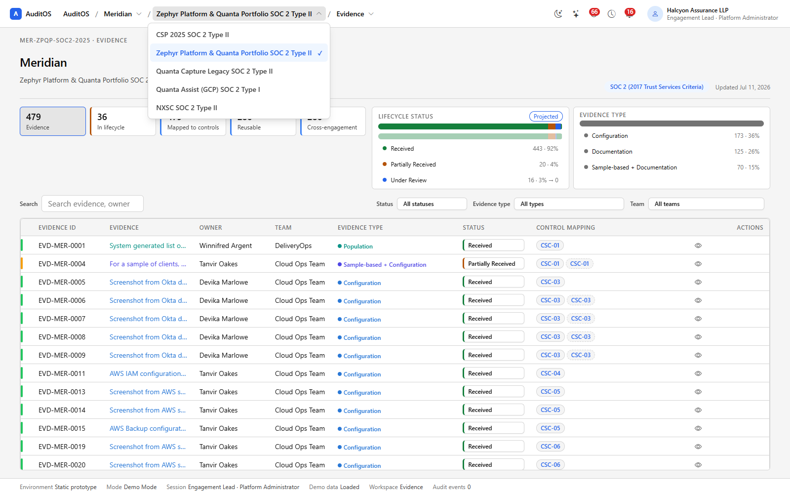

*Captured directly from the running prototype. See Appendix D, entry D.10.*

---

### Chapter 10 — Repository Architecture

*Source grounding note — a naming collision, disclosed rather than
silently resolved: `AuditOS-Knowledge-Base.md` Document 76
(`docs\04-engineering\02-Repository-Architecture.md`) is titled
"Repository Architecture," but its actual subject is the **GitHub
repository's** file/folder organization — a "Documentation-First
Repository" philosophy (`.ai/brain/`, `docs/`, `prototype/`, etc.) — not
the data-access pattern this document's Chapters 1–9 have been citing
under the same chapter number every time they wrote "Chapter 10." This
chapter follows those seven-plus prior cross-references and Part II's
architectural sequence (it sits between Navigation & Context and Shared
Audit State for a reason) rather than Document 76's literal topic.
Document 76's actual content — and its own claim that `prototype/`
contains Chart.js, which Chapter 6, Appendix C entry C.5 already found is
not vendored — is earmarked for Chapter 16 (Developer Guide) instead.
This chapter is grounded directly in `prototype/js/platform/repository.js`
(read in full for the first time in this document), cross-referenced
against every prior chapter that has already cited it.*

#### 10.1 The Single Data-Access Layer — As Documented, and As Built

**Intended architecture:** `repository.js` names itself, in its own
words, "the single data-access layer between the UI and storage" —
every workspace, wizard, and platform surface reading and writing
business entities exclusively through the entity repositories it
declares, never through demo-data JSON directly and never through
`AuditOS.state` directly.

**Current implementation, corrected against direct verification
(Issue #42 final documentation pass, Appendix C, C.17):** that intent
holds completely for *writes* — no workspace or component file calls
`AuditOS.state`'s write methods directly; every simulated create,
update, and remove goes through a repository (§10.6). It does not hold
for the *reads* ten files perform for their own primary per-engagement
business documents. Nine workspace files — `client-dashboard.js`,
`controls.js`, `engagement.js`, `evidence.js`, `findings.js`,
`program.js`, `reporting.js`, `testing.js`, and `walkthrough.js` — plus
one shared component, `prototype/components/header/header.js`, read
those documents through a `readEngagementDocument` helper that calls
`AuditOS.state.getDocument()` directly — the exact bypass this section
previously said never happens. (`header.js` declares its own local copy
of the function rather than calling `workspace-shared.js`'s; the two are
identical in implementation.) Only `ai-usage.js` and `global-approvals.js`
call a repository's own `getDocument()` for their reads. Three of the
collections the nine workspace files read — `findings`, `testing`, and
`activity` — have no entry at all in `repository.js`'s `ENTITIES`
catalog (§10.2), so routing those specific reads through a repository is
not currently possible, not merely unobserved; `header.js`'s two reads
(`evidence`, `evidence-requests`) do have catalog entries, so its case is
purely a convention not followed, not a missing seam.

**Future architecture:** Appendix C, C.17 sets out why this is a gap
between this document's own prior claim and the code (not a Release 1
vs. Release 2 vision gap), and recommends completing the migration —
adding `findings`, `testing`, and `activity` to `ENTITIES` and moving
all ten files above onto repository reads — before Release 2 needs
`repository.js` to be the one seam it swaps (§10.6, Appendix C, C.1).

Each repository wraps the Shared Audit State store (Chapter 2, §2.8)
while preserving its semantics exactly: defensive deep-clone reads,
simulated in-memory writes with `SIM-` identifier assignment, nothing
persisted, demo-data files never touched. `readEngagementDocument`
preserves the same deep-clone-read semantics (§16.5) — the gap is which
seam is called, not what either seam returns.

#### 10.2 The Entity Catalog

One catalog, `ENTITIES`, declares the platform's complete Release 1
repository coverage — twenty named repositories, each mapped to a
backing Shared Audit State collection: `clients`, `clientGroups`,
`programs`, `engagements`, `users`, `requirements`, `controls`,
`evidence`, `evidenceRequests`, `walkthroughs`, `walkthroughTeams`,
`reports`, `reportVersions`, `approvals`, `auditLogs`, `telemetry`,
`suggestions`, `engagementContext`, `dependencies`, and
`industryKnowledge`. Every one of these names is a Core Concept already
defined in Chapter 4, or a platform capability already grounded in
Chapters 4 and 8 — the entity catalog is, concretely, this document's
domain model and platform inventory converging on one list in code.

#### 10.3 The Repository Interface

Every entity repository exposes the same shape: `list()`, `get()`,
`getDocument()`, `datasetIds()`, `datasetsForEngagement()` for reads, and
`create()`, `update()`, `remove()` for simulated writes. Engagement-scoped
collections require a `datasetId`; shared collections ignore it. This
uniformity is what makes the Release 2 swap (§10.6) possible without UI
changes — every caller already depends on this shape, never on how a
given repository is implemented behind it.

#### 10.4 Audit Integration

Every repository write records exactly one immutable event through
`audit-service.js` (Chapter 4, §4.15) when that service is loaded,
carrying the acting session, the entity reference, the previous and new
values, and the caller's context (reason, workspace, correlation id).
Reads record nothing. This is `repository.js` and `audit-service.js`
wired together at the point of every mutation — not two independently
documented claims that happen to agree, but one piece of code calling the
other directly.

#### 10.5 Hierarchy Resolution

`repository.js` also owns hierarchy resolution for the router: routing
slugs for clients and engagements (`slugify`, `clientSlug`,
`engagementSlug` — deterministic, derived only from recorded identifiers,
never stored) and `resolveHierarchy`, which resolves URL segments into
Client → Engagement → Workspace → Entity. Chapter 9 established that "the
router parses nothing itself, every hash resolves through the Context
Resolver" — this is the layer underneath that: the router parses
segments, `repository.js` resolves what they mean. `listAccessibleClients`
is the same access-control seam Chapter 1, §1.9 already cited — a Release
1 session restricted only by an optional `companyIds` array, with real
access control left for Release 2.

#### 10.6 The Release 2 Seam, Confirmed in Full

Chapters 1, 2, 4, and 8 have all cited `repository.js` as the seam Release
2 replaces with AI-agent- and real-backend-driven implementations. Having
now read the file in full rather than in fragments, that claim holds
completely: nothing about the interface in §10.3 assumes simulated
persistence — `create`, `update`, and `remove` could be backed by a real
service tomorrow, called exactly the same way, by every one of the
dozens of files already grounded across this document. Release 1
repositories simulate persistence for one stated, mechanical reason: "a
portable `file://` `index.html` cannot reliably write files."

---

*D.11's entity-catalog diagram is conceptual, not a UI capture — outside Playwright's screenshot scope, and remains a placeholder for a hand-authored diagram.*

---

### Chapter 11 — Shared Audit State

*Source grounding: `AuditOS-Knowledge-Base.md`, Document 57
(`docs\01-product\02-Shared-Audit-State.md` — last modified 08/03/2026
09:56:10, the single freshest source document used anywhere in this
project so far, nine minutes newer than the Audit Lifecycle document used
in Chapter 5). The Shared Audit State itself has already been grounded in
code across Chapters 1, 2, 4, 8, and 10 (`state-store.js`,
`repository.js`, `synchronization-bus.js`, `engagement-context-service.js`,
`audit-service.js`); this chapter consolidates that grounding under the
concept's own dedicated source rather than re-deriving it, and
cross-references the gaps already logged in Appendix C rather than
re-litigating them.*

#### 11.1 The Core Principle

Document 57 calls this "the most important architectural concept within
the platform" and states plainly why: traditional audit software fails
because it is document-centric — evidence trackers, workpapers,
walkthrough documents, issue trackers, reports, and spreadsheets each
become an independent source of information that must be manually kept
consistent, and the engagement slowly fragments into multiple partially
accurate representations. This is framed explicitly as an *architectural*
problem, not an operational one (Chapter 3, §3.1 covers the same
fragmentation problem from the reader's perspective; this chapter covers
the architectural response to it). AuditOS's answer is to replace
document-centric architecture with state-centric architecture: the Shared
Audit State is the single authoritative representation of everything an
engagement currently knows, and everything else — every workspace, every
report, every recommendation — is derived from it. It is explicitly not a
document, a workpaper, a report, a checklist, a SharePoint library, a
database table, or a collection of forms.

#### 11.2 Architectural Position

Document 57 places the Shared Audit State at the literal center of the
platform:

```text
                 Human Users
                      │
                      ▼
              User Interfaces
                      │
                      ▼
               Shared Audit State
          ┌───────────┼───────────┐
          ▼           ▼           ▼
     Event Bus    AI Agents   Integrations
          │           │           │
          └───────────┼───────────┘
                      ▼
               Audit Timeline
```

Every box in this diagram already has a named, grounded Release 1
counterpart except one: User Interfaces are the workspaces (Chapter 15);
Shared Audit State is `state-store.js` behind `repository.js` (Chapters
2, 10); Event Bus is `synchronization-bus.js` (Chapter 4, §4.18); Audit
Timeline is `audit-service.js` (Chapter 4, §4.15). **AI Agents** and
**Integrations** are the two boxes with no Release 1 implementation —
consistent with Appendix C, entry C.1 (no AI agent executes yet) and with
Chapter 6's finding that Release 1 has no backend integrations at all
(the Infrastructure layer, Chapter 8, §8.2, has no Release 1 folder).

#### 11.3 Single Source of Truth

Every Engagement owns exactly one Shared Audit State, containing the
authoritative understanding of scope, requirements, controls, risks,
walkthroughs, evidence, samples, testing, observations, findings,
documentation, reports, AI recommendations, approvals, timeline, and
engagement metadata. Individual workspaces never own business data — they
visualize different aspects of this one shared understanding. This list
maps almost one-to-one onto Chapter 4's Core Concepts; the two additions
here (Risks, Samples) are domain-model entities (Domain Model, Document
56, §8.8 and §8.11) that did not make this document's required Core
Concepts list, not new discoveries.

#### 11.4 The State Evolution Lifecycle

Document 57 describes state change as a fixed, governed sequence:
Observation → Understanding → AI Recommendation → Human Review → Approval
/ Rejection → Shared Audit State Updated → Dependent Views Refresh. This
is the same lifecycle already described in Chapter 1, §1.8 and Chapter 2,
§2.6, now with its own dedicated diagram. As established there and in
Appendix C, entry C.2, the "Human Review → Approval" gate in this diagram
is the Human Approval Engine that Release 1's `state-store.js` explicitly
does not implement — the diagram describes the governed target state, not
Release 1's current one.

#### 11.5 State Integrity Rules

Document 57, §9.13 states eleven rules the Shared Audit State "shall
obey." Checked individually against Release 1 rather than accepted as a
block:

| Rule | Release 1 status |
|---|---|
| Every Engagement owns exactly one Shared Audit State | Holds — `state-store.js` loads one baseline per session |
| Only authoritative representation of engagement knowledge | Holds structurally — `repository.js` is the only sanctioned access path |
| Business objects never maintain conflicting state | Holds — single in-memory store, no duplication |
| Pages/AI agents/documents/reports never own business data | Holds — confirmed across every workspace and service file read so far |
| Every modification requires explicit approval | **Does not hold yet** — Appendix C, entry C.2 |
| Every modification generates an immutable audit event | **Partially holds** — immutable while running, not persisted; Appendix C, entry C.4 |
| Historical state is preserved / traceability is mandatory | Same caveat as above — C.4 |

Four of the eleven rules hold today without qualification; three map
directly onto gaps already logged. This chapter does not add new gap
entries — it confirms that Chapters 2 and 4's earlier findings are not
isolated observations but violations of this document's own named
integrity rules, stated in one place for the first time.

#### 11.6 Determinism, Newly Checked

Document 57, §9.11 makes one claim not yet checked in this document: "If
two users generate the same report against the same Shared Audit State,
they should receive functionally identical outputs." `report-generation-
service.js` (Chapter 5, §5.5) is a pure derivation with no `AuditOS.state`
writes and no randomness in what was read — two calls against the same
state have no mechanism by which they could diverge. This holds, and is
the one genuinely new verification in this chapter rather than a
cross-reference to an existing one.

---

*D.12's State Integrity Rules checklist is a conceptual redraw, not a UI capture — outside Playwright's screenshot scope, and remains a placeholder.*

---

### Chapter 12 — Synchronization

*Source grounding: `AuditOS-Knowledge-Base.md`, Document 100
(`docs\06-data\08-data-synchronization.md` — last modified 08/03/2026
09:56:53, the single freshest source document used anywhere in this
project, newer even than Chapter 11's). This document carries its own
accurate Release 1 status note, naming both propagation chains this
chapter verifies below. Cross-checked against `synchronization-bus.js`
(revisited) and `report-propagation-service.js` (read for the first time
in this document).*

#### 12.1 The Core Principle

Synchronization in AuditOS follows one rule: **business information is
updated once and consumed everywhere.** Business Objects are updated
once, the Shared Audit State becomes authoritative, Business Events are
published, and interested components synchronize automatically —
synchronization is a consequence of architecture, not something any
individual component implements for itself. This is Chapter 11's
"nothing requires manual synchronization" (§11.1) from the mechanism's
own dedicated chapter.

#### 12.2 The Synchronization Sequence

Document 100 describes one consistent pattern: Business Change → Human
Approval → Shared Audit State Updated → Business Event Published →
Interested Components Notified → Views Refreshed → Generated Artifacts
Regenerated. No component synchronizes directly with another — the same
"no page communicates with another page directly" rule already grounded
in Chapter 4, §4.18 and Chapter 8's dependency-direction discussion
(§8.7).

#### 12.3 Two Chains, Both Real

Document 100's own Release 1 status note claims two distinct, real
propagation chains exist in code, not one. Both are confirmed:

- **Downstream (Issue #36):** `synchronization-bus.js`'s `propagate()` walks Walkthrough → Requirements → Controls → Report → Approvals → Audit → AI Usage → Timeline → Context for walkthrough-originated changes, already grounded in Chapter 4, §4.18 and Appendix C, entry C.3.
- **Upstream (Issue #41):** `report-propagation-service.js`'s `propagate()` walks a second, independent chain, `REPORT_PROPAGATION_CHAIN` — Reporting → Findings → Testing → Controls → Evidence → Walkthrough — confirmed exported and consumed by grepping both files directly, not inferred from either document's prose. This chain fires for approved report edits: the edit's own `analyzeImpact` names only the operational domains the edited section is genuinely generated from, and hops the edit doesn't affect are skipped rather than published as no-ops — "only affected objects receive suggestions."

Both chains publish one event per hop and record each in the Audit Log
under one correlation id, so either direction of propagation is
inspectable end to end (Chapter 4, §4.15).

#### 12.4 A Second AI Extension Point, Found Here

`report-propagation-service.js` documents its own Release 2 extension
point: `analyzeImpact` returns the *structural* impact the recorded
lineage supports today; Release 2 replaces `describeImpact` — one clearly
marked function — with the AI's own reasoning about what an edit means
for each upstream object. This is a second, distinct extension point from
`draftNarrative` (Appendix C, entry C.1), not a restatement of it — it
sits in the upstream propagation path rather than the report-generation
path, and is added to C.1 below rather than opened as a new entry, since
both describe the same underlying gap: no AI agent executes in Release 1.

#### 12.5 Conflict Prevention

Conflicts are prevented architecturally rather than procedurally: the
Shared Audit State, human approval, and immutable audit events together
mean competing sources of business truth are structurally prohibited, not
merely discouraged. Failures in synchronized components — a dashboard
refresh failing, a report regeneration failing — never compromise the
Shared Audit State itself; dependent components recover independently
from published events rather than the whole platform needing to recover
together.

#### 12.6 What Remains Simulated

Both chains in §12.3 are real, shipped code — but Document 100's own
status note is explicit that both are "simulated propagation over the
Shared Audit State's in-memory writes, not a distributed event system,"
with Release 2 replacing the simulated publishers with real event
producers behind the same `publish`/`subscribe` contract. This is the
same finding as Appendix C, entry C.3, now confirmed to cover both chains
rather than only the one originally cited.

---

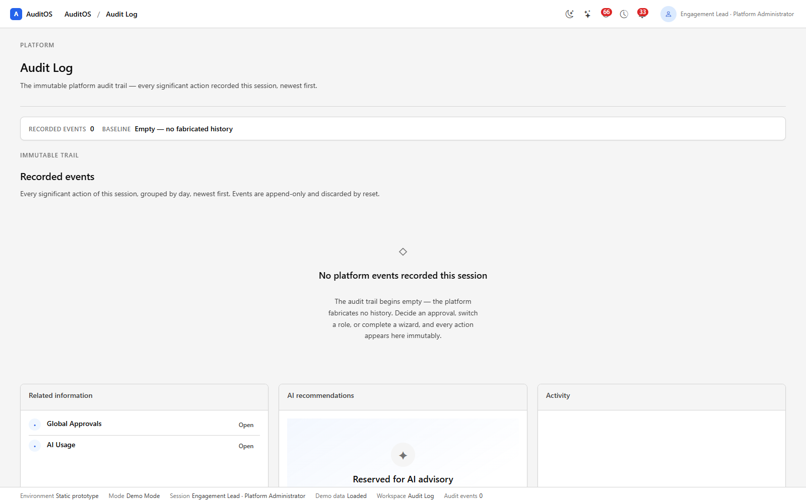

*Captured directly from the running prototype. Shows the log's general schema and layout rather than one chain filtered to a single correlation id. See Appendix D, entry D.13.*

---

### Chapter 13 — Suggestion Lifecycle

*Source grounding: `AuditOS-Knowledge-Base.md`, Document 71
(`docs\03-ai\06-Recommendation-Engine.md`), which uses the term
"Recommendation" throughout — Chapter 4, §4.13 already established that
Release 1 code uses "Suggestion" for the same concept, so this chapter
follows the code's vocabulary in its title while grounding the underlying
architecture in Document 71. Cross-checked against
`suggestion-service.js`, read this time down to its actual record schema
rather than its header comment alone — which surfaced two new,
previously unlogged findings (§13.3, §13.4).*

#### 13.1 From Answers to Proposals

Document 71 draws one deliberate distinction: most AI applications
generate answers; AuditOS generates proposals. Answers imply certainty;
proposals invite professional evaluation. Every intelligent capability in
AuditOS — narratives, summaries, classifications, comparisons,
predictions, insights, risk indicators, suggested actions — is
intentionally converted into this one standardized object, so that every
AI capability shares one vocabulary for consistency, explainability,
reviewability, governance, traceability, and provider independence,
rather than each AI feature inventing its own review mechanism.

#### 13.2 Architectural Position

The Recommendation Engine sits between AI reasoning and organizational
governance:

```text
             Shared Audit State
                     │
                     ▼
              Context Engine
                     │
                     ▼
               AI Services
                     │
                     ▼
          Recommendation Engine
                     │
                     ▼
          Human Approval Engine
                     │
          ┌──────────┴──────────┐
          ▼                     ▼
     Approved              Rejected
          │                     │
          ▼                     ▼
 Shared Audit State      Audit Timeline
```

This is the same Human Approval Engine already established as a Release 2
component in Chapters 2 and 11 (Appendix C, entry C.2) — the gate this
diagram shows between "Recommendation Engine" and either outcome does not
yet exist in Release 1. `suggestion-service.js` implements everything
above that gate (context arrives via `engagement-context-service.js`,
Chapter 4 §4.17) and everything the gate itself simulates (an audited
Repository write standing in for a real approval engine, Chapter 10
§10.4).

#### 13.3 The Documented Lifecycle vs. the Implemented One

Document 71, §23.8 names ten possible Recommendation states: Draft,
Pending, Under Review, Approved, Approved with Modification, Rejected,
Deferred, Superseded, Withdrawn, Archived. `suggestion-service.js`'s own
`STATUS` object, read directly, defines exactly six: `Suggested`,
`Reviewed`, `Approved`, `Rejected`, `Modified`, `Applied`. Six of those ten
documented states have no Release 1 counterpart at all — Draft, Pending,
Under Review (Release 1's `Reviewed` is the closest match but is not the
same state), Deferred, Superseded, Withdrawn, and Archived, seven names
in total once "Under Review" is counted as distinct from "Reviewed" —
and "Approved with Modification" is implemented as its own
independent status (`Modified`) rather than a variant of `Approved`. This
is a new finding, not a restatement of Appendix C's existing entries —
recorded as C.7.

#### 13.4 The Recommendation Structure vs. the Suggestion Record

Document 71, §23.7 specifies a thirteen-field structure every
recommendation should carry: Identifier, Category, Summary, Detailed
Explanation, Supporting Context, Referenced Business Objects, Confidence,
Expected Impact, Dependencies, Suggested Action, Approval Requirements,
Status, and Timeline Reference. Reading `propose()`'s actual record
construction, most of these have a direct counterpart (`id`, `category`,
`title`, `description`, `affectedRequirements`/`affectedControls`/
`affectedReportSections`, `applyTarget`, `status`, `auditReferences`).
Two documented fields have no clear counterpart at all (Expected Impact,
Dependencies as their own fields). One field is present but permanently
empty: **`confidence: null`**, hardcoded at creation with no code path
that ever sets it to anything else. §13.5 covers why this particular gap
is worth its own entry rather than folding into "no AI agent yet."

#### 13.5 Confidence: A Field Waiting for a Value

`confidence` is not a missing field — it is a *present, empty* one, and
the distinction matters. Six other files (`engagement.js`,
`client-dashboard.js`, `workpaper-service.js`, `walkthrough.js`,
`ai-lineage-service.js`, `ai-usage.js`) reference `.confidence`,
confirming real UI and plumbing already exist to display a confidence
value — the surface is built and waiting. What's missing is not
infrastructure but the one thing only a live AI model can produce: a
number. This is a sharper, more specific instance of Appendix C, entry
C.1 than that entry currently captures, and is recorded as its own gap
(C.8) because the recommendation for it is different — C.1's
recommendation is about labeling vision correctly; this one is about a
concrete, already-built UI surface that renders emptiness today and will
need no further construction once Release 2 supplies a real value.

#### 13.6 Where This Lives in Release 1 Today

Every suggestion follows Suggested → Reviewed → Approved → Applied (or
Rejected / Modified). Users without the `suggestions.decide` capability
(Chapter 8, §8.3) may review, comment, and recommend; permissioned users
may approve, reject, modify, and apply — the same hidden-not-disabled
pattern as every other gated action in the platform. Commenting itself
carries no capability gate at all: Document 71's "professional evaluation"
philosophy (§13.1) extends to letting anyone contribute review input,
while reserving decisions for permissioned reviewers. Every transition is
a simulated, audited Repository write (Chapter 10, §10.4); applying a
suggestion additionally publishes the downstream propagation chain
(Chapter 12, §12.3).

---

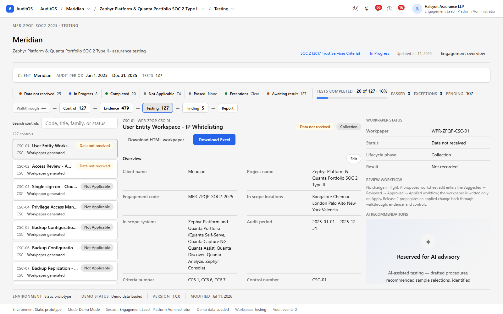

*Captured directly from the running prototype. A Suggestion detail drawer with an empty Confidence field specifically was not isolated as its own capture; this workpaper view names the same lifecycle in its own Review Workflow copy. See Appendix D, entry D.14.*

---

### Chapter 14 — Telemetry Architecture

*Source grounding note: unlike every prior chapter in Part II, no
dedicated `docs/` source names Token Accounting, Cost Attribution, Model
Accounting, Provider Accounting, Caching, or Billing — a direct text
search for these terms across the entire knowledge base returned no
matches outside of CSS design tokens, which are unrelated. This is the
same situation as Program, Context, and Synchronization in Chapter 4:
a code-first concept, grounded directly in
`prototype/js/workspaces/ai-usage.js` and
`prototype/demo-data/ai-telemetry.json`. Document 122
(`docs\08-workspaces\11-ai-workspace.md`) documents a broader, more
aspirational "AI Workspace" vision at the level of Recommendation
Centers, Agent Explorers, and Safety Centers; it is cited only where it
overlaps with what Release 1 actually implements.*

#### 14.1 AI Usage: Observability Ahead of the Agents

`ai-usage.js` is an administrator-only platform surface, gated by the
`ai-usage.view` capability (Chapter 8, §8.3's hidden-not-disabled
pattern), for AI operational telemetry and spend accounting. Its own
header comment states it was "rebuilt on the complete Release 2
telemetry schema" — meaning Release 1 ships the full observability
surface before any AI agent exists to generate real events for it
(Appendix C, entry C.1). Every number renders from
`prototype/demo-data/ai-telemetry.json` through the Repository
Foundation (Chapter 10) — nothing hardcoded — with aggregation rolling
up the platform hierarchy (Platform → Client → Program → Engagement →
Requirement → Control → Evidence) from the attribution each event
carries, the same hierarchy Chapter 9 already established for
navigation.

#### 14.2 Token Accounting

Every telemetry event records token usage as four figures:
`input`, `output`, `cacheRead`, and `cacheWrite`. A real record from the
demo dataset (`TEL-2026-0001`) reads `input: 12902, output: 932,
cacheRead: 0, cacheWrite: 2580` — confirming the schema is not a flat
token count but already distinguishes cache-read and cache-write tokens
from ordinary input/output, a distinction that only matters once a real
model provider with prompt caching is behind these events.

#### 14.3 Cost Attribution

Each event carries `costUsd` directly (e.g. `0.0176` for the same
record), plus `billable` (boolean) and `billingCategory` (e.g.
`"internal"`). The demo dataset's own metadata declares a
`blendedHourlyRateUsd` of 175 and a currency of USD — the assumption
`estimatedHoursSaved` figures are costed against. Cost is therefore
attributed at the level of one AI operation, then rolled up the same
platform hierarchy token counts use, not tracked as a single aggregate
platform-wide number.

#### 14.4 Model and Provider Accounting

Each event names its `provider` (e.g. `Anthropic`, `OpenAI`) and
`model` (e.g. `claude-haiku-4-5`, `gpt-5`) explicitly and independently
— confirming Chapter 1's provider-neutrality principle (§1.6) is
represented at the data level, not just asserted architecturally: the
schema has no privileged provider field, and the demo dataset itself
mixes providers across events.

#### 14.5 Caching

Caching is represented at the token level (§14.2's `cacheRead` /
`cacheWrite`) rather than as a separate concept — there is no
independent "cache" object, only cache-attributed tokens on each event.
This is a narrower implementation than a dedicated caching subsystem
might imply, but it is sufficient to compute cache-driven cost savings
once real provider billing is behind these numbers.

#### 14.6 Billing

`billable` and `billingCategory` together distinguish AI operations an
organization would charge to a client from ones it would not — the
concrete data-level implementation of Chapter 1, §1.3's "AI accelerates
execution; humans remain accountable for outcomes" applied to cost
rather than judgment. This is real schema, populated in demo data, not
a placeholder: every one of the sampled events carries both fields with
a definite value, never null.

#### 14.7 A Second, Different Confidence Field

`ai-telemetry.json` events carry `confidence` (e.g. `0.62`) and
`qualityScore` populated with real numbers — in contrast to Chapter 13,
§13.5's finding that live Suggestion records are created with
`confidence: null`. This is not a contradiction: telemetry events are
static demo data representing hypothetical past AI operations (the
dataset's own metadata names a deterministic generation seed), while
Suggestion records are created live by `propose()` with nothing yet to
populate that field from. The schema anticipates confidence data
flowing from real operations in both places; only the telemetry demo
data currently has any to show.

#### 14.8 Future AI Accounting

The telemetry dataset's metadata reserves four fields Release 1 does not
yet populate at all: `sessionId`, `promptId`, `evaluationId`, and
`guardrailVerdict` — present in the schema contract, absent from every
sampled event, reserved explicitly for Release 2. This is the same
forward-compatibility pattern Appendix A already records for
`engagement.js`'s array-driven frameworks field, now confirmed at the
data-schema level for telemetry specifically: the header comment states
plainly that "schema fields Release 1 does not yet exercise stay part
of the dataset
for Release 2 compatibility."

#### 14.9 Where This Closes Part II

Telemetry closes the platform layer this document has covered since
Chapter 8: state and routing (Ch. 8–9), the data-access layer (Ch. 10),
the state the platform protects (Ch. 11), how change propagates through
it (Ch. 12), how AI proposes changes to it (Ch. 13), and now how every
AI operation against it — real or, today, entirely simulated — gets
measured. Every chapter in Part II has pointed at the same underlying
fact from a different angle: Release 1 builds the complete governed
structure first, and reserves clearly marked seams for the intelligence
Release 2 adds behind it.

---

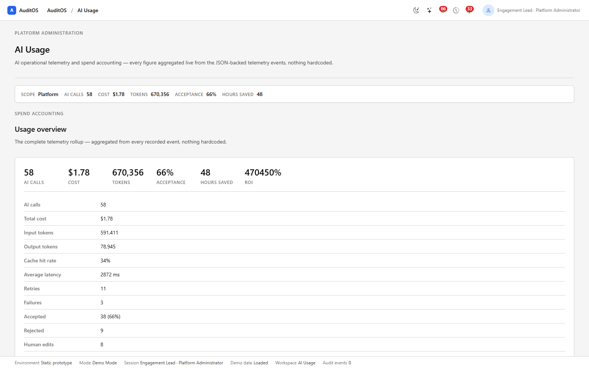

*Captured directly from the running prototype. See Appendix D, entry D.15.*

---

### Chapter 15 — Workspace Guide

*Source grounding: this chapter is grounded directly in each of the
twelve workspace files' own header comments, read for the first time in
this document (`home.js`, `client-dashboard.js`, `walkthrough.js`,
`evidence.js`, `controls.js`, `testing.js`, `findings.js`,
`reporting.js`, plus `ai-usage.js`, `audit-log.js`, `global-approvals.js`,
and `engagement.js`, all previously grounded). Matching specs exist under
`docs\08-workspaces\`; given twelve workspaces in one chapter, each
subsection is grounded in its own code file first, with the matching
docs/ chapter cited only where it adds something code alone does not
already establish — a deliberate depth trade-off, disclosed rather than
silently applied, to keep this chapter's length proportionate to the
document as a whole. Added during the Issue #42 final documentation pass:
§15.13 verifies `client-wizard.js` and `engagement-wizard.js` — two of
`prototype/js/workspaces/`'s fifteen files that no earlier chapter had
read, found by directly counting the directory rather than assuming
Chapter 15's twelve-workspace scope was exhaustive.*

#### 15.1 Home

The Global Home workspace is deliberately narrow: it answers exactly one
question, "which client do I work with now?" Home no longer presents
engagement summaries, evidence cards, reports, or activity feeds — its
only action anywhere on the page is selecting a client. This is worth
stating precisely against Appendix D, entry D.1's description ("one entry
point, engagement-centric navigation"): Home is *client*-centric, not
engagement-centric — the top of the hierarchy (Chapter 9, §9.2), not a
dashboard. Users always start here, and Home never automatically reopens
a previous client — resuming is always an explicit choice, never an
inferred one.

#### 15.2 Client

`client-dashboard.js` is the client level of the same hierarchy: a
module-driven operational portfolio workspace showing engagement health,
portfolio progress, team/POC workload, AI advisory signals, and
cross-entity search before a user drills into one engagement's own
workspaces. Completed engagements stay visible but read-only — collapsed
by default, contributing to no operational metric — so portfolio
aggregates always reflect active work, never inflated by closed
engagements.

#### 15.3 Engagement

Already grounded in full in Chapter 5, §5.4: the operational entry point
into one audit, organized around the six-stage pipeline (Walkthrough →
Evidence → Controls → Testing → Findings → Reporting) with per-connector
health. Nothing new to add here beyond the cross-reference — this
workspace is the one this document has verified most thoroughly of the
twelve.

#### 15.4 Walkthrough

The Walkthrough workspace implements the Team → POC operating hierarchy
from Chapter 4, §4.5–§4.6 directly: one Walkthrough Workspace per Team, a
roster of Teams and their operational readiness at the top level, each
Team's command center (scheduling, ingestion, dependencies, AI
Suggestions, Industry Knowledge) one level down, each POC's detail below
that. Route depth comes from `repository.js`'s `resolveHierarchy`
(Chapter 10, §10.5) — this workspace only renders what the resolved
context names. Unlike Controls, Evidence, and Testing, Walkthrough is
**not** purely read-only in Release 1: scheduling, ingestion, comments,
and the Suggestion Lifecycle (Chapter 13) all go through real, audited
Repository writes — AI still never writes directly, but humans acting in
this workspace do.

#### 15.5 Evidence

Evidence is, in its own header's words, "the operational object of an
engagement" — the direct implementation of Chapter 9, §9.8's finding that
Requirements was removed as a user-facing workspace in its favor. The
surface is deliberately consolidated (filters, metrics, table, drawer,
workflow — nothing else); the search strip, framework strip, and AI
recommendations panel that once existed were removed, not merely
unbuilt. This is the workspace Chapter 3, §3.5 already grounded in detail
via `evidence-lifecycle.js`'s one canonical status vocabulary.

#### 15.6 Controls

Controls visualizes the evolving control library for an engagement — a
faithful visualization of current control JSON today, with Release 2
named explicitly as where AI agents would draft, refine, deduplicate,
retire, and propose controls. Its own header is precise about what it
will not do even then: never fabricating a mapping, a relationship, or a
history. This is the same evidence-status vocabulary workspace already
grounded in Chapter 3, §3.5 from the consuming side.

#### 15.7 Testing

Testing is where "audit knowledge becomes audit assurance" — validating
controls using evidence, not a standalone activity. Its header names the
same Release 2 seam pattern as Controls (AI agents would draft test
procedures, recommend samples, identify gaps, evaluate evidence, propose
conclusions) while stating Release 1 renders only current testing state
and never infers a business conclusion. Architecturally identical to
Engagement, Walkthrough, Evidence, and Controls — Business → ViewModel →
Components → DOM, one `collectViewModel` read of `AuditOS.state`.

#### 15.8 Findings

Rebuilt by Issue #41 as a true Observation Register, Findings moves every
observation through one governed lifecycle: **Detected → AI Drafted →
Under Review → Management Response → Accepted → Resolved → Closed**. The
"AI Drafted" state name is notable: a direct search of every demo-data
file found zero records in that state — the lifecycle names a state no
current data occupies, consistent with Appendix C, entry C.1 (no AI agent
runs in Release 1) rather than contradicting it. The workspace's
three-column Workbench layout (Register / Details / AI Suggestions ·
History · Propagation · Approvals) is shared with Controls, Testing, and
Reporting — one layout, not four independent ones.

#### 15.9 Reporting

The Reporting workspace is where the living report (Chapter 5, §5.3,
§5.5) is read, traced to sources, edited through approval, versioned, and
exported — not a document produced at the end of the audit, but one that
exists from engagement creation onward. Its three-column layout (Report
Navigator / Selected Report / AI Suggestions · History · Approvals ·
Lineage) is the same shared Workbench as Findings. Editing a report
section here is what triggers the upstream propagation chain grounded in
Chapter 12, §12.3.

#### 15.10 AI Usage

Already grounded in full in Chapter 14: the administrator-only telemetry
and spend-accounting surface, built on the complete Release 2 schema
ahead of any agent that would generate real events for it.

#### 15.11 Audit Log

The Global Audit Log is the platform-wide surface of the immutable audit
trail (Chapter 4, §4.15) — every event the Platform Audit Service has
recorded this session, newest first, with the complete schema inspectable
per event. Its own header states plainly: "honestly empty at baseline:
the demo dataset fabricates no history, so the log begins empty and fills
as simulated actions are performed... reset discards the trail with every
other simulated write." This is a second, independent, UI-level
confirmation of Appendix C, entry C.4 — the same finding, now visible in
the workspace a user would actually open to check.

#### 15.12 Global Approvals

The one actionable approval inbox of the platform, redesigned around an
inbox interaction model (Outlook / pull-request style): a searchable,
filterable rail of everything awaiting a decision, and an inspector where
the decision happens. Its own header is specific about scope: three live
approval types route through it today — evidence awaiting review,
evidence requests awaiting review, and Approval Workflow requests — "and
the remaining platform types stay honestly reserved." Notably, this list
does **not** include Suggestion decisions (Chapter 13) — `walkthrough.js`
describes Suggestions being approved within the owning workspace's own AI
Suggestions panel instead. This document has not verified whether that is
the complete picture or whether some Suggestions also surface here; it is
stated as an observed structural distinction between two named approval
surfaces, not a confirmed architectural rule, and is a candidate for
deeper verification if a future chapter revisits approvals specifically.
Tracked formally in Appendix C, C.19.

#### 15.13 Client & Engagement Creation Wizards

`prototype/js/workspaces/` holds fifteen files, not twelve — Program was
already grounded in Chapter 4, §4.2, and two further files verified here
for the first time complete the count: `client-wizard.js` and
`engagement-wizard.js` (both GitHub Issue #34). Both are real,
capability-gated, multi-step creation flows, not placeholders: the Client
Wizard captures eight steps (Client Details, Business Information,
Services, Technology Stack, Contacts, User Access, Programs, Review) and
the Engagement Wizard captures seven (Client, Engagement Details, Audit
Period, Scope, Program, Team, Review), each ending in a review step that
reads back everything captured before anything is created. Every
selectable option is derived from real records — the Engagement Wizard's
`deriveEngagementTypes` reads the distinct `engagementType` values the
dataset's own records already carry rather than a fabricated list, the
same "never invent a list" discipline Appendix E already names as a
Design Principle.

Both wizards are Repository-backed exactly like every other write path
this document has verified: completing one creates its record (a client,
or an engagement and, when a program is chosen, appends it to that
program) through the Repository Foundation's simulated write pipeline,
recording an immutable Platform Audit Service event (Chapter 4, §4.15) —
nothing touches demo-data files, and a reset discards the simulated
record like every other simulated write in Release 1 (Appendix C, C.4).
Both are capability-gated (`clients.create`, `engagements.create`
respectively) using the same hidden-not-disabled Permission Notice pattern
as every other gated action (Chapter 8, §8.3), and both reuse one shared
wizard engine (`components/wizard/wizard.js`) rather than each inventing
its own step chrome — the same "never bespoke primitives" rule Chapter
16, §16.4 already states for every workspace.

---


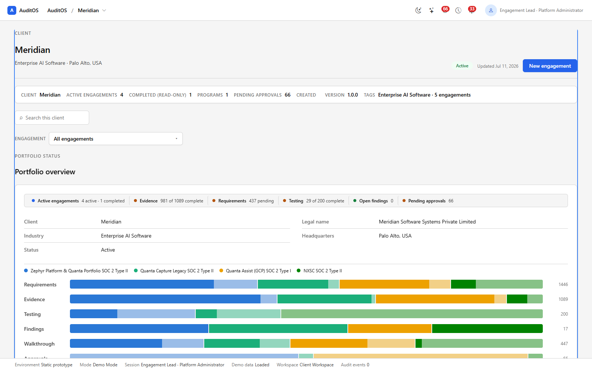

*Captured directly from the running prototype. Together with Chapter 5's Engagement capture, these three show the hierarchy narrowing at each click (Appendix D, entry D.16).*

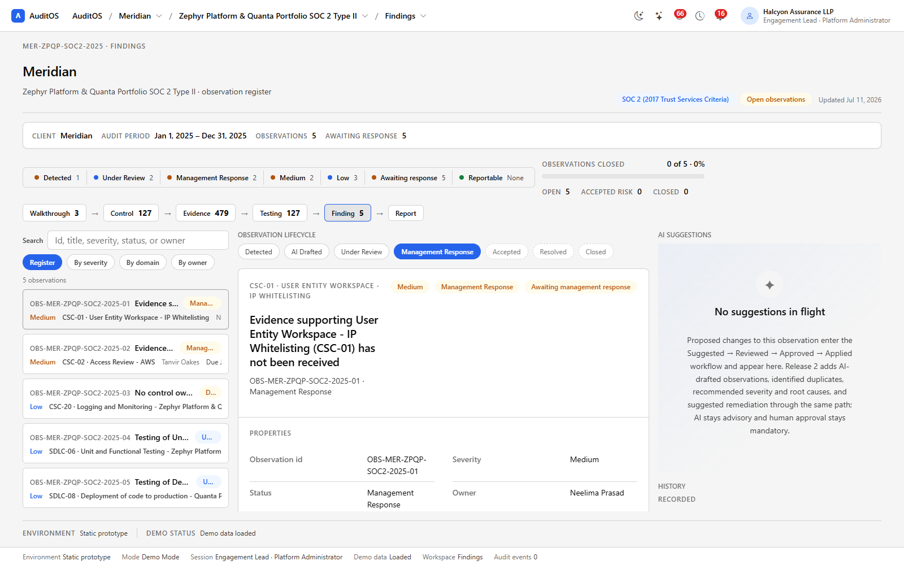

*Captured directly from the running prototype. See Appendix D, entry D.17.*

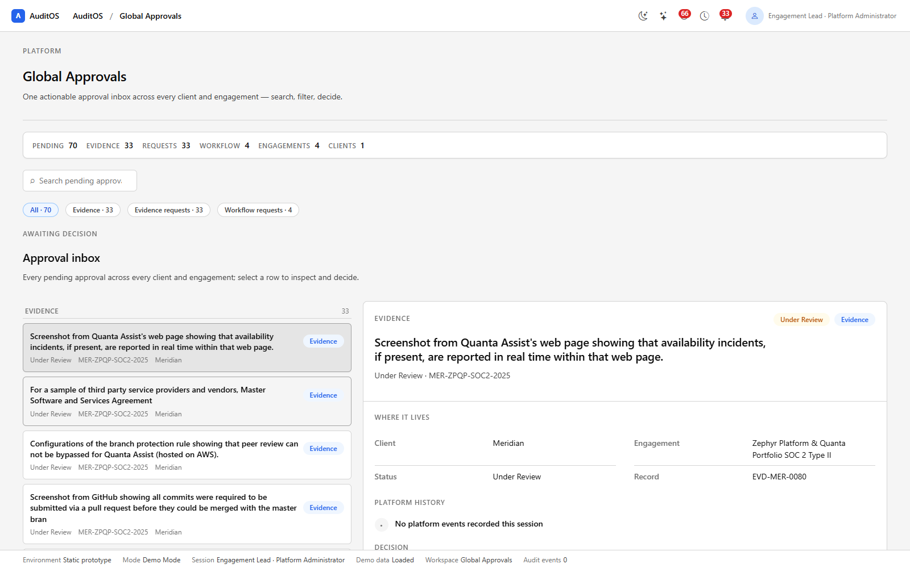

*Captured directly from the running prototype. See Appendix D, entry D.18.*

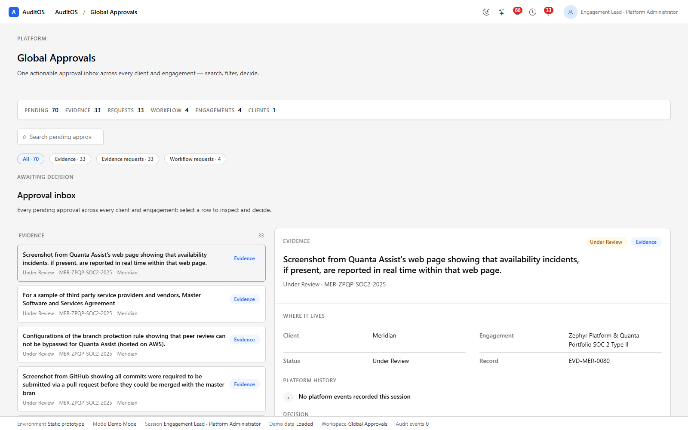

*Captured directly from the running prototype — the same "Reviewing" state Appendix D, entry D.18 describes, reached by selecting a rail item.*


*Captured directly from the running prototype. Only the single populated-this-session state was captured, not a true reset-to-empty-then-filled pair. See Appendix D, entry D.19.*

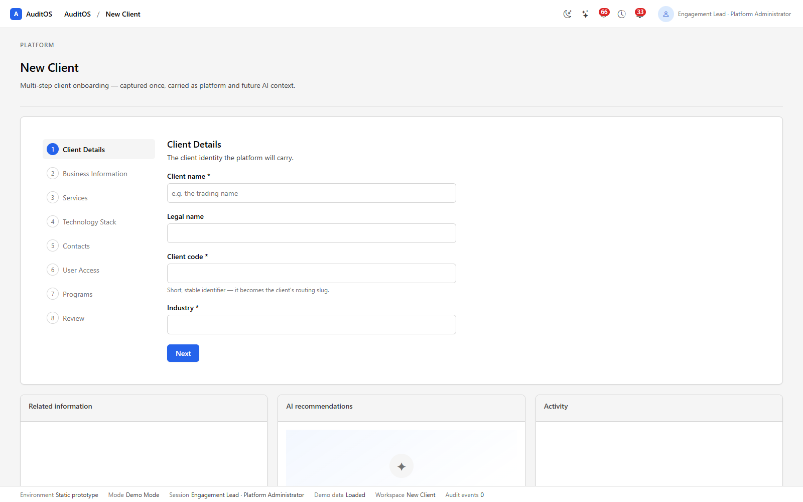

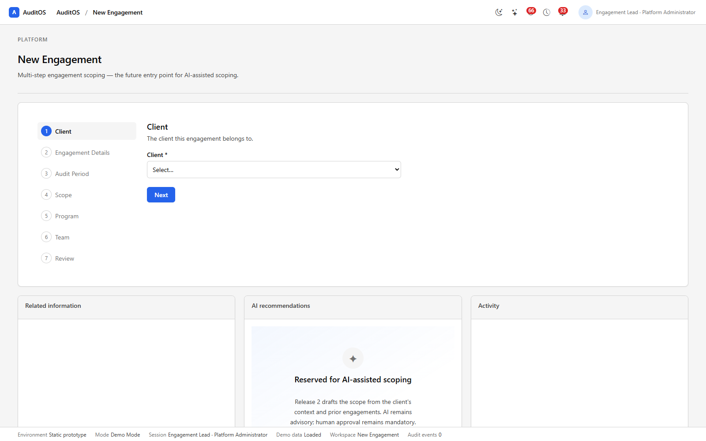

*Captured directly from the running prototype. Neither wizard's mid-flow or Review step specifically was captured — both show the wizard's opening step. See Appendix D, entry D.25.*

---

### Chapter 16 — Developer Guide

*Source grounding: this is the chapter Appendix C, entries C.5 and C.6
pointed at. Document 190 (`docs\15-implementation-guide\06-static-prototype.md`)
supplies the corrected technology stack and project structure; Document
76 (`docs\04-engineering\02-Repository-Architecture.md`) supplies the
repository-organization content under a heading that deliberately does
not reuse "Repository Architecture," per C.6's own recommendation.
Cross-checked against `tools/validate.js`, `tests/README.md`, and the
architectural pattern already confirmed verbatim across every workspace
and service file read in this document.*

#### 16.1 The Actual Technology Stack

Corrected against Document 190's stated stack (Appendix C, entry C.5):
Release 1 is vanilla HTML5, CSS3, and JavaScript loaded as classic
`<script>` tags — never ES Modules — plus exactly two vendored
libraries, Bootstrap and Bootstrap Icons, loaded locally rather than from
a CDN. No charting library, table library, rich-text editor, PDF/Excel
library, or animation library is present anywhere in `prototype/vendor/`.
This is not a partial implementation of a larger planned stack; it is the
complete stack, chosen because ES Modules cannot load correctly from a
`file://` URL without a server, and this project's one hard constraint
(CLAUDE.md; Chapter 6, §6.2) is that the application must run by opening
`index.html` directly.

#### 16.2 The Actual Project Structure

```text
prototype/
├── index.html
├── js/
│   ├── main.js
│   ├── platform/       (10 files — Chapter 8, §8.3)
│   ├── services/       (13 files — Chapter 8, §8.4)
│   ├── state/          (2 files — Chapter 8, §8.5)
│   ├── router/          (2 files — Chapter 8, §8.5)
│   └── workspaces/      (15 files — Chapter 15)
├── css/                 (26 files)
├── components/           (component library, presentation system)
├── demo-data/            (~79 JSON files across 15 domains)
├── vendor/                (bootstrap, bootstrap-icons only)
├── tools/                 (validate.js, generate-demo-data-bundle.js)
└── tests/                 (smoke, unit, integration, and more)
```

This supersedes Document 190's illustrative `assets/`, `pages/`,
`data/` layout — that structure was never built (Appendix C, entry
C.5); the layout above is what exists on disk today.

#### 16.3 Repository Organization Philosophy

Document 76 — despite its misleading title, see Chapter 10's grounding
note and Appendix C, entry C.6 — describes a "Documentation-First
Repository" philosophy worth preserving under its own name here: the
repository should communicate architecture before code, and exists to
answer five questions — what is AuditOS, why does it exist, how is it
architected, how should it be built, how should it evolve. Document 76's
principle that "files that do not improve understanding should not exist"
is the same spirit behind this document's own Cleanup Plan (Appendix B) —
and, as of the Issue #42 Phase 5 cleanup, the principle this repository's
top-level structure now actually embodies rather than only aspires to.

**Updated by the Issue #42 cleanup (Appendix B):** at the time Chapters
1–15 were written, this section named `.ai/` and `docs/` as existing
top-level folders. Both were retired in the same session that completed
this document: `.ai/`, `.zoo/`, and the seventeen `docs/` subfolders
other than `docs/architecture/` (194 tracked files) were deleted once
this canonical document and `AuditOS-Knowledge-Base.md` were confirmed to
already preserve everything of value they contained (Appendix B, items
1–3). The repository's actual top-level structure today is: `AUDITOS.md`
(this document — the single canonical source), `AuditOS-Knowledge-
Base.md` (the archival citation source every "Document N" reference in
this document points into), `docs/architecture/` (three files this
project's own reading rules treat as a second live source, alongside the
Knowledge Base), `images/` (the screenshots Chapter 15 onward embeds),
`prototype/` (the working implementation, §16.1–§16.2), and
`graphify-out/` (the generated knowledge graph CLAUDE.md directs queries
to, untouched by the cleanup per explicit instruction). `mdmaker.ps1`,
the script that had generated `AuditOS-Knowledge-Base.md` from the
now-removed folders, was removed alongside them (Appendix B, item 4) —
its output already exists and this document's methodology no longer
treats it as something regenerated on demand.

#### 16.4 The Architectural Pattern Every Workspace Follows

One sentence, close to verbatim, appears in the header comment of every
workspace file read across this document: *"Architecture: Business →
ViewModel → Components → DOM."* Concretely: `collectViewModel` is the
single place a workspace reads `AuditOS.state` (via the Repository
Foundation, Chapter 10), returning a declarative model of pure,
offline-testable derivations; the renderer then configures the Shared
Workspace Framework's inherited skeleton and fills its slots with
compositions from the Enterprise Data Presentation System — never
bespoke primitives, never duplicated components. A developer adding a
workspace is expected to follow this same four-stage shape, not invent a
new one.

#### 16.5 Two Boundaries — One Held Without Exception, One Only Partially

Two architectural rules recur, stated almost identically, across dozens
of files already read in this document. Direct verification during the
Issue #42 final documentation pass found they do not hold with equal
strength:

1. **`js` depends on nothing in `components/`** — "keeping the js →
   components boundary one-way" (Chapter 8, §8.7). Components never call
   back into workspace or service code. No exception found anywhere in
   this document's file-by-file grounding.
2. **Business data writes flow only through the Repository; business
   data reads mostly do, but not always** — no workspace or component
   calls `AuditOS.state`'s write methods directly (§10.6), and none
   reads raw demo-data JSON directly. But nine workspace files —
   `client-dashboard.js`, `controls.js`, `engagement.js`, `evidence.js`,
   `findings.js`, `program.js`, `reporting.js`, `testing.js`, and
   `walkthrough.js` — plus the header component
   (`prototype/components/header/header.js`) read their own primary
   per-engagement documents through a `readEngagementDocument` helper
   that calls `AuditOS.state.getDocument()` directly rather than a
   repository's `getDocument()`. This document previously stated flatly
   that no workspace reads state any other way; that statement was
   wrong, not a simplification — corrected here and logged as Appendix
   C, C.17, with the corrected architecture also carried back into
   Chapter 10, §10.1.

Boundary 1 is a convention enforced by consistent authorship, not by a
build-time linter or type system — Release 1 has neither (§16.6 below).
Boundary 2's write half is the same kind of convention, held without
exception; its read half is not fully enforced in the code as it exists
today, independent of tooling.

#### 16.6 Running and Validating the Prototype

Running the application requires nothing: open `prototype/index.html`
directly in a browser. Two separate, Node-based tools exist for
*developers*, and neither is part of what ships — this is a real
distinction, not a contradiction of the zero-build promise, since an end
user never runs either:

- **`node prototype/tests/run-tests.js`** — offline, dependency-free tests using the Node standard library only, no test framework, no npm dependency, no browser. Suites (smoke, unit, integration, plus accessibility/animation/responsive/visual-contract per Session 1's inventory) are auto-discovered from `*.test.js` files; a suite registers cases via `harness.test(name, fn)` and asserts with Node's own `assert.strict`.
- **`node prototype/tools/validate.js`** — renders `index.html` in a headless browser (Playwright) to check the live DOM and console; explicitly never installs Playwright or browsers itself, only uses an already-installed copy.

The two are complementary by design: `run-tests.js` validates source
contracts directly with no browser; `validate.js` validates what a real
browser actually renders. Both require Node on the developer's machine;
neither is required to use the application itself.

#### 16.7 Adding to the Codebase

Extending Release 1 means working within the patterns this chapter and
Chapter 8 already establish: a new workspace follows §16.4's four-stage
shape and registers in `workspace-registry.js` (Chapter 9, §9.2); a new
platform capability goes in `platform/` or `services/` depending on
whether it is core state/audit machinery or application-layer
orchestration (Chapter 8, §8.2's layer mapping); any new business entity
gets a repository entry in `repository.js`'s `ENTITIES` catalog (Chapter
10, §10.2) before anything *writes* it — every simulated create, update,
and remove in this codebase does go through a repository, without
exception (§10.6). The equivalent claim for *reads* does have a known
exception: `findings`, `testing`, and `activity` are read directly from
`AuditOS.state` by nine workspace files with no `ENTITIES` catalog entry
of their own (§10.1, §16.5; Appendix C, C.17) — a gap to close, per that
entry's recommendation, before treating a catalog entry as a precondition
for reads the way it already is for writes.

---

*D.20's three-way terminal split is a developer-tooling capture (browser tab plus two terminal windows), not a single page a browser screenshot can produce — outside Playwright's `page.screenshot()` scope, and remains a placeholder.*

---

### Chapter 17 — Release 2 AI Architecture

*Source grounding: `AuditOS-Knowledge-Base.md`, Documents 66–74
(`docs\03-ai\01-AI-Architecture.md` through `08-AI-Orchestration-
Architecture.md`, plus `docs\03-ai\Implementation Context.md`) — the
eight chapters the underlying documentation calls "Part IV — AI
Operating System," compressed here into the one chapter this document's
own approved Table of Contents allocates to it (Part V; Part VI, Chapter
18, is reserved for instantiating this architecture per agent). Document
71 (`06-Recommendation-Engine.md`) was already the grounding source for
Chapter 13 and is cross-referenced rather than re-derived. Cross-checked
directly against `prototype/js/services/ai-lineage-service.js` (read in
full for the first time — Chapter 8, §8.4 named it under "AI provenance"
but deferred verifying it), and re-read against `suggestion-service.js`,
`engagement-context-service.js`, `synchronization-bus.js`,
`dependency-service.js`, `industry-knowledge.js`, `permissions.js`,
`ai-telemetry.json`, and every file under `prototype/demo-data/suggestions/`.*

#### 17.1 Eight Documents, One Chapter

The underlying documentation devotes eight chapters to what it calls the
AI Operating System: AI Architecture, AI Agent Architecture, Event Bus
Architecture, Human Approval Engine, Context Engine, Recommendation
Engine, AI Memory and Knowledge Architecture, and AI Orchestration
Architecture. This canonical document's Table of Contents does not
mirror that structure — it allocates one chapter, 17, to all of it, and
reserves Chapter 18 for the seven-agent instantiation Part VI already
names (Documentation, Walkthrough, Controls, Evidence, Testing, Findings,
Reporting — Chapter 7, §7.3). Document 71's Recommendation Engine
chapter is the exception: Chapter 13 already read it in depth against
`suggestion-service.js`'s actual record schema, so this chapter treats
that ground as covered and cross-references it rather than repeating it
(§17.6).

#### 17.2 The Architecture as a Single System

Read together, Documents 66–73 describe one continuous pipeline, not
seven independent systems: the Shared Audit State (Chapter 11) supplies
knowledge; the Context Engine assembles understanding from it; AI
Services and Agents reason from that understanding; the Event Bus
(Chapter 12, under the name Synchronization) carries the facts that
trigger and connect all of it; the Recommendation Engine (Chapter 13,
under the name Suggestion) standardizes what reasoning produces; the
Human Approval Engine gates every one of those proposals before it can
change the Shared Audit State; and the Orchestration Engine coordinates
which of these capabilities runs, when, and under what policy, without
itself reasoning. Document 66 names the Shared Audit State the
platform's "brain," the Event Bus its "nervous system" (Document 68,
§20.20), the Human Approval Engine its "conscience" (Document 69,
§21.20), and the Orchestration Architecture its "scheduler" (Document
73, §25.20) — four self-consistent metaphors across four independently
authored documents, describing one architecture. Nothing in this
pipeline executes in Release 1 today; §17.12 inventories exactly how much
of it already has a seam.

#### 17.3 AI Is Stateless; Humans Remain Central

Document 66's governing decision (§18.6) is that Artificial Intelligence
owns reasoning and nothing else — no engagement knowledge, no permanent
memory, no authority. Every operational fact lives in the Shared Audit
State; changing AI providers or replacing a model never requires
migrating business data. This is the same separation Chapter 2 already
established for the Shared Audit State generally, restated here
specifically for AI: the permanent split between what AI performs
(observation, analysis, correlation, drafting, recommendation,
explanation, organization, summarization — §18.4) and what remains
exclusively human (judgment, interpretation, skepticism, materiality
assessment, approval, accountability, client communication, final
conclusions). Document 66 describes the end state as AI becoming
"infrastructure" — "always available, rarely noticed" (§18.17) — a
considerably more ambient vision than anything Release 1 attempts today;
consistent with that gap, `Implementation Context.md` itself already
scopes Release 1's AI regions as "reserved presentation surfaces only,"
with AI remaining advisory and human approval mandatory.

#### 17.4 The Event Bus: Release 1 Already Built One

Of every component in this architecture, the Event Bus is the one
Release 1 implements most completely. Document 68's core principle —
"nothing talks directly to anything else" (§20.3) — is exactly what
Chapter 12 already found built into `synchronization-bus.js`: workspaces
publish and subscribe, never call each other directly. Document 68,
§20.8 requires events to describe completed facts, not intentions
("Evidence Uploaded" is correct; "Process Evidence" is not) —
`synchronization-bus.js`'s own `EVENT_TYPES` vocabulary
(`walkthrough-updated`, `controls-updated`, `evidence-updated`, and nine
others) follows exactly that convention, and its header comment cites the
same rule under a different name ("Coding Standards §30.13 — Event
Standards"), independent confirmation that this principle was already
enforced before this document ever cited Document 68. The one gap
already logged against this component (Appendix C, C.3) still holds:
both of Release 1's chains (`PROPAGATION_CHAIN` and
`REPORT_PROPAGATION_CHAIN`) are scripted simulations of the fan-out
Document 68 describes, not independently triggered events from each
downstream workspace. No new gap found here — this is the strongest
architectural match between vision and code this document has found,
alongside Chapter 9's equivalent finding for Navigation & Context.

#### 17.5 The Context Engine: A Noun in Release 1, a Verb in the Vision

Document 70 specifies six responsibilities — discovery, selection,
assembly, optimization, validation, delivery (§22.5) — performed fresh
for every AI interaction, filtered by the requesting user's permissions
before assembly (§22.14), and drawn from six layered scopes (Engagement,
Business, Operational, Relationship, Historical, Organizational context —
§22.9). It is, by its own description, a live process: something that
runs, decides, and compresses, every time.

`engagement-context-service.js` (Chapter 4, §4.17) is not that. It is a
single stored record per engagement — one fixed set of fields
(`workingMemory`, `observedEvidence`, `assumptions`, `dependencyIds`,
`suggestionIds`, `timeline`, `industryKnowledgeIds`, `confidence`,
`affectedRequirements`, `affectedControls`, `affectedReportSections`,
`auditReferences`) that only the Synchronization Bus ever writes and
every page reads unfiltered and read-only. Nothing selects, compresses,
or validates it per task; nothing checks the reading session's
permissions before returning it; there is no equivalent of Document 70's
context layers, only one flat record. This is a real, previously
unflagged distinction — not a contradiction of anything Chapter 4 or
Chapter 11 already stated (both described the record accurately for what
it is), but a gap between the noun Release 1 built (a Context) and the
verb Document 70 specifies (a Context Engine that assembles one).
Recorded as Appendix C, C.10.

#### 17.6 The Recommendation Engine: Already Covered, One New Nuance

Chapter 13 already read Document 71 against `suggestion-service.js` in
full — the six-of-ten lifecycle states (C.7) and the permanently null
`confidence` field (C.8) are not repeated here. One nuance surfaced only
by reading the actual demo dataset for this chapter: Document 71, §23.6
specifies five recommendation categories (Documentation, Analysis,
Governance, Operational, Knowledge), and Chapter 13, §13.4 confirmed
`category` exists as a field on the Suggestion record. The values that
field actually holds in `prototype/demo-data/suggestions/*.json` —
`evidence`, `agenda`, `requirements` — are operational domain tags, not
any of Document 71's five category names. The field exists; its
populated vocabulary does not yet match the one the vision specifies.
Folded into Appendix C, C.8 as an addendum rather than a new entry, since
it is the same underlying gap (a structurally present field with no live
categorization logic behind it) viewed from its data rather than its
schema.

#### 17.7 The Human Approval Engine: Confirmed Absent, One Documentation Inconsistency

Chapter 2, §2.8 and Chapter 11 already established that no Human Approval
Engine exists anywhere in Release 1 — a direct text search of
`prototype/js` for the term returns exactly one file, `state-store.js`'s
own comment, already the basis of Appendix C, C.2. Nothing in this
chapter changes that finding. One inconsistency did surface between two
Release 2 vision documents rather than between vision and code: Document
69, §21.6 lists ten recommendation states (Draft, Pending Review, Under
Review, Approved, Approved with Modification, Rejected, Superseded,
Withdrawn, Expired, Archived), while Document 71, §23.8 — the list
Chapter 13 already grounded C.7 in — names a different ten (substituting
Pending for Pending Review and Deferred for Expired). Both documents
describe Release 2 vision; neither describes Release 1 behavior; this is
noted for completeness rather than logged as a numbered gap, since
Appendix C tracks implemented-versus-documented differences, not
documented-versus-documented ones.

#### 17.8 AI Memory and Knowledge Architecture: One Layer of Five

Document 72 separates five memory layers by ownership and permanence
(§24.3, §24.9): Conversation Memory and Session Memory (owned by the user
session, both transient), Engagement Memory (owned by the engagement,
persistent for its lifecycle), Organizational Knowledge (owned by the
organization, reusable across engagements), and Platform Intelligence
(owned by AuditOS itself, emergent across many engagements).

Mapped against Release 1: Engagement Memory is fully realized — it is the
Shared Audit State itself (Chapter 11), the one layer this document has
verified in the greatest depth. Organizational Knowledge is partially
realized: `industry-knowledge.js` (Chapter 8, §8.3) is deliberately
scoped as cross-engagement, reusable learning, kept separate from
engagement-scoped Suggestions for exactly the ownership reason Document
72, §24.7 describes — but it holds one flat, unversioned collection, not
the governed, versioned knowledge asset Document 72, §24.17–§24.18
specifies (author, reviewer, timestamp, reason, and preserved prior
versions per revision). Conversation Memory and Session Memory have no
Release 1 counterpart at all — there is no chat surface anywhere in the
codebase for a conversation to exist in. Platform Intelligence also has
none: `ai-usage.js` (Chapter 14) is a telemetry and spend-accounting
observability surface, not the "reusable reasoning patterns" and
"workflow optimization" Document 72, §24.8 describes as emerging from
many engagements. Recorded as Appendix C, C.11.

#### 17.9 AI Orchestration Architecture: The Widest Gap in This Document

Document 73 gives the Orchestration Engine six responsibilities —
capability discovery, capability selection, execution planning,
dependency management, resource coordination, and governance integration
(§25.5) — and one explicit boundary: it coordinates; it never reasons
(§25.6). A direct search of `prototype/js` for the terms "Event Bus,"
"Context Engine," "Human Approval Engine," "Orchestration," and "Memory
Architecture" returns exactly one match — the same `state-store.js`
comment already cited in C.2 — confirming none of these components has
been built under any name. Nor is there an Agent Registry (Document 67,
§19.12): all ten files in `prototype/js/platform/` are already named and
accounted for in Chapter 8, §8.3, and none is a registry of agents.

The two closest Release 1 analogues are both data, not behavior.
`synchronization-bus.js`'s `PROPAGATION_CHAIN` and
`REPORT_PROPAGATION_CHAIN` are fixed, hard-coded orderings — a form of
execution planning with nothing to plan, since no capability selection
ever occurs (there is exactly one hard-coded chain, not a choice among
several). `dependency-service.js` (Chapter 8, §8.3) models the shape of
Document 73's dependency-management responsibility — Team → POC →
Requirement → Control → Evidence → Report — but as authored demo JSON
read back verbatim, not derived live; its own header comment already says
as much. No capability discovery, capability selection, resource
coordination, or Agent Registry exists in any form. Of every Release 2
component this document has examined, Orchestration is the one with the
least Release 1 groundwork underneath it — recorded as Appendix C, C.12.

#### 17.10 The Explainability Engine: One Genuine Head Start

Document 66, §18.11 names Explainability a dedicated architectural
responsibility, not a by-product of a well-written prompt: every
recommendation should answer why it was generated, which information was
considered, which evidence influenced it, which assumptions were made,
and what will and will not change if approved.

`prototype/js/services/ai-lineage-service.js` — named but deferred in
Chapter 8, §8.4 ("AI provenance"), read here in full for the first time —
is Release 1's real, working implementation of exactly this idea, under
GitHub Issue #39's title "AI Lineage Architecture." `buildLineage()`
resolves any record into a fixed nine-stage sequence: Origin, Walkthrough
session, Transcript timestamps, Evidence file references, AI reasoning,
Generated object, Review history, Approval history, Current object.
Review and approval history are drawn from the Platform Audit Service's
own trail (Chapter 4, §4.15); every other stage is drawn from a record's
own declared `aiLineage` or `origin` block. A stage with nothing to show
is returned as `present: false`, never fabricated — the file's own
comment calls this its "honesty contract," the same principle Appendix E
already lists as "Never fabricate data." `evidence.js` is the first
consumer (Chapter 15); `controls.js`, `testing.js`, and
`workpaper-service.js` also render it.

Confirmed directly against every file in `prototype/demo-data/`: no
record anywhere declares an `aiLineage` or `origin` block. `isAiGenerated()`
therefore returns `false` for every record in the current dataset, and
every lineage panel rendered today shows the same honest empty state —
`evidence.js` renders it in its own words: *"This evidence declares no AI
origin — it was collected directly."* This is the same shape as two
findings already logged elsewhere in this document — Findings' zero-record
"AI Drafted" state (Chapter 15, §15.8) and Suggestion's permanently null
`confidence` (C.8) — a third, independent instance of real, working
plumbing with nothing yet feeding it. Recorded as a new Appendix A row
and as Appendix C, C.13.

#### 17.11 AI Agent Architecture: What Chapter 18 Instantiates

Document 67 specifies the contract every future agent must satisfy: one
responsibility, one input model, one output model, stateless execution,
event-driven activation, context-aware reasoning, explainable
recommendations, human-governed outcomes, provider independence, and zero
ownership of business data (§19.4). Two rules recur verbatim across
Documents 66 and 67 rather than appearing once and being paraphrased: "AI
never talks to AI" (Document 66, §18.8) and "no agent directly instructs
another" (Document 67, §19.11) — agents coordinate exclusively through
the Event Bus and the Shared Audit State, never through direct calls to
each other, echoing this document's own Chapter 8, §8.7 observation about
one-way dependency direction elsewhere in the codebase.

Document 67's agent categories (Understanding, Analysis, Documentation,
Governance, Knowledge, Coordination — §19.8) map loosely onto Chapter 7,
§7.3's seven named agents (Documentation, Walkthrough, Controls,
Evidence, Testing, Findings, Reporting), but not one-to-one, and this
chapter does not force a mapping that neither source document draws
explicitly. No agent of any kind executes in Release 1; every seam this
chapter has found (§17.4–§17.10) is infrastructure an agent would
eventually run behind, not an agent itself. Chapter 18 applies this
architecture to each of the seven named agents individually, using the
fixed template this document's own Table of Contents already specifies —
Purpose, Responsibilities, Inputs, Outputs, Memory, Context, Knowledge
Sources, Repository Interfaces, Synchronization, Approval Workflow, Audit
Trail, Human Review, Failure Handling, Plug-in Point, Release 2
Implementation, Future Extensions — rather than the freer chapter
structure used here and in every chapter before it.

#### 17.12 The Complete Seam Inventory

| Release 2 component | Release 1 seam | Status |
|---|---|---|
| Shared Audit State (the brain) | `state-store.js`, `repository.js` | Implemented — mechanical substrate only, no approval gate (C.2) |
| Event Bus (the nervous system) | `synchronization-bus.js`, `report-propagation-service.js` | Implemented as scripted simulation (C.3) |
| Context | `engagement-context-service.js` | Implemented as a stored record, not an assembly engine (C.10) |
| Recommendation Engine | `suggestion-service.js` | Implemented — 6 of 10 states, `confidence` always null, categories don't yet match (C.7, C.8) |
| Human Approval Engine (the conscience) | none | Not implemented (C.2) |
| Memory & Knowledge Architecture | `industry-knowledge.js` (1 of 5 layers) | Partially implemented (C.11) |
| Orchestration Architecture (the scheduler) | none (`dependency-service.js`, `synchronization-bus.js` model data/sequence only) | Not implemented — widest gap found (C.12) |
| Explainability Engine | `ai-lineage-service.js` | Implemented — zero populated demo records (C.13) |
| AI Agents | none | Not implemented — Chapter 18 documents each individually |

Read across seventeen chapters, the pattern is consistent: Release 1 is
thorough about the mechanics of governance (writes are audited,
propagation is deterministic, lifecycles are enforced) and honest about
the absence of intelligence behind them. Nothing found in this chapter
contradicts that pattern; it only extends the same finding across three
components — Context, Memory, and Orchestration — that no prior chapter
had examined together as one architecture.

---

*D.21's AI Operating System diagram is conceptual, not a UI capture — outside Playwright's screenshot scope, and remains a placeholder for a hand-authored diagram.*

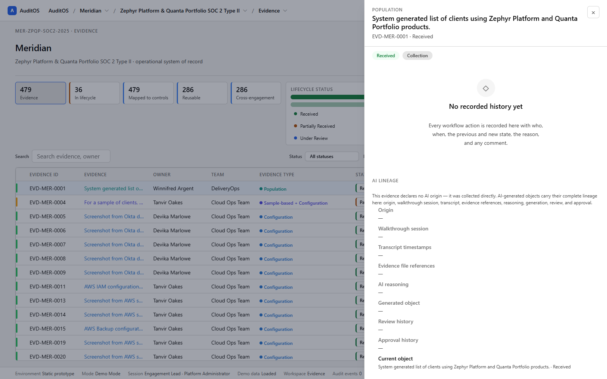

*Captured directly from the running prototype — an exact match for Appendix C, entry C.13's finding. See Appendix D, entry D.22.*

---

### Chapter 18 — AI Agents

*Source grounding: `AuditOS-Knowledge-Base.md`, Documents 141–150
(`docs\10-ai-agents\01-ai-agent-architecture.md` through `10-ai-agent-
specifications-summary.md`) — a second, more detailed AI Agent
specification set than Documents 66–74 (Chapter 17), covering the general
AI Agent Architecture, the seven named agents individually, the shared AI
Agent Lifecycle, and a specifications summary. Also cross-referenced
against `docs\05-security\07-ai-security.md` (Document 89), which every
per-agent document cites for AI Safety and which this chapter draws on
only for the Failure Handling field below — a full Security Architecture
chapter is outside this document's approved Table of Contents. Every
Release 1 file cited was already verified in an earlier chapter
(`report-generation-service.js`, `report-propagation-service.js`, read
here down to their actual `draftNarrative`/`describeImpact` function
bodies for the first time; `ai-lineage-service.js`, `findings.js`,
`suggestion-service.js`, `synchronization-bus.js`, `dependency-service.js`,
`permissions.js`, `repository.js`'s `ENTITIES` catalog).*

#### 18.0 A Second Specification Set, and Two New Concepts

Documents 141–150 use somewhat different vocabulary than Chapter 17's
sources: an **AI Orchestrator** (Document 141, §83.5, §83.11) refining
what Chapter 17 called the Orchestration Architecture (Appendix C, C.12),
and a **Recommendation Aggregator** (Document 141, §83.12) — a
consolidation step with no counterpart anywhere in Documents 66–74 or in
Release 1 code. Every agent produces its own recommendation
independently; the Aggregator merges all of them into one recommendation
before a human ever sees it, so a reviewer facing seven possible
contributing agents still reviews exactly one proposal. No file in
`prototype/js` implements anything resembling this — `synchronization-
bus.js`'s `propagate()` publishes multiple events but never merges them
into one artifact, and `suggestion-service.js` has no concept of multiple
agents contributing to a single Suggestion. Recorded as Appendix C, C.14.

A second finding directly resolves an item Chapter 7, §7.3 left open:
whether the Documentation Agent *is* the eventual implementation behind
`report-generation-service.js`'s `draftNarrative`, or a separate, missing
extension point. Document 142 (the Documentation Agent's own
specification) settles this directly, in its own words: *"Release 1 /
Release 2 Status. This chapter describes a Release 2 capability; the
Documentation Agent itself is not implemented. Its landing surface,
however, is real and already built... The reserved seam this agent will
fill is `reportGenerationService.draftNarrative(sectionKey, blocks,
context)`."* Chapter 7's open question is confirmed, not merely
speculated — recorded in §18.1 below rather than as a separate appendix
entry, since it resolves an existing open item rather than creating a new
one.

A minor, doc-internal inconsistency: each agent document's own
"Relationship to Other Architecture" section cites the general AI
architecture chapters as "Chapter 39 — AI Architecture" through "Chapter
46 — AI Orchestration Architecture," but Documents 66–73, read directly
in Chapter 17, are headed Chapter 18 through Chapter 25 in their own
text. Both numbering schemes describe the same eight topics; neither
affects Release 1 code. Noted for completeness, not logged as a gap.

Five of the sixteen template fields below resolve to the same Release 1
mechanics for all seven agents, since nothing about *how* a recommendation
would be governed differs by domain. Rather than repeat this seven times,
it is stated once here; each agent's own section states only what is
agent-specific — usually just which Synchronization Bus event triggers
it.

- **Synchronization (shared mechanics):** Every agent would react to the `synchronization-bus.js` `EVENT_TYPES` constant matching its own domain (Chapter 12; Chapter 17, §17.4) — the specific constant is named per agent below.
- **Approval Workflow (shared mechanics):** Every agent's output would enter the existing Suggested → Reviewed → Approved → Applied/Rejected/Modified lifecycle `suggestion-service.js` already implements (Chapter 13) — no new lifecycle, no new file.
- **Audit Trail (shared mechanics):** Every write a human approves would record exactly one `audit-service.js` event, in-memory only, discarded on reset (Chapter 4, §4.15; Appendix C, C.4) — identical to every write in Release 1 today.
- **Human Review (shared mechanics):** Every recommendation would be gated by the same `suggestions.decide` capability `permissions.js` already declares (Chapter 8, §8.3) — one capability, not seven domain-specific ones.
- **Failure Handling (shared mechanics):** None of the seven agents executes in Release 1, so none can fail today. Document 149, §91.18–§91.19 (AI Agent Lifecycle) specifies that failures — insufficient context, knowledge-retrieval failure, provider failure, validation failure, timeout — would never modify the Shared Audit State and would always be observable and auditable; retry would follow provider fallback or degraded execution under the AI Orchestrator's policy, never silently.

#### 18.1 Documentation Agent

- **Purpose:** Continuously transform approved Business Objects into structured assurance documentation, reducing repetitive writing without inventing organizational truth (Document 142, §84.1).
- **Responsibilities:** Draft and rewrite documentation; improve clarity, consistency, grammar, and terminology; summarize Business Objects; generate structured documentation; explain generated content. Not responsible for approving documentation, creating organizational truth, modifying Business Objects, determining testing outcomes, or generating Findings independently (§84.6).
- **Inputs:** The same recorded facts `report-generation-service.js` already binds Section III to — walkthroughs, controls, evidence, testing results, findings — plus framework terminology and organizational writing standards (§84.7).
- **Outputs:** Walkthrough documentation, control descriptions, evidence/testing summaries, finding narratives, report sections, executive summaries — all recommendations until approved (§84.8).
- **Memory:** Engagement terminology, approved writing style, organizational vocabulary, reusable documentation patterns (§84.16) — maps onto Chapter 17, §17.8's Engagement Memory (fully built) and Organizational Knowledge (partially built via `industry-knowledge.js`).
- **Context:** Task-bounded context assembled per drafting request — the same gap already logged as Appendix C, C.10: `engagement-context-service.js` is a flat stored record today, not the per-task assembly this agent would need.
- **Knowledge Sources:** Framework terminology (`control-library.json`, `framework-mappings.json`), organizational writing standards, approved prior documentation.
- **Repository Interfaces:** Reads across `requirements`, `controls`, `evidence`, `walkthroughs`, and `reports` (Chapter 10, §10.2's twenty-entity catalog); its one write path runs through `reports`/`reportVersions` via a `suggestions` record, identical to every other governed write today.
- **Synchronization:** `CONTEXT_UPDATED` and `REPORT_UPDATED`, plus effectively any hop of either propagation chain, since documentation touches every domain those chains traverse.
- **Approval Workflow / Audit Trail / Human Review / Failure Handling:** See §18.0 — no agent-specific variation.
- **Plug-in Point:** `reportGenerationService.draftNarrative(sectionKey, blocks, context)` in `js/services/report-generation-service.js:419` — confirmed by direct read: the function's body today is exactly `return null;`, called once, only for the `'system-description'` section (line 495). Release 2 replaces this one function; the block shape, lineage, and approval path are unchanged (§84.1; Chapter 5, §5.5; Appendix C, C.1).
- **Release 2 Implementation:** Per Document 142, drafts documentation across every engagement stage from approved Business Objects, then participates in Recommendation Aggregation (§18.0) alongside any other agent whose output touches the same section.
- **Future Extensions:** Multilingual documentation, organization-specific writing styles, meeting transcript summarization, continuous documentation updates (§84.21).

#### 18.2 Walkthrough Agent

- **Purpose:** Transform business-process knowledge into structured, explainable process intelligence — organizing understanding, not performing the walkthrough itself (Document 143, §85.1–§85.2).
- **Responsibilities:** Interpret business processes; organize walkthrough knowledge; identify participants, activities, and relationships; identify potential Business Controls; identify documentation gaps; recommend improvements. Not responsible for approving walkthroughs, determining control effectiveness, creating Findings, or modifying Business Objects (§85.6).
- **Inputs:** Walkthrough narratives, interview notes, process descriptions, Business Objects and Relationships, framework guidance, historical approved walkthroughs (§85.7).
- **Outputs:** Improved narratives, process summaries, activity/actor identification, relationship suggestions, potential Business Control recommendations, documentation improvements (§85.8).
- **Memory:** Approved walkthroughs, organizational terminology, reusable process patterns, approved relationships (§85.18).
- **Context:** Same C.10 gap as every agent — bounded per-walkthrough context this agent would need is not what `engagement-context-service.js` currently supplies.
- **Knowledge Sources:** Prior approved walkthroughs, organizational process patterns, framework guidance.
- **Repository Interfaces:** Reads `walkthroughs`, `walkthroughTeams`, `requirements`; the comment in `dependency-service.js` (Chapter 8, §8.3) names this exact agent as the one that would eventually derive `dependencies` records live "from walkthrough, requirement, and control activity through the SynchronizationBus," rather than the authored demo JSON Release 1 reads today.
- **Synchronization:** `WALKTHROUGH_UPDATED` — the origin of `PROPAGATION_CHAIN` itself (Chapter 12, §12.2).
- **Approval Workflow / Audit Trail / Human Review / Failure Handling:** See §18.0.
- **Plug-in Point:** No single named function exists for this agent the way `draftNarrative` exists for Documentation. The closest seam is `dependency-service.js`'s own header comment (Chapter 8, §8.3) naming this agent as the future author of live-derived dependency records; `walkthrough.js`'s existing real, audited Suggestion-writing surfaces (scheduling, ingestion, comments — Chapter 15) are the human-authored precedent this agent would eventually author instead of a human.
- **Release 2 Implementation:** Per Document 143, develops structured process understanding, discovers Business Object relationships, suggests Business Control candidates, and detects documentation gaps — all as recommendations requiring approval.
- **Future Extensions:** Meeting transcript interpretation, business process mining, BPMN generation, process simulation (§85.23).

#### 18.3 Controls Agent

- **Purpose:** Transform organizational knowledge into structured control intelligence — identifying, describing, and mapping Business Controls without determining which ones exist (Document 144, §86.1–§86.2).
- **Responsibilities:** Identify potential Business Controls; improve descriptions; identify duplicate and overlapping controls; discover relationships; suggest framework mappings. Not responsible for approving controls, determining effectiveness, creating Findings, or modifying Business Objects (§86.6).
- **Inputs:** Business processes, walkthroughs, risks, existing Business Controls, evidence, testing results, the Framework Registry and Control Library (§86.7) — in Release 1 terms, `control-library.json` and `framework-mappings.json` (Chapter 8).
- **Outputs:** New control recommendations, improved descriptions, duplicate/consolidation identification, framework mapping suggestions, relationship recommendations (§86.8).
- **Memory:** Approved Business Controls, organizational control patterns, framework mappings, reusable relationships (§86.18).
- **Context:** Same C.10 gap.
- **Knowledge Sources:** Control Library, Framework Registry, prior engagement control patterns.
- **Repository Interfaces:** Reads `controls`, `requirements`, `evidence`, `dependencies`; would write through `controls` via the standard `suggestions` route.
- **Synchronization:** `CONTROLS_UPDATED`.
- **Approval Workflow / Audit Trail / Human Review / Failure Handling:** See §18.0.
- **Plug-in Point:** No named function exists in Release 1 code. `controls.js`'s own Appendix A entry states, as its documented Release 2 extension: "Release 2 AI agents would draft/refine/deduplicate/retire/propose controls and draft test procedures" — a comment, not a reserved function the way `draftNarrative` and `describeImpact` are.
- **Release 2 Implementation:** Per Document 144, analyzes business processes, risks, and framework requirements to recommend Business Controls and map them across frameworks (SOC 2, ISO, PCI, HIPAA) without redefining Business Controls as framework-specific.
- **Future Extensions:** Continuous control monitoring recommendations, automated control rationalization, regulatory change impact analysis, digital control twins (§86.23).

#### 18.4 Evidence Agent

- **Purpose:** Organize and evaluate evidence quality and relationships without ever concluding evidential sufficiency — that remains a professional judgment (Document 145, §87.1–§87.2).
- **Responsibilities:** Evaluate evidence quality; organize evidence; identify missing, duplicate, and stale evidence; identify relationship gaps; recommend evidence requests; improve metadata. Not responsible for approving evidence, determining control effectiveness, or concluding testing results (§87.6).
- **Inputs:** Evidence Business Objects, Business Controls, framework requirements, testing objectives, walkthroughs, historical evidence (§87.7).
- **Outputs:** Evidence quality recommendations, additional evidence requests, classification improvements, relationship recommendations, duplicate/stale-evidence identification (§87.8).
- **Memory:** Approved evidence relationships, organizational evidence patterns, approved classifications (§87.19).
- **Context:** Same C.10 gap.
- **Knowledge Sources:** Prior approved evidence classifications, organizational evidence patterns.
- **Repository Interfaces:** Reads `evidence`, `evidenceRequests`, `controls`; would write through `evidence` via the standard `suggestions` route.
- **Synchronization:** `EVIDENCE_UPDATED` — the origin of `REPORT_PROPAGATION_CHAIN`'s upstream walk (Chapter 12, §12.3).
- **Approval Workflow / Audit Trail / Human Review / Failure Handling:** See §18.0.
- **Plug-in Point:** The most concrete of all seven. `prototype/js/services/ai-lineage-service.js` (Chapter 17, §17.10, Appendix C, C.13) already implements the nine-stage lineage architecture, and `evidence.js` is explicitly "the first implementation" of it (the file's own comment). No demo record today declares an `aiLineage`/`origin` block, so `isAiGenerated()` returns `false` universally — this agent is the one Document 145 describes that would be first to populate that block on a real evidence record, activating a UI surface that already renders correctly and honestly around its absence.
- **Release 2 Implementation:** Per Document 145, develops structured evidence understanding (source, owner, type, authenticity, completeness), assists classification, discovers relationships to controls/testing/findings, and flags potential gaps.
- **Future Extensions:** Evidence authenticity verification, cryptographic evidence validation, continuous evidence monitoring, evidence similarity detection (§87.24).

#### 18.5 Testing Agent

- **Purpose:** Assist in designing, organizing, evaluating, and documenting assurance testing — testing remains professional evaluation, not the agent's conclusion (Document 146, §88.1–§88.2).
- **Responsibilities:** Recommend testing procedures; evaluate coverage; identify gaps and inconsistent evidence; improve documentation; recommend sampling strategies. Not responsible for approving testing results, determining control effectiveness, or issuing Findings (§88.6).
- **Inputs:** Business Controls, evidence, testing procedures and objectives, framework requirements, risks, historical testing results (§88.7).
- **Outputs:** Testing procedure recommendations, documentation improvements, coverage recommendations, sampling recommendations, unsupported-conclusion warnings (§88.8).
- **Memory:** Approved testing procedures and documentation, organizational testing standards, approved sampling strategies (§88.19).
- **Context:** Same C.10 gap.
- **Knowledge Sources:** Organizational testing standards, historical testing results, framework requirements.
- **Repository Interfaces:** Reads `evidence`, `controls`; Release 1 has no dedicated `testing` or `samples` entry in `repository.js`'s twenty-entity catalog (Chapter 10, §10.2) — testing and sample records are read by `testing.js` outside the entity catalog this document has verified, a scope this chapter does not extend to close.
- **Synchronization:** `TESTING_UPDATED`.
- **Approval Workflow / Audit Trail / Human Review / Failure Handling:** See §18.0.
- **Plug-in Point:** No named function exists in Release 1 code. `testing.js`'s own Appendix A entry states its documented Release 2 extension as a comment: "Release 2 AI agents would draft procedures, recommend samples, identify gaps, evaluate evidence, propose conclusions" — the same comment-only pattern as the Controls Agent, not a reserved function.
- **Release 2 Implementation:** Per Document 146, correlates evidence with testing activities, assists sampling strategy, and assists deviation detection — all advisory, never a pass/fail conclusion.
- **Future Extensions:** Adaptive sampling strategies, statistical testing assistance, automated evidence correlation, continuous assurance integration (§88.24).

#### 18.6 Findings Agent

- **Purpose:** Transform approved assurance knowledge into structured, explainable Finding recommendations — Findings remain professional conclusions the agent never issues (Document 147, §89.1–§89.2).
- **Responsibilities:** Identify potential observations; correlate testing outcomes; identify supporting evidence and root-cause candidates; assist impact and severity assessment; discover relationships; draft narratives. Not responsible for issuing or approving Findings or determining materiality (§89.6).
- **Inputs:** Business Controls, evidence, testing results, risks, framework requirements, historical approved Findings, management responses (§89.7).
- **Outputs:** Finding recommendations and narratives, observation and impact summaries, root-cause candidates, severity indicators (§89.8).
- **Memory:** Approved Findings, organizational terminology, approved narratives, remediation patterns (§89.19).
- **Context:** Same C.10 gap.
- **Knowledge Sources:** Historical approved Findings, remediation patterns, framework requirements.
- **Repository Interfaces:** Reads `controls`, `evidence`, `approvals`; Release 1 has no dedicated `findings` entry in `repository.js`'s twenty-entity catalog — `findings.js` reads findings records outside the entity catalog this document has verified.
- **Synchronization:** `FINDINGS_UPDATED` — the second hop of `REPORT_PROPAGATION_CHAIN`'s upstream walk (Chapter 12, §12.3).
- **Approval Workflow / Audit Trail / Human Review / Failure Handling:** See §18.0.
- **Plug-in Point:** The second most concrete of the seven. `findings.js`'s governed lifecycle (Chapter 15, §15.8) already names **"AI Drafted"** as one of its seven states — Detected → AI Drafted → Under Review → Management Response → Accepted → Resolved → Closed — with zero populated demo records (Appendix C, C.1). This agent is the one that would populate that named, waiting state.
- **Release 2 Implementation:** Per Document 147, correlates testing outcomes and evidence, drafts observation and impact narratives, and suggests root cause and severity — every output remaining a recommendation until a professional issues the Finding.
- **Future Extensions:** Recurring Finding analysis, predictive issue identification, remediation effectiveness analysis, cross-engagement trend analysis (§89.24).

#### 18.7 Reporting Agent

- **Purpose:** Assist in transforming approved organizational knowledge into accurate, framework-aware reports — reports communicate organizational truth, they never create it (Document 148, §90.1–§90.2).
- **Responsibilities:** Draft report sections and executive summaries; organize approved content; validate completeness; maintain terminology; identify missing information. Not responsible for publishing or approving reports, creating Findings, or modifying Business Objects (§90.6).
- **Inputs:** Engagements, Business Controls, evidence, testing results, Findings, management responses, framework requirements, organizational reporting standards (§90.7).
- **Outputs:** Executive summaries, report narratives, scope/methodology/findings sections, completeness recommendations (§90.8).
- **Memory:** Approved report structures, organizational reporting standards, approved terminology, reusable summaries (§90.19).
- **Context:** Same C.10 gap.
- **Knowledge Sources:** Approved report templates, organizational reporting standards.
- **Repository Interfaces:** Reads `engagements`, `controls`, `evidence`, `approvals`, `reports`; would write through `reports`/`reportVersions` via the standard `suggestions` route — the same entities the Documentation Agent writes through, since both agents ultimately touch the same report record from different angles (drafting narrative versus reasoning about an edit's upstream impact).
- **Synchronization:** `REPORT_UPDATED` — the origin of `REPORT_PROPAGATION_CHAIN`'s upstream walk (Chapter 12, §12.3).
- **Approval Workflow / Audit Trail / Human Review / Failure Handling:** See §18.0.
- **Plug-in Point:** `reportPropagationService.describeImpact(section, target, editText)` in `js/services/report-propagation-service.js:99` — confirmed by direct read: unlike `draftNarrative`, this function is *not* a stub. It already returns real, templated text today (e.g., `"Section III — System Description. Proposed change: ..."`), built at line 134 into every upstream propagation node. Release 2 replaces the *template* with the AI's own reasoning about what an approved report edit means for each upstream object; the proposal shape, approval gate, and propagation chain are unchanged (Chapter 12, §12.4; Appendix C, C.1, C.3). This is a distinct seam from the Documentation Agent's `draftNarrative` — this agent reasons about the *impact* of an edit already made; the Documentation Agent drafts the *narrative* in the first place.
- **Release 2 Implementation:** Per Document 148, composes report sections from approved knowledge, drafts executive summaries, validates completeness, and assesses consistency — all recommendations, never a published report.
- **Future Extensions:** Multi-framework and multilingual reporting, executive briefing generation, continuous reporting, interactive digital reports (§90.24).

#### 18.8 Seven Agents, One Pipeline

| Agent | Synchronization Bus event | Plug-in point | Specificity |
|---|---|---|---|
| Documentation | `CONTEXT_UPDATED` / `REPORT_UPDATED` | `reportGenerationService.draftNarrative` | Named function, currently returns `null` |
| Walkthrough | `WALKTHROUGH_UPDATED` | `dependency-service.js`'s live-derivation comment | Comment only, no reserved function |
| Controls | `CONTROLS_UPDATED` | `controls.js`'s Appendix A comment | Comment only, no reserved function |
| Evidence | `EVIDENCE_UPDATED` | `ai-lineage-service.js`'s `aiLineage`/`origin` block | Named data contract, zero populated records |
| Testing | `TESTING_UPDATED` | `testing.js`'s Appendix A comment | Comment only, no reserved function |
| Findings | `FINDINGS_UPDATED` | `findings.js`'s `"AI Drafted"` lifecycle state | Named state, zero populated records |
| Reporting | `REPORT_UPDATED` | `reportPropagationService.describeImpact` | Named function, already returns real (templated) text |

Three seams are genuinely reserved and precise (Documentation, Evidence,
Findings, plus Reporting's `describeImpact`); three (Walkthrough,
Controls, Testing) exist only as prose comments in their workspace's own
Appendix A row, with no function or state constructed to receive a future
agent's output. Read together, this means roughly half of the seven
named agents already have a landing point Release 2 code could target
without modifying the surrounding file, and half would require first
choosing where in the existing workspace an AI-authored recommendation
would attach. Neither the Recommendation Aggregator (§18.0, Appendix C,
C.14) nor the AI Orchestrator (Appendix C, C.12) exists to route any of
these seven agents' output today — every plug-in point above is,
individually, exactly as far from execution as Chapter 17 already found
the surrounding architecture to be.

---

*D.23's seven-agent pipeline diagram is conceptual, not a UI capture — outside Playwright's screenshot scope, and remains a placeholder for a hand-authored diagram.*

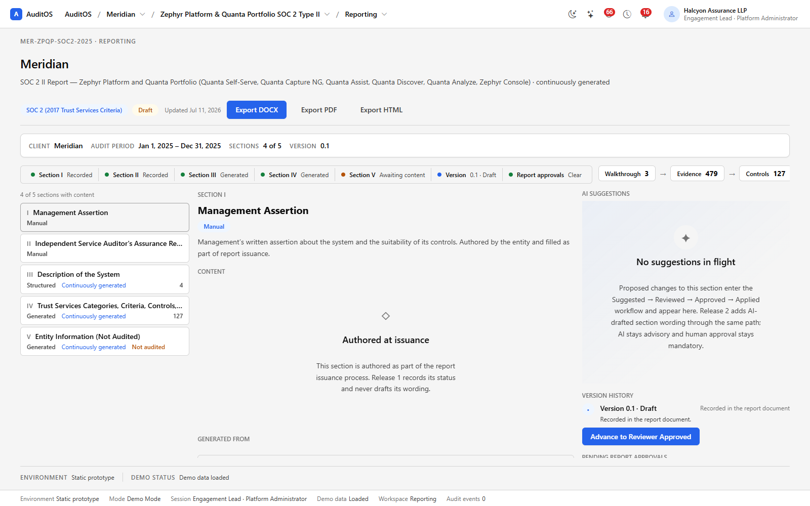

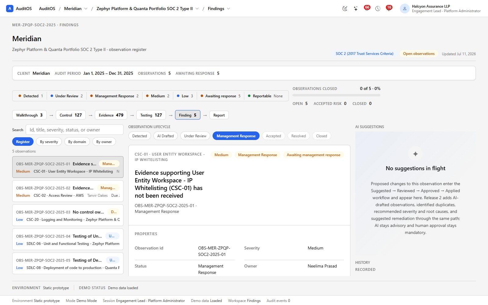

*Captured directly from the running prototype. The Findings status filter was not specifically opened to reveal the "AI Drafted" option (Appendix C, entry C.1's zero-record finding), so this pairs the Reporting seam with the Findings register's default view rather than that exact filter state. See Appendix D, entry D.24.*

---

## Appendices

*Not chapters. Maintained continuously throughout the writing process —
each grows as every chapter is completed and validated against source.*

### Appendix A — Repository Inventory

Per application file: Purpose, Responsibilities, Dependencies, Extension
Points, Release 1, Release 2, Deprecated.

*Populated incrementally — rows are added when the chapter that verifies
that file against source is written. Chapter 1 verifies the application's
entry point; Chapter 2 verifies where the Shared Audit State concept lives
in code; Chapter 3 verifies one concrete fragmentation problem solved in
Release 1; Chapter 4 verifies the platform files backing five core domain
concepts; Chapter 5 verifies the operational pipeline and report
generation; Chapter 6 verifies the actual technology stack against the
original specification. Chapter 7 introduces no new files — it is
vision-only and cites the same rows already listed here as the seams
Release 2 will implement behind. Chapter 8 verifies the remaining
`platform/`, `state/`, and `router/` files. Chapter 9 verifies the four
navigation/context services. Chapter 10 reads `repository.js` (already
listed below, first added in Chapter 1) in full for the first time,
confirming its 20-entity catalog, CRUD interface, audit integration, and
hierarchy resolution — no new row, deeper verification of an existing
one. Chapter 11 introduces no new files — it consolidates existing rows
(`state-store.js`, `repository.js`, `synchronization-bus.js`,
`engagement-context-service.js`, `audit-service.js`,
`report-generation-service.js`) under the Shared Audit State's own
dedicated source. Chapter 12 adds `report-propagation-service.js`. Chapter 13 introduces no
new files — it reads `suggestion-service.js` (added in Chapter 4) down to
its record schema for the first time. Chapter 14 adds `ai-usage.js` and
the `ai-telemetry.json` demo-data schema. Chapter 15 adds the ten
remaining workspace files (`home.js`, `client-dashboard.js`,
`walkthrough.js`, `evidence.js`, `controls.js`, `testing.js`,
`findings.js`, `reporting.js`, `audit-log.js`, `global-approvals.js`).
Chapter 16 adds `tools/validate.js` and `tests/run-tests.js`. Chapter 17
adds `services/ai-lineage-service.js`, completing the file Chapter 8,
§8.4 named but deferred. Chapter 18 introduces no new files — like
Chapter 7, it is vision-only, citing seams already listed here
(`report-generation-service.js`, `report-propagation-service.js`,
`ai-lineage-service.js`, `dependency-service.js`) at the level of their
actual function bodies for the first time, rather than adding new rows.
The Issue #42 final documentation pass adds `client-wizard.js` and
`engagement-wizard.js` (Chapter 15, §15.13) — two of the fifteen
`prototype/js/workspaces/` files no earlier chapter had verified — and
all eight files of `prototype/components/` (Chapter 8, §8.6), the
Presentation layer named but never enumerated since §8.2's original
mapping table.*

| File | Purpose | Responsibilities | Dependencies | Extension Points | Release 1 | Release 2 | Deprecated |
|---|---|---|---|---|---|---|---|
| `prototype/index.html` | Single application entry point | Loads shell markup and scripts; no business logic | Loads `prototype/js/main.js` and downstream bootstrap scripts | None | Yes — implemented | N/A | No |
| `prototype/js/main.js` | Application bootstrap | Initializes Shared Audit State foundation, then the static routing foundation, in that order; contains no business logic itself | `AuditOS.state.init`, `AuditOS.router.init` | Documented as the point later issues extend to start additional foundations | Yes — implemented | N/A | No |
| `prototype/js/state/state-store.js` | Runtime "Shared Audit State" store | Loads the immutable demo-data baseline once; maintains in-memory runtime state; exposes read API and simulated writes; publishes state events | `AuditOS.demoDataRegistry`, `demo-data/demo-data.js` bundle | Self-documented seam for the future Human Approval Engine; UI, business workflows, governance/approval flows, AI, and persistence explicitly out of scope for Release 1 | Yes — implemented (mechanical substrate only) | Governance/approval routing, persistence — see Appendix C, C.2 | No |
| `prototype/js/platform/repository.js` | Single data-access layer between UI and storage | Declares 20 entity repositories (`list`/`get`/`getDocument`/`datasetIds`/`datasetsForEngagement`/`create`/`update`/`remove`) over the Shared Audit State store; records one audit event per write; resolves URL segments into Client → Engagement → Workspace → Entity for the router | Wraps `state-store.js`; writes through to `audit-service.js`; consumed by `platform/`, `services/`, `workspaces/` | Self-documented as the point Release 2 swaps in AI-agent- and real-backend-driven implementations; `listAccessibleClients`'s optional `companyIds` filter is the seam for real access control | Yes — implemented (demo-data-backed, simulated persistence) | AI-agent / real-backend implementations, access control | No |
| `prototype/js/services/evidence-lifecycle.js` | Canonical evidence/testing status model | Defines one status vocabulary (phase, tone, order) that every consuming surface renders from; maps two differently sourced legacy vocabularies onto it; falls back to an unknown status neutrally rather than fabricating or dropping it | Consumed by `workspaces/controls.js`, `workspaces/evidence.js`, `services/workpaper-service.js`, loaded via `index.html` (confirmed by direct search, not inferred from comments) | None documented — Release 1 status model, not flagged as a Release 2 seam | Yes — implemented | N/A | No |
| `prototype/js/workspaces/program.js` | Audit Program workspace | Reads `programs.json`; renders one program's member/reuse-source engagements and cross-program evidence reuse | `AuditOS.state`, Workspace Shared Platform, Cross-Workspace Relationship Engine | Explicitly read-only in Release 1: no AI, no workflow engine, no writes, no schema changes | Yes — implemented (read-only) | AI/workflow-engine driven program management | No |
| `prototype/js/platform/engagement-context-service.js` | Read API for AI-derived engagement state (Context) | Exposes working memory, observed evidence, assumptions, dependencies, suggestions, timeline, industry knowledge, confidence, affected requirements/controls/report sections; read-only for pages | `AuditOS.repository.engagementContext`; written only by `synchronization-bus.js` | Repository-backed, so every write is automatically audited | Yes — implemented | N/A | No |
| `prototype/js/platform/synchronization-bus.js` | Cross-workspace propagation (Synchronization) | Publish/subscribe event bus; `propagate()` simulates the full downstream chain (Walkthrough → Requirements → Controls → Report → Approvals → Audit → AI Usage → Timeline → Context) as one immutable audit event per hop | `platform/permissions.js` (shared subscribe/publish shape), writes `engagement-context-service.js` | Self-documented as simulating publishers that Release 2 replaces with real event producers behind the same contract | Yes — implemented (simulated propagation) | Real event producers — see Appendix C, C.3 | No |
| `prototype/js/platform/suggestion-service.js` | AI Suggestion lifecycle | Enforces Suggested → Reviewed → Approved → Applied/Rejected/Modified (6 states — fewer than Document 71's 10, see Appendix C, C.7); record schema includes a `confidence` field hardcoded to `null` at creation (Appendix C, C.8); every transition is a simulated, automatically audited Repository write; applying a suggestion publishes the Synchronization Bus propagation chain; commenting is ungated, decisions require `suggestions.decide` | `platform/repository.js`, `platform/synchronization-bus.js`, `platform/permissions.js`, `platform/id-service.js` | AI never writes directly today; this is the seam a live agent would call into in Release 2; `confidence` is a populated-by-nothing field waiting for a real model score | Yes — implemented | Live AI-originated suggestions with real confidence scores | No |
| `prototype/js/platform/audit-service.js` | Platform-wide immutable audit trail | Exposes `record` (write) and read-only access; captures timestamp, user, role, session, action, entity, old/new value, reason, approval chain, client/program/engagement/workspace, correlation id | Shared Audit State's simulated write API (`audit-logs` collection) | No update/removal by design; intentionally empty baseline ("fabricates no history") | Yes — implemented, but in-memory only — see Appendix C, C.4 | Persistent storage | No |
| `prototype/js/workspaces/engagement.js` | Engagement Workspace — operational entry point into one audit | Renders current operational focus, next actions, blocking items, and the six-stage operational pipeline (Walkthrough → Evidence → Controls → Testing → Findings → Reporting) with per-connector health | `AuditOS.state`, Shared Workspace Framework, Enterprise Data Presentation System | Frameworks array-driven for future multi-framework support; Walkthrough always renders as a stage even with no data yet, so a future collection fills it in without a UI redesign | Yes — implemented (read-only, renders only existing JSON) | AI-populated surfaces, workflow engine | No |
| `prototype/js/services/report-generation-service.js` | Assembles the engagement's five-section report continuously | Binds Sections I–V to recorded data; regenerates only the sections a change touches; renders undeclared sections as "not recorded," never invented narrative | `sections` records, test workpapers, `cuecs`/`csocs`/`ipeProcedures` registers | `draftNarrative` — the one marked seam for Release 2 AI-authored prose | Yes — implemented (faithful generation only) | AI-authored narrative — see Appendix C, C.1 | No |
| `prototype/vendor/` (`bootstrap`, `bootstrap-icons`) | Only third-party libraries actually vendored | Local, offline copies — no CDN | None (leaf dependency) | The original spec named five additional libraries (charting, tables, editors, documents, animation) never vendored — see Appendix C, C.5 | Yes — implemented (2 of 7+ specified libraries) | N/A | No |
| `prototype/js/platform/permissions.js` | Platform-wide session capability descriptor | Declares capability vocabulary (which roles may do what, and why); manages active demo session; answers `can()` / `explainDenial()` | Consumed by every gated action across workspaces | Self-documented as "not an authorization engine" — no authentication, identity provider, or backend in Release 1 | Yes — implemented (capability descriptor only) | Real authentication/authorization engine | No |
| `prototype/js/platform/id-service.js` | Deterministic runtime identifier minting | Single source of new record ids, replacing ad hoc `Date.now()` schemes that could collide within the same millisecond | Consumed by `suggestion-service.js`, `report-version-service.js`, others | None documented | Yes — implemented | N/A | No |
| `prototype/js/platform/relationships.js` | Cross-Workspace Relationship Engine | Shared, pure, read-only derivation for relationship logic (control reference resolution, activity-history normalization, collection metadata) previously duplicated per workspace | Callers pass in their own status vocabulary/field shape; nothing stored | None documented | Yes — implemented | N/A | No |
| `prototype/js/platform/dependency-service.js` | Read-only dependency chain traversal | Traverses Team → POC → Requirement → Control → Evidence → Report, each with reason, confidence, blocking flag, affected objects | Reads `demo-data/dependencies/*.json` via Repository | Self-documented: Release 2 AI agents derive dependencies live via the Synchronization Bus behind the same read surface | Yes — implemented (authored demo data) | Live AI-derived dependencies | No |
| `prototype/js/platform/industry-knowledge.js` | Read-only organizational learning | Cross-engagement reusable knowledge, deliberately separate from engagement-scoped Suggestions; `resolveApplicable` bounds an item to its implementation date through the engagement's audit period | Repository-backed | None documented | Yes — implemented | N/A | No |
| `prototype/js/state/demo-data-registry.js` | Catalog of the "simulated SharePoint structure" | Authoritative structure-only catalog (id, scope, file location, record key) of `prototype/demo-data/`; no business data or logic | Consumed by `state-store.js` | None documented | Yes — implemented | Real SharePoint/backend integration (name is a self-documented hint, not a commitment) | No |
| `prototype/js/router/router.js` | Navigation backbone | Switches between Workspace Hosts, syncs URL for deep linking/history, announces changes to assistive technology; parses nothing itself | `workspace-registry.js`, `services/context-resolver.js` | None documented | Yes — implemented | N/A | No |
| `prototype/js/router/workspace-registry.js` | Authoritative workspace list | Each entry: id, label, document title, hash path, hierarchy scope (platform/client/engagement) | Consumed by `router.js` | None documented | Yes — implemented | N/A | No |
| `prototype/js/services/navigation-service.js` | Sole URL builder and route-transition initiator | Exposes pure href builders (`hrefHome`, `hrefClient`, `hrefEngagement`, `hrefWorkspace`, `hrefPlatform`, `hrefFor`) and imperative navigation (`navigate`, intent helpers) | Consumed by every page; consumed by `router.js`'s compatibility shim | None documented | Yes — implemented | N/A | No |
| `prototype/js/services/hierarchy-builder.js` | Canonical platform hierarchy builder | Builds AuditOS → Clients → Programs → Engagements → Workspaces; filters workspace visibility by session capability | Reads live via Repository Foundation | None documented | Yes — implemented | N/A | No |
| `prototype/js/services/context-resolver.js` | Single hash-to-context resolver | `resolve(hash)` returns a resolved context, a redirect, `{pending:true}`, or `null`; no fallback-guessing of engagement context | Consumed by `router.js`; every page reads via `contextResolver.current()` | None documented | Yes — implemented | N/A | No |
| `prototype/js/services/breadcrumb-generator.js` | Ordered breadcrumb trail generator | Produces crumb descriptors; enforces peer-switcher dropdown rule structurally in `generate()` | Rendered by `components/navigation/navigation.js` | None documented | Yes — implemented | N/A | No |
| `prototype/js/services/report-propagation-service.js` | Upstream report-edit propagation | Owns `analyzeImpact` (structural impact from recorded lineage) and `propagate` (walks `REPORT_PROPAGATION_CHAIN`: Reporting → Findings → Testing → Controls → Evidence → Walkthrough), publishing one event per affected hop, skipping unaffected hops | Reuses `suggestion-service.js` for the approval lifecycle; walks `synchronization-bus.js`'s exported `REPORT_PROPAGATION_CHAIN`/`propagateFrom` | `describeImpact` — the marked seam Release 2 replaces with real AI reasoning about upstream impact | Yes — implemented (structural impact only) | AI-authored impact reasoning — see Appendix C, C.1 | No |
| `prototype/js/workspaces/ai-usage.js` | Administrator-only AI telemetry and spend accounting workspace | Renders tokens, costs, models, providers, cache, latency, retries, failures, outcomes, confidence, quality, ROI/hours saved, billing category, agent execution, and trend/heatmap aggregation entirely from `ai-telemetry.json` via the Repository Foundation | `ai-telemetry.json`, Repository Foundation, Shared Workspace Framework, presentation system | Built on "the complete Release 2 telemetry schema" ahead of any agent that would populate it live; gated by `ai-usage.view` | Yes — implemented (demo-data-driven observability surface) | Live agent-generated telemetry | No |
| `prototype/demo-data/ai-telemetry.json` | Complete Release 2 telemetry contract, demo-populated | One record per (simulated, deterministically seeded) AI operation: tokens (input/output/cacheRead/cacheWrite), costUsd, provider, model, latency, retries, outcome, confidence, qualityScore, estimatedHoursSaved, billable, billingCategory; metadata reserves `sessionId`/`promptId`/`evaluationId`/`guardrailVerdict` for Release 2 | Consumed by `ai-usage.js` via the Repository Foundation | Reserved fields present in metadata, absent from every event | Yes — implemented (demo data only) | Live event population, reserved-field population | No |
| `prototype/js/workspaces/home.js` | Global Home — client selection only | Sections: Continue Working, Recent Clients, Pinned Clients, All Clients, Client Groups, Search; only action is selecting a client; never auto-reopens previous client | `AuditOS.state`, Shared Enterprise Component Library, Shared Workspace Framework toolbar | None documented | Yes — implemented | N/A | No |
| `prototype/js/workspaces/client-dashboard.js` | Client-level operational portfolio | Module-driven: engagement health, portfolio progress, team/POC workload, AI advisory signals, cross-entity search; completed engagements read-only and excluded from aggregates | `AuditOS.state`, module registry (`buildModuleRegistry`, Issue #35 §11) | None documented | Yes — implemented | N/A | No |
| `prototype/js/workspaces/walkthrough.js` | Walkthrough — Team → POC operating hierarchy | Team roster and readiness at top level; Team command center (scheduling, ingestion, dependencies, Suggestions, Industry Knowledge); POC detail below that | `repository.resolveHierarchy`, `suggestion-service.js`, `industry-knowledge.js` | Not read-only like other workspaces — scheduling/ingestion/comments/Suggestions are real audited Repository writes; AI still never writes directly | Yes — implemented (writes via Repository) | Live AI-originated content | No |
| `prototype/js/workspaces/evidence.js` | Evidence — the engagement's operational object | Consolidated surface: filters, metrics, table, drawer, workflow only; search debounces without remounting or moving focus | `evidence-lifecycle.js` status vocabulary, `AuditOS.state` | None documented | Yes — implemented (read-only) | N/A | No |
| `prototype/js/workspaces/controls.js` | Controls — evolving control library | Faithful visualization of control JSON; no AI, no writes, no workflow engine | `evidence-lifecycle.js`, `AuditOS.state` | Release 2 AI agents would draft/refine/deduplicate/retire/propose controls and draft test procedures | Yes — implemented (read-only) | AI-drafted/refined controls | No |
| `prototype/js/workspaces/testing.js` | Testing — control validation via evidence | Faithful visualization of testing JSON; no AI, no backend, no writes | `AuditOS.state` | Release 2 AI agents would draft procedures, recommend samples, identify gaps, evaluate evidence, propose conclusions | Yes — implemented (read-only) | AI-assisted testing | No |
| `prototype/js/workspaces/findings.js` | Findings — the Observation Register | Governed lifecycle Detected → AI Drafted → Under Review → Management Response → Accepted → Resolved → Closed; three-column Workbench shared with Controls/Testing/Reporting | `AuditOS.state`, shared `presentation.workbench` | "AI Drafted" is a named lifecycle state with zero populated demo records — see Appendix C, C.1 | Yes — implemented (read-only) | Live AI-drafted observations | No |
| `prototype/js/workspaces/reporting.js` | Reporting — the living report | Report exists from engagement creation, evolves continuously; three-column Workbench (Navigator / Selected Report / Suggestions·History·Approvals·Lineage) | `report-generation-service.js`, `report-propagation-service.js` | See Chapter 5 §5.5, Chapter 12 §12.3 | Yes — implemented | N/A | No |
| `prototype/js/workspaces/audit-log.js` | Global Audit Log — platform-wide immutable trail surface | Every recorded event this session, newest first, full schema per event; honestly empty at baseline, discarded on reset | `audit-service.js` | Self-documented: "reset discards the trail with every other simulated write" — second confirmation of Appendix C, C.4 | Yes — implemented (in-memory only) | Persistent storage | No |
| `prototype/js/workspaces/global-approvals.js` | Global Approvals — the one actionable approval inbox | Inbox-style rail + inspector; three live approval types (evidence review, evidence requests, Approval Workflow requests) route through it; remaining types reserved | `audit-service.js`, dataset's own status vocabulary | Self-documented: additional platform approval types "stay honestly reserved"; relationship to per-workspace Suggestion decisions not fully verified — see Chapter 15, §15.12 | Yes — implemented (3 of N approval types) | Additional approval types | No |
| `prototype/tools/validate.js` | Developer-only headless-browser validation | Renders `index.html` in Playwright to check live DOM/console; never installs Playwright or browsers itself, only uses an already-installed copy | An already-installed Playwright package (project, global, or npx cache); `tools/lib/validation.js` | None documented | Yes — implemented (dev tool, Node required) | N/A | No |
| `prototype/tests/run-tests.js` | Developer-only offline test runner | Auto-discovers `*.test.js` in `smoke/`, `unit/`, `integration/`; Node standard library only — no framework, no npm dependency, no browser; prints PASS/FAIL, exits non-zero on failure | Node standard library (`assert.strict`) only | None documented | Yes — implemented (dev tool, Node required) | N/A | No |
| `prototype/js/services/ai-lineage-service.js` | Reusable AI-provenance ("AI Lineage") architecture for AI-generated objects | Resolves any record into a fixed nine-stage lineage (Origin → Walkthrough session → Transcript timestamps → Evidence file references → AI reasoning → Generated object → Review history → Approval history → Current object) from the record's own declared `aiLineage`/`origin` block plus the Platform Audit Service trail; absent stages return `present: false`, never fabricated | `AuditOS.auditService` (review/approval history); consumed by `workspaces/evidence.js` (first implementation), `workspaces/controls.js`, `workspaces/testing.js`, `services/workpaper-service.js` | Named but deferred in Chapter 8, §8.4; the seam a live agent populates by declaring `aiLineage`/`origin` on a generated record | Yes — implemented (honest zero-state: no demo record declares an AI origin today — Appendix C, C.13) | Live AI-generated lineage data | No |
| `prototype/js/workspaces/client-wizard.js` | Client Creation Wizard | Eight-step capability-gated flow (Client Details → Business Information → Services → Technology Stack → Contacts → User Access → Programs → Review); every field pure-mapped to the client record shape before a single Repository write | `components/wizard/wizard.js` (shared engine, never re-invented); Repository Foundation write pipeline | Captured fields (business description, technology stack) explicitly noted in-file as "for future AI context and memory" (Release 2) | Yes — implemented (real Repository write, capability-gated on `clients.create`) | AI-assisted scoping/context population from captured fields | No |
| `prototype/js/workspaces/engagement-wizard.js` | Engagement Creation Wizard | Seven-step capability-gated flow (Client → Engagement Details → Audit Period → Scope → Program → Team → Review); engagement-type options derived from the dataset's own recorded values, never a fabricated list | `components/wizard/wizard.js` (shared engine); Repository Foundation write pipeline; appends to a Program when one is selected | Self-described as "the future entry point for AI-assisted scoping (Release 2)" | Yes — implemented (real Repository write, capability-gated on `engagements.create`) | AI-assisted engagement scoping | No |
| `prototype/components/component-library/component-library.js` | Shared Enterprise Component Library registry | Catalogs every reusable presentation primitive by identity only (id, name, category, base CSS class, description); kept in sync with `css/components.css` | Consumed by workspaces composing UI; defines no visual values itself | None documented | Yes — implemented | N/A | No |
| `prototype/components/workspace-framework/workspace-framework.js` | Shared Workspace Framework renderer | Renders the Universal Workspace Structure into the mounted Workspace Host on every route change; workspaces configure it declaratively rather than inventing page structure | Reads Workspace Registry for navigation identity; consumed by every workspace | None documented | Yes — implemented | N/A | No |
| `prototype/components/presentation/presentation.js` | Enterprise Data Presentation System | Turns a workspace's declarative configuration into DOM (data grids, master-detail, inspectors, timelines, activity feeds, entity cards, status badges) by composing Component Library primitives | Composes `component-library.js` primitives; feeds nodes into `workspace-framework.js` slots | None documented — presentation only, never reads/writes `AuditOS.state` | Yes — implemented | N/A | No |
| `prototype/components/workspace-shared/workspace-shared.js` | Workspace Shared Platform | Extracts presentation/derivation patterns stabilized across Engagement, Walkthrough, Evidence, Controls, Testing, Findings, and Reporting; holds no business logic or status vocabulary of its own. Also owns `resolveReportStatus(engagementId, reportDocument)` (added fixing Appendix C, C.16) — the single function every one of those six workspaces now calls to read a report's lifecycle status from `reportVersionService.currentVersion()` rather than each independently re-reading the report document's own frozen `status` field | Loads after the Presentation System, before every workspace module; `resolveReportStatus` calls `AuditOS.reportVersionService` and `AuditOS.repository` | None documented | Yes — implemented | N/A | No |
| `prototype/components/navigation/navigation.js` | Breadcrumb navigation renderer | Renders the breadcrumb region from `breadcrumb-generator.js`'s trail data; no locally derived hierarchy or URL construction | Consumes `services/breadcrumb-generator.js` (Chapter 9, §9.6) | None documented | Yes — implemented | N/A | No |
| `prototype/components/header/header.js` | Global header trailing regions | Theme toggle, AI Usage hover indicator (route-scoped live telemetry), notification and Global Approvals indicators, Session Panel | Repository Foundation, Shared Audit State; theme preference is memory-only | None documented | Yes — implemented | N/A | No |
| `prototype/components/footer/footer.js` | Persistent platform footer | Environment/session mode, demo-data status, active workspace, live recorded audit-event count — every value sourced live, none fabricated | Permission Foundation, Shared Audit State, router/registry, Platform Audit Service | None documented | Yes — implemented | N/A | No |
| `prototype/components/wizard/wizard.js` | Shared Wizard Engine | One reusable multi-step wizard renderer (steps, fields, validation, review, completion) both creation wizards configure declaratively; holds captured values in memory only | Consumed by `client-wizard.js`, `engagement-wizard.js` | None documented | Yes — implemented | N/A | No |
| `prototype/js/services/report-version-service.js` | Report version register and lifecycle | Enforces Draft → AI Draft → Reviewer Approved → Partner Approved → Issued; an Issued version is immutable, editing opens a new Draft carrying it forward as predecessor | `report-versions` Repository entity; audited like every other simulated write | "AI Draft" is a named lifecycle state — see Appendix C for the same zero-populated-state pattern already found in Findings and Suggestions | Yes — implemented | Live AI-drafted report versions | No |
| `prototype/js/services/workpaper-service.js` | Single generated-workpaper model | One structure (Overview, Control description, Walkthrough summary, Testing objective/procedure, Population, Evidence references, Attributes, Exceptions, Conclusion, Reviewer notes, Approval) consumed by the Testing workspace, HTML workpaper, and workbook export alike | Reads `walkthroughTest`/`oeTest` recorded demo-data shapes; consumed by `document-export.js`, `workpaper-export.js`, `testing.js` | Every section but AI provenance is editable; absent data returns `present: false`, never invented | Yes — implemented | N/A | No |
| `prototype/js/services/document-export.js` | Report serialization to DOCX/PDF/HTML | Real OOXML WordprocessingML for DOCX (reusing the workbook ZIP writer), a hand-written PDF 1.4 document with accurate byte-offset xref, and self-contained HTML — zero runtime dependencies | Reuses `workbook-export.js`'s ZIP writer; builds `documentModel` from `report-generation-service.js`'s report model | None documented | Yes — implemented | N/A | No |
| `prototype/js/services/workbook-export.js` | The platform's one `.xlsx` writer | Minimal, standards-correct SpreadsheetML part set inside a STORE-method ZIP (CRC-32 only, no compressor); deliberately no shared strings, formulas, charts, or calculation chain | Consumed by `document-export.js`, `workpaper-export.js` | None documented — a real writer, not a Release 2 placeholder | Yes — implemented | N/A | No |
| `prototype/js/services/workpaper-export.js` | Workpaper serialization to HTML and Excel | Self-contained HTML workpaper plus an Excel workbook (via `workbook-export.js`) mirroring the CSC-01 structure, adding an evidence register and AI-provenance sheet | Reads `workpaper-service.js`'s model; consumes `workbook-export.js` | None documented — pure serialization, no state reads/writes | Yes — implemented | N/A | No |
| `prototype/components/context-panel/` (`context-panel.html`, `README.md`) and `prototype/css/panel.css` | An apparently-planned "Right Context Panel" structural component, named in `Implementation Context.md`'s foundations list | No `.js` module exists; `context-panel.html` is not referenced by `index.html`; `panel.css` is confirmed by direct search to be neither `@import`-ed by `main.css` nor `<link>`-ed anywhere — orphaned on both the markup and style side | None found — nothing in the load chain references either file | Likely superseded by the Activity/Audit Trail drawer (Appendix D, entry D.36) | No — never wired in | N/A | **Yes — cleanup candidate, Appendix B, item 8** |

### Appendix B — Cleanup Plan

**Status: executed (Issue #42, Phase 5), following explicit approval of
the plan below.** Every deletion was verified against the six-point
checklist (no HTML/CSS/JS/JSON reference, no dynamic runtime load, no
remaining documentation reference, no screenshot reference, no export
pipeline reference, no future AI extension point reference) before it
was carried out. A note on scope: this appendix had previously deferred
`.ai/`, `docs/`, `.zoo/`, and `mdmaker.ps1` to "Issue #43 (Future Issue
(TBD))." Phase 5's explicit approval covered the full list below under
Issue #42 itself, superseding that deferral — recorded here rather than
silently collapsed, so the change of plan remains visible.

| # | Path | Purpose | Reason | Risk | Replacement | Status |
|---|---|---|---|---|---|---|
| 1 | `.ai/` (34 files, 327K) | Prior architectural-memory system for AI coding assistants, predating this canonical document | Superseded by `AUDITOS.md`; its full content is already preserved verbatim inside `AuditOS-Knowledge-Base.md` | Low | `AUDITOS.md` + `AuditOS-Knowledge-Base.md` | **Deleted** |
| 2 | `.zoo/` (11 files, 76K) | Earlier memory/config system, same role as `.ai/` | Same as above | Low | Same as above | **Deleted** |
| 3 | `docs/` excluding `docs/architecture/` (145 files, ~2.0M, 17 subfolders) | Original per-topic product/engineering/AI specification documents | Chapters 6, 10, 16 and Appendix C (C.5, C.6) already found this folder contains stale, misleading claims (a technology stack never built, Chart.js never vendored); `AUDITOS.md`'s own header states it is the single canonical source | Medium — the largest candidate by content | `AUDITOS.md` (canonical) + `AuditOS-Knowledge-Base.md` (archival citation source) | **Deleted.** `docs/architecture/`'s three files (`AuditOS-Data-Architecture.md`, `AuditOS-UI-Rendering-Guide.md`, `Workspace Specification.md`) were explicitly preserved — this session's own reading rules name that folder a second live source alongside the Knowledge Base |
| 4 | `mdmaker.ps1` (root, 3.2K) | PowerShell script that concatenated `.ai/`, `docs/`, `.zoo/`, `.github/copilot-instructions.md`, `CLAUDE.md`, and prototype component READMEs into `AuditOS-Knowledge-Base.md` | Its inputs (items 1–3) were removed in the same pass; the Knowledge Base is no longer treated as something regenerated on demand | Low | None needed | **Deleted** |
| 5 | `AuditOS.code-workspace` (root, 0 bytes) | Apparently an intended VS Code multi-root workspace file | Empty — zero bytes, no configuration | Very low | None, or recreate properly if wanted later | **Deleted** |
| 6 | `validation/` (3 PNG files, gitignored) | Output of `prototype/tools/validate.js`'s responsive-capture step | Filenames exactly match `validate.js`'s own hardcoded viewport list; a regenerable dev-tool artifact | Very low | Regenerate via `validate.js` | **Deleted** |
| 7 | `graphify-out/2026-07-11/`, `2026-07-12/`, `2026-07-13/`, `2026-08-02/` (4 dated snapshot folders, ~34M) | Historical dated snapshots of the graphify knowledge-graph tool's output | Superseded by the root-level current state and the newest dated folder; whether `graphify` itself relies on historical snapshots for a diff/rollback feature was never confirmed | Medium — unconfirmed | `graphify update` would regenerate a current snapshot regardless | **Preserved.** Phase 5's explicit instructions name "Graphify outputs" in the Preserve list without qualification — this overrides the Phase 4 plan's proposal to remove the four older snapshots. No graphify-out content of any kind was touched |
| 8 | `prototype/components/context-panel/` (`context-panel.html`, `README.md`) and `prototype/css/panel.css` | An apparently-planned "Right Context Panel" structural component and its dedicated stylesheet | `panel.css` was never `@import`-ed by `main.css` nor `<link>`-ed in `index.html`; `context-panel.html` had no `.js` module and was unreferenced. Independently corroborated during Phase 5 verification: `prototype/tools/lib/validation.js`'s own comment states "the empty context-panel `<aside>` was removed with the left rail" (Issue #16) — confirming this component was already dead before this cleanup, not a partially-built feature this pass cut short | Low-Medium | The Activity/Audit Trail drawer (`components/header/header.js`), which serves an equivalent role today | **Deleted** |

**Interpretive note on the Preserve list, disclosed rather than applied
silently:** Phase 5's Preserve list names "HTML, CSS, JavaScript, JSON"
without qualification. Item 8 above is HTML and CSS. This cleanup reads
that clause as protecting *required* application HTML/CSS/JS/JSON — the
files that make the prototype function — not as a blanket exemption for
every file of those types regardless of use, since the same instructions
separately direct identifying "unused CSS" and "unused JavaScript" as
valid cleanup targets, and the Vendor section applies identical logic
("delete only vendor assets proven unused"). Item 8 was proven unused by
the six-point checklist and by independent corroboration in
`validation.js`'s own comment; it was deleted under that reading. If a
stricter, literal reading was intended, `git checkout -- "prototype/components/context-panel" "prototype/css/panel.css"`
restores it — both were tracked in git before this cleanup.

**Final repository audit:**

- **Files deleted:** 194 tracked files (`.ai/`: 34; `.zoo/`: 11; `docs/` minus `docs/architecture/`: 145; `AuditOS.code-workspace`: 1; `context-panel.html` + its `README.md`: 2; `panel.css`: 1) plus `mdmaker.ps1` and `validation/`'s 3 PNGs, both untracked/gitignored and therefore invisible to `git status` but confirmed removed from disk.
- **Folders deleted:** `.ai/`, `.zoo/`, seventeen `docs/` subfolders (`00-overview` through `20-release-notes`, excluding `architecture/`), `validation/`, `prototype/components/context-panel/`.
- **Files/folders intentionally preserved:** `docs/architecture/` (3 files — second live source per this session's own reading rules); all of `graphify-out/`, including the four older dated snapshots the Phase 4 plan had proposed removing (explicit Preserve-list instruction, this phase); `AUDITOS.md`, `AuditOS-Knowledge-Base.md`, `images/` (all untouched); every file under `prototype/` other than the one orphaned component and stylesheet above.
- **Reduction:** ~2.6MB of tracked/relevant content removed from the working tree (`.ai/` 327K + `.zoo/` 76K + `docs/` ~2.0M + `context-panel/`+`panel.css` 12K + `mdmaker.ps1` 4K + `validation/` 180K), across 194+ files. `graphify-out/`'s 58M was explicitly out of scope and remains, so it dominates the repository's total size unchanged.
- **Remaining cleanup candidates:** none identified beyond what this table already resolves. The four older `graphify-out/` snapshots (item 7) remain a candidate for a future pass specifically once graphify's own retention behavior can be confirmed — not resolved here, per the explicit Preserve-list instruction overriding the Phase 4 proposal.
- **Reasons for every preserved candidate:** given inline in the Status column above; summarized: `docs/architecture/` is a named live source, `graphify-out/` is protected by explicit instruction, and everything else in `prototype/`, `images/`, `AUDITOS.md`, and `AuditOS-Knowledge-Base.md` is either required application source or the canonical documentation itself.

**Post-cleanup verification:** `node prototype/tests/run-tests.js` — 919/919
passed (unchanged from before cleanup). `node prototype/tools/validate.js`
— PASS, 0 console errors, 0 failed assets. A full Playwright navigation
across all 15 registered routes (Home, Client, Engagement, Walkthrough,
Evidence, Controls, Testing, Findings, Reporting, Global Approvals, AI
Usage, Audit Log, both wizards, Program) recorded zero console or page
errors. Every image path `AUDITOS.md` references resolves to a file in
`images/`, and none is orphaned. No remaining reference to any deleted
path was found anywhere in `prototype/` (one historical code *comment* in
`validation.js` referring to a *different*, already-years-removed
`<aside>` element was found and is explained in item 8 above — not a
functional reference to the files this pass removed).

### Appendix C — Release 2 Gap Analysis

Continuously updated after every chapter. Per entry: Implemented Behaviour,
Documented Behaviour, Difference, Impact, Recommendation, Future Issue (TBD).

*Chapter 3 was checked against `evidence-lifecycle.js` and its confirmed
consumers (`controls.js`, `evidence.js`, `workpaper-service.js`,
`index.html`); no discrepancy found — the "one canonical status
vocabulary" claim in §3.5 holds at the level verified. No new entry.*

*Chapter 5 was checked against `engagement.js` (six-stage pipeline and
health indicators) and `report-generation-service.js` (five-section
faithful generation and the `draftNarrative` seam); both match the
lifecycle document's own Release 1 status note exactly. No new entry —
this is the same Release 2 seam already logged as C.1.*

*Chapter 7 was checked against the product roadmap's own phase
definitions (Document 164, §106.7–106.9) rather than against code, since
it is a vision chapter. Two clarifications resulted, neither a
documented-vs-implemented conflict: (1) Release 1 as verified in Chapters
1–6 sits closer to the roadmap's Phase 2 than Phase 1, noted in §7.1; (2)
the Human Approval Engine is named identically in both `state-store.js`
(Chapter 2) and the roadmap's Phase 3, independently corroborating the
term rather than conflicting. No new entry.*

*Chapter 8 was checked against `permissions.js`, `id-service.js`,
`relationships.js`, `dependency-service.js`, `industry-knowledge.js`,
`demo-data-registry.js`, `router.js`, and `workspace-registry.js` — all
read directly. `permissions.js`'s self-description as "not an
authorization engine" and `dependency-service.js`'s Release 2 note are
consistent with, not additional to, the AI-agent seam already logged as
C.1. No new entry.*

*Chapter 9 was checked against `navigation-service.js`,
`hierarchy-builder.js`, `context-resolver.js`, and
`breadcrumb-generator.js` — every function name, event name, and route
example Document 125 cites was confirmed present in code by direct
search. This is the closest match to source found in this document so
far: no discrepancy, not even a terminology nuance. No new entry.*

**C.1 — AI governance is documented platform-wide; no AI agent executes yet in Release 1**

- **Implemented Behaviour:** `prototype/js/platform/repository.js` (lines 16–17, 250) documents itself as the interface seam where "Release 2 replaces the repository implementations (AI agents, real backends)" and where Release 2 access control will be added. `prototype/js/services/report-generation-service.js` exposes a `draftNarrative` extension point that is not yet backed by a live model call. `prototype/js/services/report-propagation-service.js` exposes a second, distinct extension point, `describeImpact` (Chapter 12, §12.4), for AI reasoning about upstream report-edit impact. `prototype/js/workspaces/findings.js` names an "AI Drafted" lifecycle state (Chapter 15, §15.8) with zero populated demo records, confirmed by a direct search of every demo-data file. No AI agent runs in Release 1 today.
- **Documented Behaviour:** Chapter 1 (§1.3, §1.4, §1.8) states, as core platform vision, that "AI observes, AI reasons, AI proposes; a human reviews... approves or rejects," describing this as how AuditOS already operates.
- **Difference:** The Executive Summary describes the AI-proposal/human-approval loop as the platform's operating model in the present tense; Release 1 has the interface seams for it but no running agent on either side of them.
- **Impact:** A reader of Chapter 1 alone could believe AI-generated recommendations are live today. Low risk within this document, since Chapters 6–7 and 32 are explicitly scoped to draw the Release 1 / Release 2 line — but worth flagging here because Chapter 1 itself makes no such distinction.
- **Recommendation:** No change to Chapter 1 (it is accurately presenting documented vision, per the approved chapter structure). Ensure Chapters 6, 7, and 32 explicitly cite this same code (`repository.js`, `report-generation-service.js`) so the vision-to-implementation gap is closed in the reader's mind by the end of Part I / Part VI.
- **Future Issue (TBD):** Track whether `draftNarrative` and the `repository.js` seam get a real Release 2 implementation, or whether the extension points drift out of sync with the vision documented here.

**C.2 — Governance/approval routing is documented as core to the Shared Audit State; Release 1's state store explicitly excludes it**

- **Implemented Behaviour:** `prototype/js/state/state-store.js` (header comment, lines 1–16) names itself the "AuditOS Shared Audit State Store" but explicitly lists "UI, business workflows, governance/approval flows, AI, and persistence" as **out of scope by design**. Writes are simulated: they mutate only the in-memory runtime state and are never routed through an approval step. The comment states the production architecture "routes every mutation through the Human Approval Engine," but that engine does not exist in Release 1 — the store is described in its own comment as "the mechanical substrate that later governance issues build in front of."
- **Documented Behaviour:** Chapter 2 (§2.2, §2.4) and Chapter 1 (§1.8) describe the Shared Audit State as something that only evolves after a structured human-approval step — i.e., governance is presented as an inherent property of the Shared Audit State itself.
- **Difference:** The concept ("Shared Audit State") and its governance model (human approval before any mutation is official) are documented together as one idea; in Release 1 code they are split — the state store exists and is functional, but the approval gate in front of it does not.
- **Impact:** Moderate. A reader could reasonably assume that because `state-store.js` exists and is named "Shared Audit State Store," the full governed-mutation model described in Chapters 1–2 is already enforced. It is not — any code path can currently call the store's write API directly.
- **Recommendation:** Chapter 8 (Platform Architecture) and Chapter 11 (Shared Audit State) should state explicitly, with this same citation, that Release 1's store is an ungoverned mechanical substrate, and name the Human Approval Engine as a Release 2 component rather than an already-enforced one.
- **Future Issue (TBD):** Specify and implement the Human Approval Engine referenced in `state-store.js`'s own comment, so the governance model documented in Chapters 1–2 has a real enforcement point in front of the existing store.

**C.3 — Synchronization is documented as an architectural property; Release 1 implements it as a simulated propagation chain**

- **Implemented Behaviour:** `prototype/js/platform/synchronization-bus.js` documents `propagate()` as simulating the full downstream chain a walkthrough-originated change triggers (Walkthrough → Requirements → Controls → Report → Approvals → Audit → AI Usage → Timeline → Context) as one immutable audit event per hop. Its own comment states Release 2 "replaces the simulated publishers with real event producers inside each downstream workspace." Chapter 12, §12.3 confirms a second, independent chain — `report-propagation-service.js`'s upstream `REPORT_PROPAGATION_CHAIN` (Reporting → Findings → Testing → Controls → Evidence → Walkthrough) — is simulated the same way, for the same stated reason.
- **Documented Behaviour:** Chapter 2, §2.3 ("A New Operating Model") describes consistency as achieved "through architecture rather than administrative discipline," without qualifying that the propagation itself is currently simulated rather than event-driven. Document 100 (Chapter 12's own source) is explicit and correct about both chains being simulated — the gap is between Chapter 2's phrasing and Release 1 behavior, not between Document 100 and Release 1.
- **Difference:** The architectural *shape* (one bus, one contract, downstream reaction rather than direct workspace-to-workspace calls) is real and implemented for both chains; the propagation each performs is a scripted simulation, not independently triggered events from each downstream workspace.
- **Impact:** Low to moderate. The `publish`/`subscribe` contract is stable and is what Release 2 builds on, so the architectural claim in Chapter 2 is directionally accurate — but a reader could assume each hop in either chain is an independent live event today rather than one simulated sequence.
- **Recommendation:** Chapter 12 already states this explicitly for both chains, with citations (done, not merely recommended, as of this chapter).
- **Future Issue (TBD):** Replace the simulated publishers in both `synchronization-bus.js` and `report-propagation-service.js` with real per-workspace event producers behind their existing `publish`/`subscribe` contracts.

**C.4 — Audit Trail is documented as providing complete, permanent traceability; Release 1's implementation does not persist across a reset**

- **Implemented Behaviour:** `prototype/js/platform/audit-service.js` documents its own contract as immutable *while running* — `record` and read-only, no update, no removal — but events live in the Shared Audit State's simulated write API only, "never touch demo-data files, and are discarded by reset." Its own comment states "the dataset baseline is intentionally empty: the platform fabricates no history."
- **Documented Behaviour:** The Domain Model (Document 56, §8.19) describes the Timeline/Audit Trail as enabling "complete engagement traceability," and Chapter 4, §4.15 of this document currently repeats that framing without qualifying it.
- **Difference:** "Immutable" in Release 1 means events cannot be edited or deleted *within a session*; it does not mean the trail survives a page reset or a new session. "Complete" and "permanent" traceability is a Release 2 property (real persistence), not a Release 1 one.
- **Impact:** Moderate. A reader relying on Chapter 4's Audit Trail definition alone could assume history persists across sessions today; it does not, by explicit design, in Release 1.
- **Recommendation:** Chapter 4, §4.15 and any later Audit Log workspace chapter should state plainly that Release 1's audit trail is immutable-in-session but not yet persistent, citing this same file.
- **Future Issue (TBD):** Define and implement real persistence for the audit-logs collection so "complete traceability" holds across sessions, not just within one.

**C.5 — The original Static Prototype specification describes a technology stack Release 1 does not use**

- **Implemented Behaviour:** `prototype/vendor/` contains exactly two vendored libraries — `bootstrap` and `bootstrap-icons` — confirmed by direct directory listing. `prototype/index.html` loads every script as a plain `<script src="...">` tag; no `type="module"` attribute appears anywhere in it. Every workspace and service file's own header comment states scripts are "loaded as a classic script... with no build step or module loader," citing `file://` compatibility as the reason.
- **Documented Behaviour:** Document 190 (`docs\15-implementation-guide\06-static-prototype.md`, §132.5 Technology Stack) specifies Vanilla JavaScript as **ES Modules**, plus Apache ECharts, Chart.js, Grid.js or Tabulator, TipTap, Monaco Editor, Marked.js, PDF.js, SheetJS, Motion One, Floating UI, and SortableJS — seven-plus libraries beyond Bootstrap. §132.6 also specifies an `assets/`, `pages/`, `data/` project layout, not the `prototype/{js,css,components,demo-data}/` layout actually used.
- **Difference:** This is the largest gap found so far. Only 2 of the 9 specified technology items were built. ES Modules specifically could not have satisfied the same document's own §132.4 constraint ("require no server," "must run by opening `index.html`") — browsers block ES Module imports over `file://` without a server, so the classic-script approach actually taken is not a minor substitution but a necessary correction of an internally inconsistent original spec.
- **Impact:** Moderate to high for anyone reading Document 190 (or the eventual `docs/` cleanup) as current guidance — it describes tooling, folder structure, and a module system that were never built and, in the ES Modules case, could not have worked as specified. Low impact on Release 1 itself, which is unaffected and functions correctly under the approach actually taken.
- **Recommendation:** Chapter 16 now states the actual, current technology stack as authoritative (done, as of Chapter 16, §16.1–§16.2, not merely recommended). Document 190 remains a strong candidate for retirement rather than migration into `AUDITOS.md`, once the `docs/` cleanup (Issue #43) is executed.
- **Future Issue (TBD):** Decide, and record in the Cleanup Plan, whether Document 190 should be corrected in place, retired, or left as historical record once `docs/` is retired in favor of this canonical document.

**C.6 — A second stale-technology claim, and a chapter-title naming collision, both in Document 76**

- **Implemented Behaviour:** `prototype/vendor/` contains only Bootstrap and Bootstrap Icons (Appendix C, C.5). Separately, `prototype/js/platform/repository.js` is the data-access pattern this document's Chapters 1–9 have consistently called "Repository Architecture."
- **Documented Behaviour:** Document 76 (`docs\04-engineering\02-Repository-Architecture.md`, §27.8) lists "Chart.js" among `prototype/`'s contents during the Proof of Concept phase — the same class of stale claim as C.5, independently found in a second document. Separately, Document 76's actual subject — under the title "Repository Architecture" — is the GitHub repository's file/folder organization (a "Documentation-First Repository" philosophy), not the `repository.js` data-access pattern.
- **Difference:** Two distinct issues sharing one document: (1) a second confirmed instance of a `docs/` file describing a technology (Chart.js) that was never vendored; (2) a chapter-title collision between this canonical document's Chapter 10 ("Repository Architecture" = the code pattern) and Document 76 ("Repository Architecture" = repo file organization), which this document resolved by disclosure in Chapter 10's own grounding note rather than by silently picking one meaning.
- **Impact:** Low for (1) — Chart.js's absence was already established via C.5; this just adds a second data point that `docs/` technology claims can't be trusted without verification. Low-to-moderate for (2) — a future author skimming Document 76 for "Chapter 10 material" would get the wrong content entirely if the collision isn't flagged, which is why it is flagged here rather than left implicit.
- **Recommendation:** Chapter 16 now draws its GitHub-repository-organization content from Document 76 under §16.3 "Repository Organization Philosophy" — a heading that deliberately does not reuse "Repository Architecture" (done, as of Chapter 16, not merely recommended).
- **Future Issue (TBD):** When `docs/` is retired (Issue #43), ensure Document 76's actual content (repo organization philosophy) is either migrated into Chapter 16 under an unambiguous heading or explicitly dropped — not left to be rediscovered as "the Repository Architecture doc" by a future reader.

*Chapter 11 checked Document 57's eleven State Integrity Rules (§9.13)
individually against Release 1 rather than as a block (§11.5's table).
Three map directly onto gaps already logged (C.2, C.4); none required a
new entry — this chapter's contribution is showing that C.2 and C.4 are
not isolated findings but named-rule violations, stated together for the
first time. §11.6's determinism check (report generation) is newly
verified and holds with no discrepancy.*

**C.7 — The documented Recommendation lifecycle has ten states; Release 1's Suggestion lifecycle implements six**

- **Implemented Behaviour:** `prototype/js/platform/suggestion-service.js`'s `STATUS` object, read directly, defines exactly six states: `Suggested`, `Reviewed`, `Approved`, `Rejected`, `Modified`, `Applied`.
- **Documented Behaviour:** Document 71 (`docs\03-ai\06-Recommendation-Engine.md`, §23.8) names ten states: Draft, Pending, Under Review, Approved, Approved with Modification, Rejected, Deferred, Superseded, Withdrawn, Archived.
- **Difference:** Seven documented state names have no distinct Release 1 counterpart (Draft, Pending, Under Review, Deferred, Superseded, Withdrawn, Archived — `Reviewed` is the nearest match to "Under Review" but is not presented as the same state), and "Approved with Modification" is implemented as an independent status (`Modified`) rather than a variant of `Approved`.
- **Impact:** Low to moderate. Release 1's six states are internally consistent and cover the lifecycle a demo engagement needs; a reader expecting all ten documented states to exist as distinct, selectable statuses today would be wrong. No functional impact on Release 1 itself.
- **Recommendation:** Either simplify Document 71's state list to match what Release 1 actually needs, or treat the additional four states (Draft, Pending, Deferred, Superseded/Withdrawn/Archived as a group) as an explicit Release 2 lifecycle expansion when this canonical document reaches Chapter 18 (AI Agents).
- **Future Issue (TBD):** Decide whether Draft, Pending, Deferred, Superseded, Withdrawn, and Archived are genuinely needed states for Release 2, or were aspirational detail that should be trimmed from the vision itself.

**C.8 — The Suggestion record schema includes a `confidence` field that is never populated**

- **Implemented Behaviour:** `suggestion-service.js`'s `propose()` constructs every new suggestion record with `confidence: null`, and no other code path in the file ever assigns it a different value. Six other files (`engagement.js`, `client-dashboard.js`, `workpaper-service.js`, `walkthrough.js`, `ai-lineage-service.js`, `ai-usage.js`) reference `.confidence`, confirming real UI/plumbing already exists to display it.
- **Documented Behaviour:** Document 71, §23.7 and §23.10 both list Confidence as a required part of every recommendation's structure — "the system's assessment of recommendation reliability."
- **Difference:** This is not a missing field — it is a present, structurally wired field with no code path that ever produces a value for it, because producing that value requires a live AI model, which Release 1 does not have.
- **Impact:** Low. This is a sharper, more specific instance of the AI-agent gap already logged as C.1, not a contradiction of anything — but worth its own entry because the remediation is different: no new UI or schema work is needed for Release 2, only a real value flowing into a field and surfaces that already exist.
- **Recommendation:** When Release 2 introduces live AI agents, confirm `confidence` is populated at the same `propose()` call site rather than bolted on separately, since six consuming surfaces already read it.
- **Future Issue (TBD):** Define what a genuine confidence score means for each Suggestion category (Chapter 13, §13.1) before any AI agent starts populating it, so early values are meaningful rather than placeholder numbers.

**C.9 — Document 122's AI Workspace vision spans nine regions; Release 1 implements only telemetry observability**

- **Implemented Behaviour:** `prototype/js/workspaces/ai-usage.js` implements one region: AI operational telemetry and spend accounting (Chapter 14). Session 1's full workspace inventory lists 15 Release 1 workspaces total, including `global-approvals.js` (a plausible partial match for a governance queue) and `audit-log.js` (a plausible partial match for an activity timeline) — but no workspace named or shaped like an Agent Explorer, Recommendation Center, Orchestration Viewer, Memory Explorer, Knowledge Explorer, or Safety Center exists anywhere in `prototype/js/workspaces/`.
- **Documented Behaviour:** Document 122 (`docs\08-workspaces\11-ai-workspace.md`, §71.8) describes the AI Workspace as nine coordinated regions: AI Header, Recommendation Center, Agent Explorer, Orchestration Viewer, Memory Explorer, Knowledge Explorer, Safety Center, Observability Dashboard, Governance Queue, and Activity Timeline.
- **Difference:** Of nine documented regions, one (Observability Dashboard) is fully implemented as `ai-usage.js`; two (Governance Queue, Activity Timeline) are plausibly, partially covered by existing workspaces under different names; six have no Release 1 implementation of any kind.
- **Impact:** Low for Release 1 itself — nothing here is broken, and `ai-usage.js` is a real, working, richly-populated surface, not a stub. Moderate for anyone treating Document 122 as a description of what exists today rather than the long-term AI Workspace vision.
- **Recommendation:** Chapter 15 (Workspace Guide)'s AI Usage entry should cite Document 122 only for the Observability Dashboard region, and Chapter 18 (AI Agents) should note the remaining regions as Release 2 workspace-design scope rather than silently absent detail.
- **Future Issue (TBD):** Decide which of the six unimplemented regions (Agent Explorer, Recommendation Center, Orchestration Viewer, Memory Explorer, Knowledge Explorer, Safety Center) become real Release 2 workspaces, and whether any fold into existing workspaces rather than becoming new ones.

*Chapter 15 corrected Appendix D, entry D.1's description of the Home
workspace from "engagement-centric" to "client-centric" (§15.1) — a
self-correction of this document's own earlier imprecision, not a
docs/-vs-code discrepancy, so it is not logged as a numbered gap. Chapter
15, §15.12 also surfaced an open question — whether Suggestion decisions
ever surface in Global Approvals alongside its three named approval types
— that this document has not verified deeply enough to log as a gap
either way; it is flagged in the chapter text itself as a candidate for
future verification rather than asserted as a finding here.*

*Chapter 16 closes out the recommendations in C.5 and C.6: the actual
technology stack and project structure are now stated as authoritative
(§16.1–§16.2), and Document 76's repository-organization content now has
a home under a heading that does not collide with Chapter 10's
"Repository Architecture" (§16.3). Both entries' Recommendation fields
were updated to reflect this rather than left as open recommendations.
No new entry for Chapter 16 itself — its one new fact (`validate.js` and
`run-tests.js` require Node, unlike the shipped application) is a
clarification, not a discrepancy.*

*Chapter 17 was checked against Documents 66–74 (`docs\03-ai\01-AI-
Architecture.md` through `08-AI-Orchestration-Architecture.md`, plus
`Implementation Context.md`) and, for the first time, `ai-lineage-
service.js` in full — a file Chapter 8, §8.4 named but had not yet read.
Four new gaps resulted (C.10–C.13); two documentation-only nuances are
noted below without new letters, since Appendix C tracks
implemented-versus-documented differences rather than
documented-versus-documented ones.*

*Addendum to C.8 (Chapter 17): Document 71, §23.6 specifies five
recommendation categories (Documentation, Analysis, Governance,
Operational, Knowledge). The `category` field Chapter 13, §13.4 confirmed
exists on the Suggestion record holds, in every populated demo record
(`prototype/demo-data/suggestions/*.json`), one of `evidence`, `agenda`,
or `requirements` — operational domain tags, not any of Document 71's
five names. The field is real; its vocabulary has not yet converged with
the vision that specifies it.*

**C.10 — Release 1's "Context" is a stored record; Document 70 specifies a Context Engine that assembles context live**

- **Implemented Behaviour:** `prototype/js/platform/engagement-context-service.js` (Chapter 4, §4.17) exposes exactly three functions — `get`, `update`, `appendTimeline` — over one fixed-shape record per engagement (`workingMemory`, `observedEvidence`, `assumptions`, `dependencyIds`, `suggestionIds`, `timeline`, `industryKnowledgeIds`, `confidence`, `affectedRequirements`, `affectedControls`, `affectedReportSections`, `auditReferences`). Only `synchronization-bus.js` writes it; every page reads the same record, unfiltered, regardless of what the page is about to do with it.
- **Documented Behaviour:** Document 70, §22.5 specifies six responsibilities performed per AI interaction — discovery, selection, assembly, optimization, validation, delivery — drawn from six layered scopes (§22.9: Engagement, Business, Operational, Relationship, Historical, Organizational) and filtered by the requesting user's permissions before assembly (§22.14).
- **Difference:** Release 1 built a Context — a noun, one flat record. Document 70 specifies a Context Engine — a verb, a process that runs fresh per task, selects and compresses what a specific AI capability needs, and checks permissions before it does. Nothing in Release 1 selects, compresses, validates, or permission-filters this record; every consumer receives the same whole thing.
- **Impact:** Low for Release 1 itself, which never claims to have a Context Engine — Chapter 4 and Chapter 11 both describe the record accurately for what it is. Moderate for a reader assuming "Context" (Chapter 4, §4.17) and "Context Engine" (Document 70) name the same maturity of component; they do not.
- **Recommendation:** When Release 2 introduces a real Context Engine, it should sit in front of `engagement-context-service.js` rather than replace it — the stored record remains a reasonable cache of the fields Document 70's engine would otherwise reassemble on every call.
- **Future Issue (TBD):** Design the assembly/selection/compression/validation/permission-filtering behavior Document 70 specifies, and decide whether it reads from an expanded `engagement-context-service.js` or a new component in front of it.

**C.11 — The AI Memory and Knowledge Architecture specifies five layers; Release 1 populates one fully and one partially**

- **Implemented Behaviour:** The Shared Audit State (Chapter 11) fully realizes Document 72's Engagement Memory layer. `prototype/js/platform/industry-knowledge.js` (Chapter 8, §8.3) partially realizes Organizational Knowledge — reusable, cross-engagement, date-bounded by `resolveApplicable` — but as one flat, unversioned Repository collection with no author/reviewer/timestamp/prior-version fields. No file anywhere in `prototype/js` implements a conversational surface, a session-scoped working set, or a cross-engagement learning/improvement mechanism.
- **Documented Behaviour:** Document 72, §24.3 specifies five layers — Conversation Memory, Session Memory, Engagement Memory, Organizational Knowledge, Platform Intelligence — each with distinct ownership (§24.9) and, for Organizational Knowledge specifically, full version governance (§24.17–§24.18: author, reviewer, timestamp, reason, previous/new version, affected engagements per revision).
- **Difference:** One of five layers (Engagement Memory) is fully built; one (Organizational Knowledge) exists but without the versioning governance the vision requires of it; three (Conversation Memory, Session Memory, Platform Intelligence) have no Release 1 counterpart of any kind. `ai-usage.js` (Chapter 14) is sometimes mistakable for Platform Intelligence but is telemetry observability, not the "reusable reasoning patterns" or "workflow optimization" §24.8 describes.
- **Impact:** Low for Release 1, which makes no claim to the other four layers. Moderate for a reader treating `industry-knowledge.js`'s existence as evidence the full Memory Hierarchy is underway — it demonstrates the ownership *concept* (organizational vs. engagement-scoped) without the governance machinery the vision layer requires.
- **Recommendation:** When Release 2 versions Organizational Knowledge, extend `industry-knowledge.js`'s existing Repository collection with the version-governance fields Document 72 already specifies, rather than introducing a parallel store.
- **Future Issue (TBD):** Decide whether Conversation/Session Memory require dedicated Release 2 components or fold into whatever conversational surface (if any) a future AI agent introduces; decide what Platform Intelligence's first concrete artifact is before building storage for it.

**C.12 — The AI Orchestration Architecture has no Release 1 implementation of any kind**

- **Implemented Behaviour:** A direct search of `prototype/js` for "Event Bus," "Context Engine," "Human Approval Engine," "Orchestration," and "Memory Architecture" returns exactly one match — the `state-store.js` comment already cited in C.2. All ten files in `prototype/js/platform/` are already accounted for in Chapter 8, §8.3; none is an Agent Registry (Document 67, §19.12). `synchronization-bus.js`'s two propagation chains are fixed, hard-coded orderings; `dependency-service.js` (Chapter 8, §8.3) reads an authored, static dependency chain rather than deriving one.
- **Documented Behaviour:** Document 73, §25.5 assigns the Orchestration Engine six responsibilities — capability discovery, capability selection, execution planning, dependency management, resource coordination, governance integration — with an explicit boundary (§25.6) that it coordinates but never reasons.
- **Difference:** Execution planning has a Release 1 echo (a fixed chain), but capability discovery and selection do not, because there is nothing yet to discover or select among — no agents exist. Dependency management has a data-shape echo (`dependency-service.js`) but not the live derivation Document 73 specifies. Resource coordination and governance integration have no echo of any kind.
- **Impact:** None for Release 1 today, which makes no orchestration claim anywhere in its own documentation. Relevant chiefly as a scoping fact for Release 2 planning: of every component this document has examined, Orchestration is the one starting from the least existing groundwork.
- **Recommendation:** Sequence Release 2 work so Orchestration follows rather than precedes the Agent Registry and at least two live agents — an orchestrator has nothing to coordinate until agents exist to discover and select among.
- **Future Issue (TBD):** Define the Agent Registry schema Document 67, §19.12 specifies, as the prerequisite Orchestration's capability-discovery responsibility depends on.

**C.13 — The AI Lineage (Explainability) architecture is implemented and consumed, but no demo record populates it**

- **Implemented Behaviour:** `prototype/js/services/ai-lineage-service.js` (GitHub Issue #39, named but deferred in Chapter 8, §8.4) builds a fixed nine-stage lineage for any record via `buildLineage()`, drawing review/approval history from the Platform Audit Service and every other stage from a record's own declared `aiLineage`/`origin` block; absent stages return `present: false` rather than fabricated content ("honesty contract," the file's own term). Consumed by `evidence.js` (first implementation), `controls.js`, `testing.js`, and `workpaper-service.js`. Confirmed directly: no record in `prototype/demo-data/` declares `aiLineage` or `origin`, so `isAiGenerated()` returns `false` universally, and `evidence.js` renders the same honest fallback copy for every record today: "This evidence declares no AI origin — it was collected directly."
- **Documented Behaviour:** Document 66, §18.11 names Explainability a dedicated architectural responsibility: every recommendation should answer why it was generated, which information and evidence were considered, which assumptions were made, and what will and will not change if approved.
- **Difference:** This is not a missing capability — the nine-stage architecture, its consuming workspaces, and its honest empty-state rendering are all real and working. What is missing is the one thing only a live agent can supply: a populated `aiLineage`/`origin` declaration on at least one record.
- **Impact:** Low. This is the same shape as Findings' zero-record "AI Drafted" state (Chapter 15, §15.8) and Suggestion's null `confidence` (C.8) — a third confirmed instance of built plumbing with nothing yet feeding it, not a new category of risk.
- **Recommendation:** When a Release 2 agent first generates a record, populate its `aiLineage` block at the same call site that creates the record — the four consuming surfaces already read it and need no further construction.
- **Future Issue (TBD):** Decide which agent (per Chapter 18) is the first to populate `aiLineage`, and confirm the `origin` alias `declaredLineage()` also accepts is still needed once a real generator exists.

*A terminology inconsistency was also found between two Release 2 vision
documents rather than between vision and code: Document 69, §21.6 lists
ten recommendation states, substituting "Pending Review" for Document 71,
§23.8's "Pending" and "Expired" for its "Deferred." Both describe
unimplemented Release 2 behavior; neither is logged as a numbered gap,
since neither reflects an implemented-versus-documented difference.*

*Chapter 18 was checked against Documents 141–150 (`docs\10-ai-agents\`)
and, for the first time, the actual function bodies of `draftNarrative`
and `describeImpact` rather than their header comments alone. One new gap
resulted (C.14). Chapter 7, §7.3's open question about the Documentation
Agent's relationship to `draftNarrative` is resolved, not contradicted —
recorded in Chapter 18, §18.0 and §18.1 rather than as a separate entry
here.*

**C.14 — The Recommendation Aggregator has no Release 1 counterpart**

- **Implemented Behaviour:** `suggestion-service.js` (Chapter 13) has no concept of more than one AI service contributing to a single Suggestion — every Suggestion is proposed, reviewed, and decided as one independent record. `synchronization-bus.js`'s `propagate()` (Chapter 12) publishes multiple events per chain but never merges them into one artifact; each hop remains a distinct event. No file in `prototype/js` merges multiple recommendations into one before a human reviews it.
- **Documented Behaviour:** Document 141 (`docs\10-ai-agents\01-ai-agent-architecture.md`), §83.12 specifies a Recommendation Aggregator: when multiple AI Agents contribute to the same event, their independent recommendations are consolidated into one unified recommendation before reaching a human reviewer, so "users interact with one professional recommendation rather than numerous fragmented AI outputs."
- **Difference:** This is not a variant of the Recommendation Engine gap already logged (Chapter 13, C.7, C.8) — those concern one agent's single recommendation lifecycle. The Aggregator is a distinct, additional consolidation step for when *multiple* agents react to the same event, and nothing in Release 1's Suggestion model anticipates more than one contributor per record.
- **Impact:** Low today, since no agent of any kind executes in Release 1 — there is nothing yet to aggregate. Relevant chiefly as a scoping fact for Release 2: introducing even two live agents (e.g., Documentation and Reporting both reacting to the same report edit, §18.7) would require this component before the existing single-Suggestion review experience could scale past one contributor.
- **Recommendation:** Design the Aggregator as a layer in front of `suggestion-service.js` rather than a change to it — individual agents would still each produce a Suggestion-shaped recommendation; the Aggregator's job is presentation-time consolidation, not a new record schema.
- **Future Issue (TBD):** Decide whether the Aggregator merges at the Suggestion-record level or only at the review-surface level, and confirm this before more than one agent from Chapter 18 goes live simultaneously.

*The Issue #42 final documentation pass re-audited the full document
against the file system directly (rather than against prior chapters'
own citations) and found two gaps closed here rather than logged as new
entries: `client-wizard.js` and `engagement-wizard.js` (Chapter 15,
§15.13) were real, undocumented Release 1 workspace files, now added to
Appendix A; and three stale numeric claims (`repository.js`'s entity
count in two places, `index.html`'s script-tag count) were corrected
in place as copyedits rather than logged as gaps, since they were simple
drift from codebase growth, not vision-versus-implementation
differences.*

**C.15 — Both creation wizards name themselves as future AI-context capture points, with no agent to consume that context yet**

- **Implemented Behaviour:** `client-wizard.js`'s own header and field help text mark `businessDescription`, `technologyStack`, and `deliveryCenters` as "captured for future AI context and memory (Release 2)"; `engagement-wizard.js` describes itself as "the future entry point for AI-assisted scoping (Release 2)." Both wizards write real, Repository-backed records today (Chapter 15, §15.13); nothing currently reads these fields for any AI purpose.
- **Documented Behaviour:** No dedicated vision document names "wizard-captured AI context" specifically; the self-documented Release 2 intent is the only source, found directly in code rather than in `docs/`.
- **Difference:** The fields exist and are captured faithfully; no Context Engine, Memory Architecture layer (Appendix C, C.10, C.11), or agent (Chapter 18) yet reads them. This is the same "built ahead of the intelligence that would consume it" shape as C.13 and C.14, found in a third location.
- **Impact:** Low. The wizards are fully functional creation flows independent of whether Release 2 ever reads these specific fields for AI purposes.
- **Recommendation:** When Release 2's Memory Architecture (C.11) is designed, treat these two wizards' captured fields as an existing, ready source of Organizational Knowledge input rather than adding a new capture surface.
- **Future Issue (TBD):** Decide which Release 2 agent or Context Engine component first consumes `businessDescription`, `technologyStack`, and `deliveryCenters`.

**C.16 — RESOLVED: the report's top-level status badge did not update when its version register advanced (found via Phase 3 screenshot capture, fixed in the same session)**

- **Implemented Behaviour (as found):** Confirmed by driving the live prototype rather than reading source alone. `reporting.js` sourced its header status pill directly from `report.status` — a field copied verbatim from the report document's own recorded identity (`report-generation-service.js`'s `buildReport()`, `status: identity.status`). `report-version-service.js`'s `advance()`, triggered by the workspace's own "Advance to Reviewer Approved" / "Advance to Partner Approved" / "Advance to Issued" buttons, writes only to the `reportVersions` collection and never touches the report document. After advancing a version through all three transitions in a live session, the version-history panel and toolbar correctly read "Issued," while the header pill beside the framework badge still read "Draft" — screenshotted directly (Appendix D, entry D.43, caption updated to describe the fix).
- **Root Cause:** Not limited to `reporting.js`. A direct search of every workspace found the same pattern independently repeated in **six** files — `reporting.js`, `walkthrough.js`, `findings.js`, `testing.js`, `controls.js`, and `engagement.js` — each reading a report document's frozen `document.status` for its own "Report" relationship/lineage hint or (in `engagement.js`) a `/final|issued|published|complete/i` regex used to decide whether the six-stage pipeline's Reporting stage should read as complete. None of the six consulted `reportVersionService.currentVersion()`, the function this same codebase already provides as the correct, single answer to "what is this report's current lifecycle position" — it already existed and was already used correctly by the Reporting workspace's own version-history panel and ribbon; only the header badge (and, it turned out, five other workspaces' own independent copies of the same read) bypassed it.
- **Fix Applied:** One new function, `resolveReportStatus(engagementId, reportDocument)`, added to `prototype/components/workspace-shared/workspace-shared.js` — the file this document's own Chapter 8, §8.6 already identifies as the canonical home for "presentation and derivation patterns that stabilized identically... across every operational workspace." It calls `reportVersionService.currentVersion(...)` (the pre-existing, already-correct canonical resolver) and overwrites the report document's `status` / `statusTone` / `version` in place with its answer — safe because `state.getDocument()` (the function every `readEngagementDocument` call resolves through) already returns a fresh deep clone per call (`state-store.js`: `JSON.parse(JSON.stringify(value))`), so the mutation never touches the Shared Audit State baseline or any other caller's own independently-cloned copy. All six files now call this one function immediately after reading their own `reportsDocument`, before anything reads `.status` from it — `reporting.js`'s call sits before `buildReport()` is even invoked, so its returned model, the header badge, and `documentExport`'s cover-page metadata all inherit the correction automatically, with no second call site to keep in sync. There is now exactly one function that resolves a report's lifecycle status, called identically everywhere it is needed — not two independently-read fields, and not six independently-duplicated fixes.
- **Verification:** A new regression suite, `prototype/tests/unit/report-status-resolution.test.js` (5 tests), asserts the exact defect scenario — advancing a version register three times leaves `document.status` unchanged ("Draft") until `resolveReportStatus` is called, which then correctly resolves "Issued." The full suite (`node prototype/tests/run-tests.js`) passes at 919/919 (914 pre-existing plus 5 new). `node prototype/tools/validate.js` passes with 0 console errors. Live browser verification (Playwright, the same harness Phase 3 used) confirmed the header badge and every workspace's "Report" hint now advance in lockstep — Draft → Reviewer Approved → Partner Approved → Issued — and that the exported document model's "Status" field (`documentExport.toDocumentModel`) reads "Issued" after advancing, where it previously would have read "Draft."
- **Impact:** Resolved. What was a real, user-visible inconsistency (Impact: Low to moderate, as originally logged) is now closed at its root cause across all six affected files, not patched at the one symptom this document's screenshot capture happened to surface first.
- **Future Issue (TBD):** None outstanding for this specific defect. General future note: should a seventh workspace ever need to display a report's lifecycle status, it should call `workspaceShared.resolveReportStatus`, not re-read `document.status` directly.

*A fourth instance of the same shape as C.1, C.8, and C.13 was found while
verifying `report-version-service.js` (Chapter 8, §8.4): its lifecycle
names an "AI Draft" state between Draft and Reviewer Approved, with no
code path that ever creates a version in it. Not logged as its own
lettered entry — the remediation is identical to C.1's (a live agent
populating a state that already exists), and a fifth citation of the same
underlying fact would not add new information.*

*C.17–C.19 are a different category from C.1–C.16. Every prior entry
compares Release 1's implementation against a Release 2 vision document.
These three compare this document's own prior claims about Release 1
against Release 1's actual implementation — found during a final,
whole-document consistency audit conducted after Issue #42's documentation
was otherwise complete (the audit the user requested before closing
Issue #42). "Documented Behaviour" below means AUDITOS.md itself, as it
read before this pass corrected it — not a vision document from
`AuditOS-Knowledge-Base.md`.*

**C.17 — This document claimed workspaces never read `AuditOS.state` directly; ten files do, for their primary business-document reads**

- **Implemented Behaviour:** Nine workspace files — `client-dashboard.js`, `controls.js`, `engagement.js`, `evidence.js`, `findings.js`, `program.js`, `reporting.js`, `testing.js`, and `walkthrough.js` — read their own primary per-engagement documents through `workspace-shared.js`'s `readEngagementDocument(state, collectionId, engagementId)`, which calls `AuditOS.state.getDocument()` directly. A tenth file, the header component `prototype/components/header/header.js`, does the same for its own `evidence`/`evidence-requests` reads, through an identical function it declares locally rather than importing from `workspace-shared.js`. Only `ai-usage.js` and `global-approvals.js` call a repository's own `getDocument()`. `repository.js`'s `ENTITIES` catalog (§10.2) has no entry for three of the collections the nine workspace files read — `findings`, `testing`, `activity` — confirmed by reading the catalog directly (lines 47–75): reading those three through a repository is not currently possible. `header.js`'s two reads (`evidence`, `evidence-requests`) do have catalog entries, so its case is a convention not followed rather than a missing seam — the same underlying bypass, a narrower cause. All writes, by contrast, do go through a repository without exception — a direct search of every workspace and component file for `AuditOS.state`'s write methods (`create`, `update`, `remove`, `setDocument`) found zero matches; only `repository.X.create/update/remove` calls exist (`walkthrough.js`, `global-approvals.js`, `client-wizard.js`, `engagement-wizard.js`, and indirectly through `reportVersionService`/`suggestionService`, both themselves repository-backed).
- **Documented Behaviour (this document, before this correction):** Chapter 10, §10.1 and Chapter 16, §16.5 both stated, as verified fact, that business data reads and writes flow exclusively through `repository.js` and "never through `AuditOS.state` directly from a workspace," with §16.5 adding that "a workspace that reads state any other way is violating a rule the codebase itself states." The Glossary's "Repository" entry (Appendix F) repeated the claim a third time.
- **Root cause, determined from evidence, not speculation:** `git log --follow` on both files shows `workspace-shared.js` (introducing `readEngagementDocument`, "Implement Workspace Shared Platform," commit `d4edcfd`) was committed 2026-07-08 — four days *before* `repository.js` existed at all (introduced by "Implement Issue #34 — Platform Foundation II with Repository Layer," commit `7fb3a49`, 2026-07-12). `findings.js` and `testing.js` were committed even earlier, 2026-07-07 ("Implement Findings/Testing Workspace Foundation"), already reading their collections the only way available at the time. `AuditOS-Knowledge-Base.md`, Document/Section 26 ("Workspace Shared Platform (Issue #27)") independently documents `readEngagementDocument` as a deliberately-built "state-read helper," with no note anywhere that it was meant to be temporary. When `repository.js` arrived, its own header comment claimed "complete Release 1 repository coverage" for a 14-entity catalog that did not include `findings` or `testing` — collections whose reading workspaces already existed. Two later commits extended the catalog (Issue #36 adding five entities including `walkthroughTeams`; Issue #41 adding `reportVersions`) without ever adding `findings`, `testing`, or `activity`. No ADR, code comment, or `docs/architecture/` file states a reason for the omission. This is conclusive evidence of an **incomplete refactor / legacy-pattern carryover** — `readEngagementDocument` is the original, pre-Repository-Layer read path; the Repository Layer was added later as a new abstraction and was never fully retrofitted onto the reads that predated it, and the catalog gap for `findings`/`testing`/`activity` was never closed across three separate opportunities to do so. It is not evidence of an intentional architectural decision (no document anywhere argues for keeping these reads outside the Repository), and it is not the kind of consciously-accepted technical debt this document elsewhere finds explicitly acknowledged in code comments (contrast §10.6's own `SIM-`/no-persistence tradeoff, stated directly in `repository.js`).
- **Difference:** This document asserted a universal rule the codebase does not actually enforce for reads, and asserted it in the confident, verified-fact register used for grounded claims — not hedged as this document hedges genuinely open questions elsewhere (e.g., §15.12, C.19 below).
- **Impact:** Low for Release 1's user-facing behavior — `readEngagementDocument` and repository `getDocument()` calls return equivalent, equally-fresh deep-cloned data (`state-store.js`'s `JSON.parse(JSON.stringify(value))` backs both paths), so no functional defect follows from this gap. Moderate for a developer or Release 2 planner relying on §10.1/§16.5's prior wording as an accurate map of where to intercept a business-entity read — nine of the highest-traffic files were not where that wording said to look. Corrected in place in Chapter 10, §10.1, Chapter 16, §16.5, and the Glossary as part of this pass.
- **Recommendation:** Do not change the running application to satisfy the documentation — `readEngagementDocument` and the repository read path are behaviorally equivalent today, so this is a documentation and (eventually) a migration debt, not a functional defect. When Release 2 needs `repository.js` to be the one seam it swaps for a real backend or AI-agent-backed implementation (§10.6; Appendix C, C.1), completing the migration first removes the second read path that would otherwise need swapping in parallel.
- **Future Issue (TBD):** Add `findings`, `testing`, and `activity` to `repository.js`'s `ENTITIES` catalog, then migrate the nine workspace files and `header.js` from their `readEngagementDocument` helper to the corresponding repository's `getDocument()`, one file at a time, verified against the existing test suite after each; sequence this before — not concurrently with — the first Release 2 repository-implementation swap.

**C.18 — Three workspace identities are registered but were never built or linked to (Chapter 9, §9.9)**

- **Implemented Behaviour:** `workspace-registry.js` declares `GOVERNANCE` and `AI` (engagement-scoped) and `EXECUTIVE` (platform-scoped, distinct from `AI Usage`) as workspace identities. No file under `prototype/js/workspaces/` implements any of the three. `hierarchy-builder.js`'s `engagementWorkspaceIds()` — the sole source of the engagement breadcrumb's workspace dropdown — hard-codes only the six pipeline workspaces and explicitly comments on what it deliberately excludes (Requirements, Documentation, the Work Queue), without mentioning Governance or AI at all, confirming their absence is not that same kind of deliberate, commented exclusion. No menu, breadcrumb, or link anywhere in the application reaches any of the three.
- **Documented Behaviour:** None conflicting — this is not a Release 2 vision document naming these three and Release 1 falling short of it; it is Release 1's own registry declaring identities its own navigation layer never wires up, found only by reading `workspace-registry.js` and `hierarchy-builder.js` against each other directly.
- **Difference:** A registry that names more workspace identities than the platform builds or exposes navigation to. `EXECUTIVE` is plausibly a real future scope (a platform-level dashboard distinct from `AI Usage`'s telemetry view); `GOVERNANCE` and `AI` may be early identity reservations for capability later folded into existing surfaces (Global Approvals; the AI Workspace vision's Governance Queue region already logged in C.9) rather than standalone workspaces — this document has not verified which.
- **Impact:** Low. Nothing links to an unbuilt workspace, so there is no reachable broken state; relevant chiefly to a developer reading `workspace-registry.js` in isolation and expecting three more workspace files to exist.
- **Recommendation:** Before Release 2 builds any of the three, decide whether each becomes a real standalone workspace or is removed from `workspace-registry.js` as a dead identity — resolving that first avoids `hierarchy-builder.js` needing a second, later decision about whether to surface it in navigation.
- **Future Issue (TBD):** Decide the fate of `GOVERNANCE`, `AI`, and `EXECUTIVE` individually: build (and link into navigation), fold into an existing workspace (Global Approvals for Governance; AI Usage or the AI Workspace vision's regions, C.9, for AI), or remove from the registry. Cross-reference: Chapter 9, §9.9.

**C.19 — Whether Suggestion decisions ever surface in Global Approvals is an open, explicitly-unverified question (Chapter 15, §15.12)**

- **Implemented Behaviour:** Global Approvals routes exactly three live approval types — evidence awaiting review, evidence requests awaiting review, and Approval Workflow requests. `walkthrough.js` shows Suggestions being decided within the owning workspace's own AI Suggestions panel instead, a separate surface.
- **Documented Behaviour:** None conflicting — Chapter 15, §15.12 already disclosed this as an open question in the chapter text itself, stating explicitly that "this document has not verified whether that is the complete picture... it is stated as an observed structural distinction... not a confirmed architectural rule." This entry exists so that disclosure is also tracked in Appendix C and carries a Future Issue field, rather than living only as chapter-body prose — it does not newly discover the gap.
- **Difference:** Unresolved by design: it has not been determined whether the two-surface split (Global Approvals for evidence/requests/workflow; per-workspace AI Suggestions panels for Suggestions) is an intentional, permanent architectural separation or an unfinished piece of Global Approvals' scope.
- **Impact:** Low. Both surfaces function correctly independently; the open question is about architectural clarity and documentation completeness, not a broken or missing feature.
- **Recommendation:** When a future pass revisits approvals specifically, verify directly (against `global-approvals.js`, `suggestion-service.js`, and any product intent documented for the split) whether Suggestion decisions should also route through Global Approvals, and either implement that routing or document the split as permanent by design.
- **Future Issue (TBD):** Verify whether Suggestion decisions belong in Global Approvals alongside its three current types; implement the routing if yes, or add an explicit statement to Chapter 15, §15.12 that the split is permanent if no. Cross-reference: Chapter 15, §15.12.

### Appendix D — Screenshot Index

Placeholders only, no images embedded yet. Per entry: Screenshot, Purpose,
What the reader should notice, Related Workspace, Related Architecture,
Related JSON, Related AI Agent.

**D.1**

- **Screenshot:** AuditOS Home workspace, initial load.
- **Purpose:** Ground the abstract "operating system for assurance engagements" claim (§1.5) in a concrete first-run view.
- **What the reader should notice:** One entry point, client-centric navigation rather than a document/file browser — no per-artifact silos. (Corrected by Chapter 15, §15.1: Home is client-centric specifically, not engagement-centric — engagement selection happens one level down, in the Client workspace.)
- **Related Workspace:** Home
- **Related Architecture:** Navigation & Context (Chapter 9)
- **Related JSON:** Demo data engagement/client domain (chapter placement for the data model is not yet fixed in the approved ToC — see Chapter 8/10)
- **Related AI Agent:** None — Release 1 has no live agent to depict

**D.2**

- **Screenshot:** The same control (or finding) shown open in two different workspaces (e.g. Controls and Testing) side by side.
- **Purpose:** Make the abstract Shared Audit State claim ("an audit should exist only once," §2.2–2.3) visible and concrete.
- **What the reader should notice:** Identical underlying data rendered through two different workspace views, rather than two independently maintained copies.
- **Related Workspace:** Controls, Testing
- **Related Architecture:** Shared Audit State (Chapter 11), Repository Architecture (Chapter 10)
- **Related JSON:** Controls/testing demo-data domain (chapter placement for the data model is not yet fixed in the approved ToC — see Chapter 8/10)
- **Related AI Agent:** None — this illustrates the state layer, not an agent

**D.3**

- **Screenshot:** An evidence item's status badge shown consistently across the Evidence table, the Controls workspace, and the generated testing workpaper.
- **Purpose:** Make §3.5's "one canonical status vocabulary" claim visible across surfaces that are otherwise easy to assume are independently maintained.
- **What the reader should notice:** The same status, tone, and phase language appearing in three different contexts instead of three different vocabularies.
- **Related Workspace:** Evidence, Controls
- **Related Architecture:** Repository Architecture (Chapter 10)
- **Related JSON:** Evidence/testing demo-data domain, plus `enums.json` (`evidenceStatusLegacy`, `testingStatus`)
- **Related AI Agent:** None — Release 1 has no live agent to depict

**D.4**

- **Screenshot:** The domain hierarchy tree (Organization → Client → Engagement → Requirements/Controls/Evidence/…/Shared Audit State) rendered as an actual diagram, not just a code block.
- **Purpose:** Give readers of Chapter 4 a single visual anchor for all eighteen concepts before they read the individual definitions.
- **What the reader should notice:** Everything below Engagement is a child of exactly one Engagement — nothing floats free of it.
- **Related Workspace:** N/A — conceptual diagram, not a workspace capture
- **Related Architecture:** Repository Architecture (Chapter 10), Shared Audit State (Chapter 11)
- **Related JSON:** N/A
- **Related AI Agent:** None

**D.5**

- **Screenshot:** A single Suggestion's status badge shown at each lifecycle stage (Suggested → Reviewed → Approved → Applied), or the four states side by side from demo data.
- **Purpose:** Make §4.13's Suggestion lifecycle concrete — this is the exact mechanism "AI proposes, human approves" (Chapter 1, §1.8) runs through in code today.
- **What the reader should notice:** Every state transition is a recorded decision, not a silent status flip.
- **Related Workspace:** Global Approvals
- **Related Architecture:** Suggestion Lifecycle (Chapter 13)
- **Related JSON:** Suggestions/approvals demo-data domain
- **Related AI Agent:** None today — Release 1 has no live agent originating suggestions; see Appendix C, C.1

**D.6**

- **Screenshot:** The Engagement Workspace's six-stage operational pipeline (Walkthrough → Evidence → Controls → Testing → Findings → Reporting), showing at least one connector in each health state (flowing, waiting, blocked).
- **Purpose:** Make §5.4's claim — that the pipeline is implemented, not aspirational — visually verifiable.
- **What the reader should notice:** Health is carried on the connectors between stages, not just on the stages themselves, and reads as one connected flow rather than disconnected cards.
- **Related Workspace:** Engagement
- **Related Architecture:** Audit Lifecycle (Chapter 5), Repository Architecture (Chapter 10)
- **Related JSON:** Engagement demo-data domain (stage completion, blockers, pending approvals)
- **Related AI Agent:** None — Release 1 reserves AI surfaces as presentation regions without populating them

**D.7**

- **Screenshot:** `prototype/index.html` opened directly via a `file://` URL, browser DevTools Network tab open and empty (or showing only local `file://` requests).
- **Purpose:** Make §6.2's "no server, no build step, no CDN" claim directly observable rather than asserted.
- **What the reader should notice:** Zero network requests to any remote host — every script, stylesheet, and JSON file loads from disk.
- **Related Workspace:** N/A — application shell, not a specific workspace
- **Related Architecture:** Release 1 (Chapter 6)
- **Related JSON:** N/A
- **Related AI Agent:** None

**D.8**

- **Screenshot:** A conceptual roadmap diagram — not a UI capture — showing the seven product-roadmap phases (§7.1, §7.4) with Release 1 and Release 2 bracketed against them, and the six named extension points from §7.2 overlaid at the point they activate.
- **Purpose:** Give readers one visual anchor for how this document's two-release framing maps onto the roadmap's seven-phase model, since §7.1 establishes they are not 1:1.
- **What the reader should notice:** Release 2 does not correspond to a single roadmap phase — it spans the end of Phase 2 and the AI-Assisted-Platform work of Phase 3.
- **Related Workspace:** N/A — conceptual diagram
- **Related Architecture:** Release 2 Vision (Chapter 7), Release 2 AI Architecture (Chapter 17)
- **Related JSON:** N/A
- **Related AI Agent:** All seven — Documentation, Walkthrough, Controls, Evidence, Testing, Findings, Reporting (named, not yet implemented)

**D.9**

- **Screenshot:** The conceptual layer diagram from §8.2 (Presentation → Workspace → Application → Shared Audit State → AI Operating System → Event Bus → Infrastructure) redrawn with each Release 1 folder annotated against its layer.
- **Purpose:** Make the mapping table in §8.2 scannable at a glance rather than read as a table.
- **What the reader should notice:** Infrastructure is the one layer with no Release 1 folder at all — `demo-data/` JSON stands in for it.
- **Related Workspace:** N/A — architecture diagram
- **Related Architecture:** Platform Architecture (Chapter 8)
- **Related JSON:** N/A
- **Related AI Agent:** None

**D.10**

- **Screenshot:** The breadcrumb trail at maximum depth (`AuditOS → Meridian → Zephyr → Evidence`) with the workspace crumb's dropdown open, showing only sibling workspaces.
- **Purpose:** Make §9.6's "structural, not careful-coding" peer-switcher guarantee visible — the dropdown contents prove the rule by what they exclude as much as what they include.
- **What the reader should notice:** The dropdown lists only the current engagement's other workspaces — no clients, no engagements, no unrelated objects.
- **Related Workspace:** Any engagement-scoped workspace
- **Related Architecture:** Navigation & Context (Chapter 9)
- **Related JSON:** N/A
- **Related AI Agent:** None

**D.11**

- **Screenshot:** The 20-entity `ENTITIES` catalog from `repository.js` (§10.2) rendered as a simple table or diagram, grouped by which Core Concept (Chapter 4) or platform capability (Chapter 8) each repository backs.
- **Purpose:** Make visible that this is a convergence, not a coincidence — the same names recur across the domain model, the platform layer, and the data-access layer because they are the same concepts, not three parallel vocabularies.
- **What the reader should notice:** Every repository name maps to content already defined somewhere earlier in this document.
- **Related Workspace:** N/A — cross-cutting reference table
- **Related Architecture:** Repository Architecture (Chapter 10), Core Concepts (Chapter 4)
- **Related JSON:** N/A — maps to Shared Audit State collections, not raw demo-data files directly
- **Related AI Agent:** None

**D.12**

- **Screenshot:** §11.5's State Integrity Rules table, redrawn as a checklist with a visible status marker (holds / does not hold yet / partially holds) per rule.
- **Purpose:** Make the four-of-eleven-rules-hold-today finding scannable without reading the surrounding prose.
- **What the reader should notice:** The rules that don't fully hold yet are exactly the ones naming approval and persistence — not an arbitrary scatter across all eleven.
- **Related Workspace:** N/A — architecture/governance summary
- **Related Architecture:** Shared Audit State (Chapter 11)
- **Related JSON:** N/A
- **Related AI Agent:** None

**D.13**

- **Screenshot:** The Audit Log filtered to one correlation id, showing every hop of a single propagation chain (either direction) as a sequence of recorded events.
- **Purpose:** Make §12.3's "inspectable end to end" claim concrete — a reader should be able to see the actual event sequence, not just the documented arrow diagram.
- **What the reader should notice:** Hops the triggering change didn't affect are simply absent, not present as empty/no-op entries.
- **Related Workspace:** Audit Log
- **Related Architecture:** Synchronization (Chapter 12)
- **Related JSON:** Audit log demo-data domain
- **Related AI Agent:** None — Release 1 has no live agent to depict

**D.14**

- **Screenshot:** A Suggestion's detail drawer, with the Confidence field visible and empty/blank, alongside the six-state status badge.
- **Purpose:** Make §13.5's "present but permanently empty field" finding visible rather than abstract — the reader should see the actual blank space where a confidence score belongs.
- **What the reader should notice:** The UI has a designated place for confidence today; it simply has nothing to show there yet.
- **Related Workspace:** Global Approvals, or any workspace surfacing a Suggestion detail view
- **Related Architecture:** Suggestion Lifecycle (Chapter 13)
- **Related JSON:** Suggestions demo-data domain
- **Related AI Agent:** None today — this is exactly the surface a live agent would populate in Release 2

**D.15**

- **Screenshot:** The AI Usage workspace's trend charts and workspace × day heatmap, with the token/cost/provider breakdown table visible beneath.
- **Purpose:** Make §14.1's "complete Release 2 telemetry schema, built ahead of any agent" claim visually concrete — a rich, populated dashboard with no live AI behind it yet.
- **What the reader should notice:** Every number traces to a demo-data event (§14.2–§14.4), not a live model call — the dashboard is real, the activity it summarizes is simulated.
- **Related Workspace:** AI Usage
- **Related Architecture:** Telemetry Architecture (Chapter 14)
- **Related JSON:** `ai-telemetry.json`
- **Related AI Agent:** None — Release 1 has no live agent generating these events

**D.16**

- **Screenshot:** Home → Client workspace → Engagement transition, three panes or states side by side showing the hierarchy narrowing at each click.
- **Purpose:** Make §15.1–§15.3's corrected hierarchy concrete: Home selects a client, the Client workspace selects an engagement, only then does engagement-level work begin.
- **What the reader should notice:** Home itself never shows engagement data — that only appears one level down.
- **Related Workspace:** Home, Client, Engagement
- **Related Architecture:** Navigation & Context (Chapter 9), Workspace Guide (Chapter 15)
- **Related JSON:** Client/engagement demo-data domain
- **Related AI Agent:** None

**D.17**

- **Screenshot:** The Findings workspace's three-column Workbench, with the status badge showing one of the seven lifecycle states other than "AI Drafted."
- **Purpose:** Make §15.8's finding concrete — show the real lifecycle in use, and let the caption note which state has zero demo records.
- **What the reader should notice:** Six of the seven states are reachable in demo data; one is a named placeholder for Release 2.
- **Related Workspace:** Findings
- **Related Architecture:** Workspace Guide (Chapter 15), Audit Lifecycle (Chapter 5)
- **Related JSON:** Findings demo-data domain
- **Related AI Agent:** None today — "AI Drafted" is reserved for Release 2

**D.18**

- **Screenshot:** The Global Approvals inbox, rail plus inspector, with the three live approval types visible in the filter control.
- **Purpose:** Make §15.12's "three live types, remainder honestly reserved" claim visible, including whatever the filter control shows for reserved-but-inactive types.
- **What the reader should notice:** The filter itself documents platform approval scope — a reader doesn't need source access to see what's live versus reserved.
- **Related Workspace:** Global Approvals
- **Related Architecture:** Workspace Guide (Chapter 15), Suggestion Lifecycle (Chapter 13)
- **Related JSON:** Approvals demo-data domain
- **Related AI Agent:** None

**D.19**

- **Screenshot:** The Audit Log workspace immediately after a reset — empty state — followed by the same view after a few simulated actions.
- **Purpose:** Make Appendix C, entry C.4's "discarded on reset" finding visible as a before/after, not just a quoted comment.
- **What the reader should notice:** The empty state is not an error or loading state — it is the documented, honest baseline.
- **Related Workspace:** Audit Log
- **Related Architecture:** Workspace Guide (Chapter 15), Core Concepts (Chapter 4, §4.15)
- **Related JSON:** Audit log demo-data domain (empty at baseline)
- **Related AI Agent:** None

**D.20**

- **Screenshot:** A terminal split three ways — `prototype/index.html` open in a browser with no console errors, `node prototype/tests/run-tests.js` mid-run, and `node prototype/tools/validate.js` mid-run.
- **Purpose:** Make §16.6's three-way distinction visible in one frame: the shipped application needs none of this, while development uses two separate Node-based tools for two different kinds of validation.
- **What the reader should notice:** The browser tab has no visible connection to either terminal — the application truly does not depend on either tool running.
- **Related Workspace:** N/A — developer tooling, not a workspace
- **Related Architecture:** Developer Guide (Chapter 16)
- **Related JSON:** N/A
- **Related AI Agent:** None

**D.21**

- **Screenshot:** A conceptual diagram of the AI Operating System — Shared Audit State, Context Engine, Event Bus, Recommendation Engine, Human Approval Engine, Orchestration Engine, and the five-layer Memory & Knowledge Architecture — with each node labeled Implemented, Partially Implemented, or Not Implemented per §17.12's inventory table.
- **Purpose:** Give readers one visual anchor for how much of the Release 2 AI Architecture already has Release 1 groundwork underneath it, and how much does not.
- **What the reader should notice:** The Event Bus and Shared Audit State nodes read "Implemented"; the Human Approval Engine and Orchestration Engine nodes read "Not Implemented" — the gap is uneven across the architecture, not a single uniform "AI isn't built yet."
- **Related Workspace:** N/A — architecture diagram
- **Related Architecture:** Release 2 AI Architecture (Chapter 17)
- **Related JSON:** N/A
- **Related AI Agent:** None — this is the architecture the agents in Chapter 18 will eventually run inside

**D.22**

- **Screenshot:** The Evidence workspace's AI Lineage panel (`buildLineageSection`), all nine stages visible, with every stage before "Current object" showing the absent state and the panel's own explanatory copy: "This evidence declares no AI origin — it was collected directly."
- **Purpose:** Make Appendix C, entry C.13's finding visible rather than abstract — a real, working panel with nothing yet feeding its earlier stages.
- **What the reader should notice:** The panel does not hide or omit the unpopulated stages — it names each one and states plainly that it is absent, the same honesty pattern as the blank Suggestion confidence field in D.14.
- **Related Workspace:** Evidence (also rendered by Controls, Testing)
- **Related Architecture:** Release 2 AI Architecture (Chapter 17), Suggestion Lifecycle (Chapter 13)
- **Related JSON:** N/A — no demo record populates this today
- **Related AI Agent:** None today — this is exactly the surface a live agent populates first

**D.23**

- **Screenshot:** A conceptual diagram of the seven-agent pipeline from Business Event through the AI Orchestrator, the seven independent agents (Documentation, Walkthrough, Controls, Evidence, Testing, Findings, Reporting), the Recommendation Aggregator, and the Human Approval Engine — with each agent's plug-in point (§18.8's table) labeled by specificity: named function, named state, or comment only.
- **Purpose:** Make Chapter 18, §18.8's finding visible at a glance — that roughly half of the seven named agents already have a precise landing point in Release 1 code, and half do not.
- **What the reader should notice:** The Recommendation Aggregator sits between the seven agents and the Human Approval Engine as a single consolidation point — not seven separate approval queues.
- **Related Workspace:** N/A — architecture diagram
- **Related Architecture:** AI Agents (Chapter 18), Release 2 AI Architecture (Chapter 17)
- **Related JSON:** N/A
- **Related AI Agent:** All seven — named, not yet implemented

**D.24**

- **Screenshot:** The Reporting workspace's Section III (System Description), showing the report-generation-service's recorded-facts-only rendering, alongside the Findings workspace's Workbench with its status filter open to reveal the zero-record "AI Drafted" state.
- **Purpose:** Pair two of the three most concrete Release 2 seams (§18.1's `draftNarrative`, §18.6's `"AI Drafted"` state) in one frame, so a reader sees both waiting surfaces together rather than in isolated chapters.
- **What the reader should notice:** Section III renders exactly what recorded facts support today, with nothing invented in `draftNarrative`'s absence; the Findings filter lists "AI Drafted" as a real, selectable option with nothing behind it yet — the same honesty pattern in two different surfaces.
- **Related Workspace:** Reporting, Findings
- **Related Architecture:** AI Agents (Chapter 18), Audit Lifecycle (Chapter 5)
- **Related JSON:** Reports and Findings demo-data domains (neither populates an AI-drafted record)
- **Related AI Agent:** Documentation Agent, Findings Agent — named, not yet implemented

**D.25**

- **Screenshot:** The Engagement Creation Wizard mid-flow (Scope step) and its final Review step, showing a real client/program selection and the engagement-type options derived from the dataset's own recorded values.
- **Purpose:** Make Chapter 15, §15.13's finding visible — that both creation wizards are real, functioning, multi-step flows, not placeholder forms.
- **What the reader should notice:** The engagement-type dropdown lists only values that already exist somewhere in the dataset — nothing fabricated for the picker.
- **Related Workspace:** Engagement Wizard, Client Wizard
- **Related Architecture:** Workspace Guide (Chapter 15), Repository Architecture (Chapter 10)
- **Related JSON:** Companies, programs, and engagements demo-data domains
- **Related AI Agent:** None today — both wizards name themselves as future AI-context capture points (Appendix C, C.15)

**D.26 through D.40 — Additional Issue #42 Phase 3 captures**

All captured directly from the running prototype (headless Chromium via
`playwright-core`, driven against `file:///prototype/index.html`, per
Chapter 16, §16.6's own validation-tooling pattern). Listed compactly
since each maps to a workspace and chapter already documented in depth
elsewhere in this document; none surfaced a new architectural finding
beyond what is already noted inline.

| # | Screenshot | Workspace | Related Chapter | Notes |
|---|---|---|---|---|
| D.26 | `images/evidence-filtered.png` | Evidence | 15, §15.5 | Search filtered to "access" |
| D.27 | `images/evidence-drawer.png` | Evidence | 15, §15.5 | Workflow drawer open, before scrolling to AI Lineage (see D.22) |
| D.28 | `images/controls-selected.png` | Controls | 15, §15.6 | A control's detail panel open |
| D.29 | `images/walkthrough-teams.png` | Walkthrough | 15, §15.4 | Team roster, top level |
| D.30 | `images/walkthrough-team.png` | Walkthrough | 15, §15.4 | One Team's command center |
| D.30b | `images/walkthrough-poc.png` | Walkthrough (POC) | 4, §4.6; 15, §15.4 | One POC's detail — the drill-down level below a Team |
| D.31 | `images/walkthrough-scheduling.png` | Walkthrough (POC) | 15, §15.4 | Scheduling section, scrolled into view |
| D.32 | `images/walkthrough-dependencies.png` | Walkthrough (POC) | 15, §15.4; 8, §8.3 | Dependency Engine section, empty state ("No dependencies recorded") |
| D.33 | `images/ai-usage-client.png` | AI Usage | 14 | Client-scoped telemetry |
| D.34 | `images/ai-usage-engagement.png` | AI Usage | 14 | Engagement-scoped telemetry |
| D.35 | `images/ai-usage-hover-panel.png` | Global header | 8, §8.6 | The header's AI Usage indicator hover state (`header.js`) |
| D.36 | `images/activity-drawer.png` | Global header | 8, §8.6; 4, §4.15 | The Activity/Audit Trail drawer, honestly empty for the session captured |
| D.37 | `images/dark-theme.png` | Global (Engagement workspace) | 8, §8.6 | Dark theme, toggled live via `header.js`'s theme control — a real, working second theme, not a stub |
| D.38 | `images/responsive-tablet.png` | Evidence | 16 | 1024×900 viewport |
| D.39 | `images/responsive-mobile.png` | Home | 16 | 430×900 viewport |
| D.40 | `images/approvals-empty.png` | Global Approvals | 15, §15.12 | Search filtered to a non-matching term, showing the empty-results state (not a true zero-pending-approvals baseline, which the demo dataset does not provide) |
| D.41 | `images/reporting-reviewer-approved.png` | Reporting | 12, §12.3; 8, §8.4 | Report version advanced live to "Reviewer Approved" via `report-version-service.js`'s own `advance()` — a real, audited, in-memory write, discarded on reload. Recaptured post-fix (Appendix C, C.16); the header badge now matches the version register |
| D.42 | `images/reporting-partner-approved.png` | Reporting | 12, §12.3; 8, §8.4 | Version advanced again, to "Partner Approved." Recaptured post-fix |
| D.43 | `images/reporting-issued.png` | Reporting | 12, §12.3; 8, §8.4 | Version advanced to "Issued." This exact capture originally surfaced the defect resolved in Appendix C, C.16 (header badge frozen at "Draft"); recaptured after the fix, the header badge and Version History panel now agree |
| D.44 | `images/reporting-overview.png` | Reporting | 5, §5.3; 15, §15.9 | Default landing view before any section or version interaction |

### Appendix E — Design Principles
- Never fabricate data
- JSON is the source of truth
- Repository abstraction
- Offline-first
- Portable
- Zero build
- HTML/CSS/JavaScript only
- AI proposes, Human approves
- Suggestion Lifecycle
- Audit everything
- Immutable Audit Trail
- Plug-and-play AI

### Appendix F — Glossary

Alphabetical. Each entry names the chapter where the term is grounded in
depth; this appendix is a lookup aid, not a substitute for that chapter.

- **AI Lineage** — The nine-stage provenance record (`ai-lineage-service.js`) any AI-generated object could carry: Origin → Walkthrough session → Transcript timestamps → Evidence file references → AI reasoning → Generated object → Review history → Approval history → Current object. Implemented; zero demo records populate it today (Chapter 17, §17.10; Appendix C, C.13).
- **AI Orchestrator / Orchestration Architecture** — The component that would decide which AI Agent runs, when, and under what policy, without itself reasoning. Has no Release 1 implementation of any kind (Chapter 17, §17.9; Appendix C, C.12).
- **Approval** — The record of a reviewer's decision on a Suggestion or recommendation — reviewer, timestamp, decision, comments, resulting state transition (Chapter 4, §4.14).
- **Audit Trail** — The platform-wide immutable event log (`audit-service.js`); one event per Repository write. Immutable within a running session, but discarded on reset — not yet persistent (Chapter 4, §4.15; Appendix C, C.4).
- **Business Object** — The vocabulary Documents 66–150 (the underlying AI/agent specifications) use for what this document calls a Core Concept (Client, Control, Evidence, Finding, etc.) — the same entities, a different source vocabulary (Chapter 18).
- **Capability** — A named, gated action (e.g. `suggestions.decide`, `clients.create`) declared in `permissions.js`; unavailable capabilities hide their action rather than disabling it (Chapter 8, §8.3).
- **Context (Release 1)** — The one stored record per engagement (`engagement-context-service.js`) holding working memory, observed evidence, assumptions, dependencies, suggestions, timeline, industry knowledge, and confidence. A flat record, not the assembling Context Engine the vision specifies (Chapter 4, §4.17; Chapter 17, §17.5; Appendix C, C.10).
- **Context Engine (Release 2 vision)** — A live process that discovers, selects, assembles, optimizes, validates, and delivers task-specific context, filtered by permissions, before every AI interaction (Chapter 17, §17.5).
- **Control** — An organizational activity satisfying one or more Requirements; a living object moving through states (proposed → draft → reviewed → approved → tested → effective/ineffective → archived) (Chapter 4, §4.8).
- **Engagement** — The primary operational entity in AuditOS; everything else belongs to exactly one (Chapter 4, §4.3).
- **Event Bus** — The vision-layer name for what Release 1 code calls Synchronization; Chapter 17 found this the closest match between vision and implementation anywhere in the document (Chapter 12; Chapter 17, §17.4).
- **Evidence** — Information supporting audit conclusions; belongs to the Engagement, may support multiple Controls without duplicate storage (Chapter 4, §4.7; Chapter 3, §3.5).
- **Explainability Engine** — The vision-layer responsibility that every recommendation answer why it was generated. Release 1's concrete realization is the AI Lineage architecture (Chapter 17, §17.10).
- **Finding** — An evaluated conclusion built on one or more Observations, carrying severity, impact, root cause, and status (Chapter 4, §4.11).
- **Human Approval Engine** — The governance gate that would sit between every AI recommendation and the Shared Audit State. Named in code (`state-store.js`'s own comment) but not implemented anywhere in Release 1 (Chapter 2, §2.8; Chapter 11, §11.4; Appendix C, C.2).
- **Observation** — A factual, objective statement identified during Testing; the raw material Findings are built from (Chapter 4, §4.10).
- **POC (Point of Contact)** — An individual client-side participant within a Team (Chapter 4, §4.6).
- **Program** — One audit program spanning several concurrent Engagements that share requirements, controls, and evidence (Chapter 4, §4.2).
- **Propagation Chain** — The fixed, hard-coded sequence of Synchronization Bus events a change fans out through — downstream (`PROPAGATION_CHAIN`: Walkthrough → Requirements → Controls → Report → Approvals → Audit → AI Usage → Timeline → Context) or upstream (`REPORT_PROPAGATION_CHAIN`: Reporting → Findings → Testing → Controls → Evidence → Walkthrough) (Chapter 12, §12.3).
- **Recommendation Aggregator** — The vision-layer component that would consolidate multiple AI Agents' independent recommendations into one before a human reviews it. No Release 1 counterpart (Chapter 18, §18.0; Appendix C, C.14).
- **Recommendation Engine** — The vision-layer name for what Release 1 code calls the Suggestion Lifecycle (Chapter 13; Chapter 17, §17.6).
- **Repository** — The interface boundary (`repository.js`) every workspace's and component's writes, and most of their reads, go through; twenty named entity repositories (Chapter 10, §10.2). Nine workspace files plus the header component read their own primary documents through a `readEngagementDocument` helper instead, and three collections (`findings`, `testing`, `activity`) have no repository entry at all — the read path is not yet the single one this document originally claimed (Chapter 10, §10.1; Chapter 16, §16.5; Appendix C, C.17).
- **Report** — A communication of engagement conclusions generated from the Shared Audit State rather than assembled by hand; not itself a source of truth (Chapter 4, §4.12; Chapter 5, §5.5).
- **Requirement** — An evidence requirement shared across Controls; ceased to be a user-facing workspace in Release 1 (Chapter 9, §9.8).
- **Shared Audit State** — The single authoritative representation of an engagement's complete current understanding; the platform's own name for its central architectural concept (Chapter 2, §2.2; Chapter 11).
- **Suggestion** — How AI participates in the Engagement without directly modifying it; the Release 1 code term for what the vision documents call a Recommendation. Lifecycle: Suggested → Reviewed → Approved → Applied (or Rejected / Modified) (Chapter 4, §4.13; Chapter 13).
- **Synchronization** — How a change in one part of the engagement becomes visible everywhere else without pages talking directly to each other; implemented as two scripted propagation chains (Chapter 4, §4.18; Chapter 12).
- **Team** — The operational grouping for one walkthrough team's engagement activities (Chapter 4, §4.5).
- **Testing** — Evaluates whether a Control operates effectively; produces Observations, not conclusions (Chapter 4, §4.9).
- **Walkthrough** — Structured knowledge about how a business process currently operates (Chapter 4, §4.4).
- **Workspace** — A user-facing surface following the Business → ViewModel → Components → DOM pattern; fifteen exist in `prototype/js/workspaces/` (twelve documented per-domain in Chapter 15, Program in Chapter 4, §4.2, and the two creation wizards in Chapter 15, §15.13).

### Appendix G — Known Limitations

Added during the Issue #42 final consistency audit, at the user's explicit
request, to separate three kinds of statement this document had previously
mixed together under Appendix C alone:

- **Known Limitations (this appendix)** — verified constraints of Release 1
  *as it exists today*, independent of any Release 2 vision document. What
  a user or developer will actually encounter running the application now.
- **Release 2 Gap Analysis (Appendix C)** — architectural evolution and
  planned capability: where Release 1 falls short of a specific documented
  Release 2 vision, or (C.17–C.19 only) where this document's own prior
  claims about Release 1 fell short of Release 1's actual implementation.
- **Future Issue (TBD) fields** — concrete, actionable implementation work,
  one per relevant Appendix C entry.

Each limitation below appears here once, as a plain statement, and
cross-references the Appendix C entry that carries the full comparative
analysis where one exists — it is not restated in both places.

- **All data is in-memory only.** A page reload or the application's Reset
  control discards every write — created records, approvals, advanced
  report versions, audit trail entries — back to the seeded demo dataset.
  Nothing is written to disk, a database, or any server; `repository.js`'s
  simulated `SIM-`-prefixed writes are the entire persistence model, for
  one stated, mechanical reason: "a portable `file://` `index.html` cannot
  reliably write files" (Chapter 10, §10.6). See Appendix C, C.4 for the
  comparison against the "permanent traceability" vision this constrains.
- **There is no authentication and no real access control.** A session's
  identity and capabilities are fixed at load time; the only restriction
  available is an optional `companyIds` array, and `permissions.js`
  documents itself as gating visibility, not as an authorization engine
  (Chapter 8, §8.3; Chapter 10, §10.5). Anyone who opens `index.html` has
  the current session's full capability set.
- **There is no backend and no multi-user collaboration.** Release 1 is a
  single static `index.html` running entirely in one browser tab; two
  people opening it, or the same person in two tabs, do not see each
  other's writes — each tab holds its own independent, discarded-on-reload
  copy of the Shared Audit State. This is the direct consequence of the
  offline-first, zero-build design (Appendix E), not a separate defect.
- **No AI agent executes anywhere in Release 1.** Every AI-labeled surface
  — Suggestions, AI Lineage, the `draftNarrative`/`describeImpact` seams —
  either operates on authored, static demo data or renders an honest empty
  state when no data populates it. See Appendix C, C.1 and C.13 for the
  full comparison against the AI-operating-model vision this constrains.
- **The Repository Foundation does not yet cover every business-data
  read.** Nine workspace files, plus the header component, read their own
  primary documents directly from `AuditOS.state` rather than through a
  repository, and three collections (`findings`, `testing`, `activity`)
  have no repository entry to read through even if a workspace wanted to.
  See Appendix C, C.17 for
  the full root-cause analysis; Chapter 10, §10.1 and Chapter 16, §16.5
  describe the corrected, as-built architecture directly.
- **Architectural boundaries are enforced by convention, not tooling.**
  Release 1 has no build step, linter, or type system (§16.6); the `js` →
  `components` and business-data-access boundaries (Chapter 16, §16.5)
  hold only as far as consistent authorship keeps them — C.17 is itself
  evidence that a boundary stated as absolute can still drift silently.
- **Three registered workspace identities have no workspace behind them.**
  `GOVERNANCE`, `AI`, and `EXECUTIVE` are declared in `workspace-registry.js`
  but unreachable from any menu, breadcrumb, or link. See Appendix C,
  C.18; Chapter 9, §9.9.
- **Whether Suggestion decisions belong in Global Approvals is unverified.**
  Global Approvals routes three types (evidence, evidence requests,
  approval workflow); Suggestions are decided in each owning workspace's
  own panel instead, and this document has not confirmed whether that
  split is intentional and permanent. See Appendix C, C.19; Chapter 15,
  §15.12.
- **The demo dataset is fixed and scripted.** Every Core Concept record a
  reader will see is one of the two seeded clients/engagements' authored
  records (Appendix E, "Never fabricate data"); records created through
  the Client or Engagement Wizard are real, Repository-backed writes
  (Chapter 15, §15.13) but share the same in-memory, discarded-on-reset
  lifetime as every other Release 1 write (first bullet, above).
